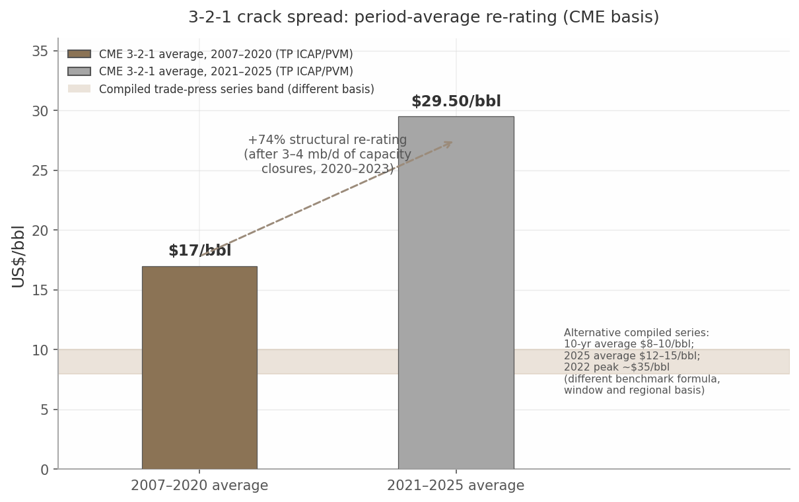
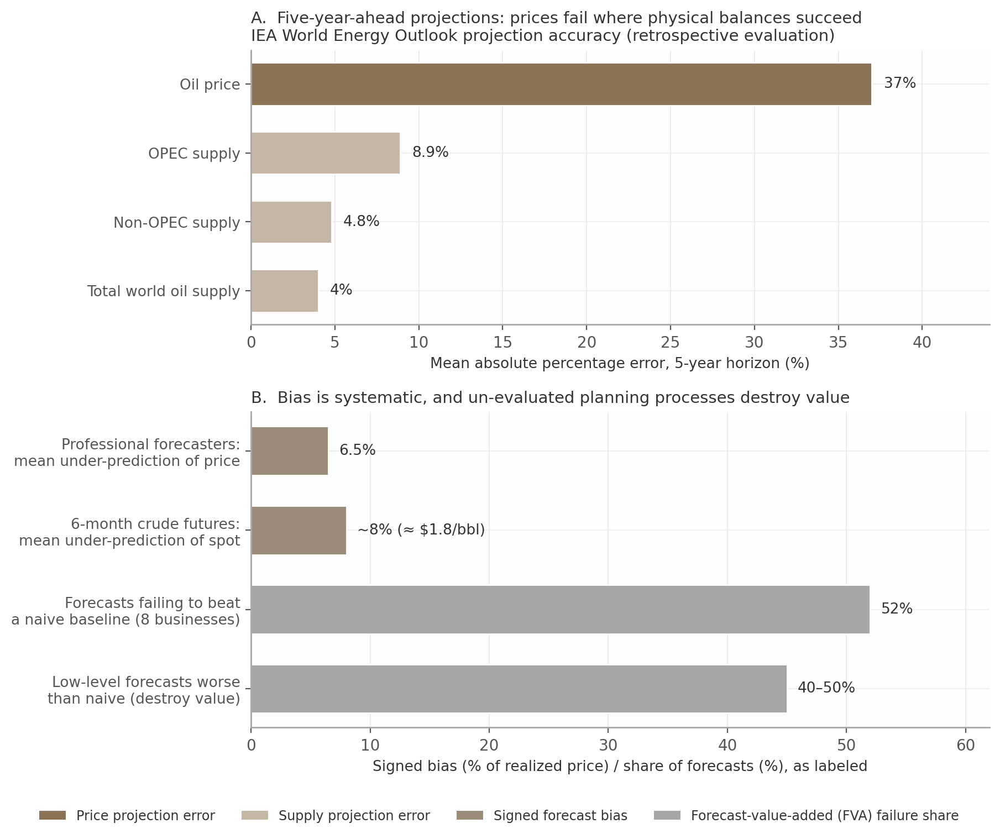

# From Variance Reports to Institutional Learning: Downstream Value Chain Optimization, Lookback/Backcasting Practice, and the Case for a CI-Focused Knowledge Management Foundation

*Prepared 18 July 2026 — Deep-research synthesis: 12 dimensions + independent-model comparison, 422 cited sources*

## Executive Summary

This report answers one question for COMPANY: why does an industry that measures itself intensely learn from itself weakly — and what must COMPANY build so its continuous improvement (CI) output compounds into institutional capability, not archives?

### The context: optimization without memory

A downstream refiner/marketer earns the spread between globally priced crude and locally priced products; crude is ~85% of refining operating cost,[1] and no function widens that spread alone — a linear program (LP) plan scheduling or logistics cannot execute destroys the value it promised. Coordinated Value Chain Optimization (VCO) is worth an estimated $30–85M/yr for a mid-sized refiner (consultancy estimate),[2] as demand peaks ~2027 and overcapacity tightens margins.[3] Yet practice is asymmetric: the industry has industrialized the *measurement* of variance — controller bridges, capture-rate KPIs, Solomon benchmarks, LP back-casting — while *learning* stays manual and episodic; post-completion audits are conducted only ~36% of the time and, where conducted, change no capital decisions.[4] The learning loop is the least tooled layer of the stack and the only one whose output compounds.

### What the research shows: eight systemic gaps

Twelve research dimensions converge on eight gaps. **Gap 1 — data fragmentation and weak context capture** (rationale evaporates into email/logbooks); **Gap 2 — reporting-oriented, not learning-oriented, lookbacks** (variance quantified, causes not); **Gap 3 — the open loop between findings and planning** (LP vectors regenerate "once in a year or few years"[5]); **Gap 4 — limited uncertainty treatment** (five-year price forecasts err ~37%, bias never audited[6]); **Gap 5 — KPI misalignment**; **Gap 6 — weak causal inference and RCA discipline**; **Gap 7 — organizational and governance barriers** (knowledge retires, rotates faster than it transfers; memory ~3 years[7]); **Gap 8 — backcasting-specific weaknesses** (98% of oil and gas capex unaligned with stated goals[8]). The gaps compound and protect recurring, quantified loss: vendor-attributed constructs price plan-versus-actual gap components at $0.05–0.15/bbl (closed-loop integration, AspenTech via ARC),[9] up to $0.25/bbl (reconciliation, AIGC),[10] and ~$0.50/bbl (LP model decay, IZZI/AVEVA estimate).[11] Two additions sharpen this analysis. First, the eight gaps share a cognitive-bias layer: without contemporaneous decision records, hindsight and outcome bias make retrospectives grade luck rather than decision quality. Second, "backcasting" carries two distinct meanings in refining — a strategic futures method that works backward from a desired end-state, and an operational discipline comparing actual performance with the best possible performance under the same conditions — and the KM framework must serve both without conflating them.

### COMPANY's situation

COMPANY's position is favorable but exposed. Its VCO CI initiative — decision lookback matrix, decision-point maturity assessments, defined governance modes, portfolio of lookbacks, backcasts, post-audits, recurring CI reporting — exceeds documented industry practice and already generates findings, decision rationales, and recommendations as a byproduct. The deficit sits after production: retention rests on individuals; themes, decision context, and reusable guidance are not captured in standardized, discoverable form. COMPANY's three stated risks (recurring issues, knowledge lost to role change and attrition, decisions made without prior learning) are default outcomes, not tail risks: ~70% of industrial incidents share a causal factor with a prior event at the same facility,[12] and NASA's purpose-built repository left 58% of program/project managers unable to retrieve the right lessons.[13, 14] CI maturity raises the stakes: the more the program produces, the more there is to lose.

### What a CI-focused KM capability must address

Chapter 5 specifies eight capability dimensions (D1–D8), deliberately solution- and vendor-agnostic. D1 reconciles requirements into a governed baseline; D2 inventories CI knowledge sources with quality, ownership, reuse metadata; D3 builds taxonomy and contextualization around decision/learning context; D4 establishes quality tiers and a confidence model — the keystone for governance, trusted reuse, and AI grounding; D5 designs governance and lifecycle, closing four interfaces — finding→planning model, lesson→standard, pathway→plan, person→system — with verified closure; D6 imports adjacent-industry practice; D7 sets technology direction; D8 sequences the roadmap.

Table ES1 — Preview: the eight systemic gaps mapped to the primary capability dimensions that close them

| Gap (Chapter 3) | Primary capability dimensions (Chapter 5) |
|---|---|
| 1 — Data fragmentation and weak context capture | D2 inventory; D3 taxonomy and decision records; D4 tiering |
| 2 — Reporting- not learning-oriented lookbacks | D3 templates with quality gates; D4 tiering; D5 lifecycle |
| 3 — Open loop between findings and planning | D5 interface closures with verification; D1 baseline; D8 pilots |
| 4 — Limited uncertainty and robustness treatment | D3 versioned assumptions and context attributes; D4 confidence model |
| 5 — KPI misalignment and inconsistent metrics | D1 single owned dictionary; D3 naming conventions and basis metadata |
| 6 — Weak causal inference and RCA discipline | D3 lesson records with root-cause fields; D5 closure verification |
| 7 — Organizational and governance barriers | D2 SME elicitation; D3 system-framed context fields; D5 ownership; D8 sustainment |
| 8 — Backcasting-specific weaknesses | D1 scope validation; D3 pathway decision records; D5 event-based refresh |

Three properties govern the build. Coverage is complete both ways: every gap has at least two dimensions acting on it, and every dimension traces to a documented root cause — D6 and D7 excepted by design, one importing validated constructs, the other readying closed loops for AI leverage. The load-bearing dimensions are D3 and D5, touching seven and five gaps, so the roadmap sequences taxonomy, tiering, and governance activation first. No dimension requires invention — each has a documented adjacent-industry counter-practice — so the requirements state expected impact, not aspiration. The mapping doubles as the validation matrix the requirements baseline maintains as requirements, gaps, and evidence evolve.

### The payoff and the path

Contextualized decisions change what lookbacks can conclude: with rationale and ex-ante assumptions versioned against the decisions they informed, variance decomposes into forecast error, assumption bias, and execution error — bad luck becomes distinguishable from bad decisions — making lookbacks accurate, reproducible, comparable; accumulated, they expose what no single review can: recurring biases, structural bottlenecks, cross-functional misalignments. Governed interface closures feed lessons into LP vectors, inventory policies, pricing rules, pathway milestones — verified, not assigned. CI-first is the right entry point — CI is the one function whose output *is* knowledge, and a reused lesson is close to money — anchors: a reliability spread near 7% of Plant Replacement Value[15] and $0.2–0.6/bbl for margin integration with shared incentives (Boston Consulting Group).[16] The same foundation is the prerequisite for AI enablement (under 1% of unstructured enterprise data is AI-consumable[17]): decision records and tiered lessons written now are AI-consumable capital later; tooling bought first industrializes the black-hole failure at machine speed. The path: ratify the requirements baseline, adopt the tiering and confidence model, fund operating-line ownership, and defer AI enablement as a conditional decision with named re-entry triggers.

## 1. The Downstream Value Chain and What Value Chain Optimization Means

A downstream refining and marketing company earns its living inside a single identity: profit is the difference between a globally priced crude input and locally priced product outputs, less the cost of moving molecules between the two.[18, 19] Every function — trading, refining, logistics, marketing — exists to widen that spread, and none can do so alone. This chapter establishes the report's foundation in three steps: Section 1.1 describes the end-to-end value chain in decision terms; Section 1.2 defines what Value Chain Optimization (VCO) means in practice; Section 1.3 quantifies the stakes that make disciplined optimization — and disciplined learning from its outcomes — a board-level concern.

### 1.1 The downstream value chain for an integrated refiner/marketer

The chain has five economically distinct segments — procurement, refining, slate optimization, logistics, and marketing — described below as a map of where money is made and lost, not as an engineering walkthrough.

#### 1.1.1 Crude and feedstock procurement: benchmark ± differential pricing, light/heavy differential swings (+$15.51/bbl 2006 to −$3.64/bbl 2011), GPW/netback valuation, and why crude ≈ 85% of refining operating cost makes feedstock selection the largest value lever

Feedstock selection is the largest value lever in the chain because of one brute fact: crude oil is about 85% of a typical refining operating cost — "the greatest cost in refining is not capital investment, but crude costs."[1, 20] A one-dollar-per-barrel valuation error dwarfs most operating-cost programs combined.

Crudes do not trade at independent prices. Each is priced as a differential to a benchmark — Brent, West Texas Intermediate (WTI), Dubai/Oman — capturing "the cost to get a given crude to the refiner and the value of its yield."[21] Light/heavy (sweet/sour) differentials typically run at 15–25% of the light-sweet price, because crude's value derives entirely from the high-value products it can yield.[22] Refiners therefore value each crude through gross product worth (GPW) — yield multiplied by regional product prices — and the netback, GPW minus transport and processing; in a worked regulatory example, Cold Lake crude worth C$80.75/bbl at a US Gulf Coast refinery netted back to C$72.95/bbl in Edmonton.[23, 24]

These differentials are volatile bets, not stable inputs. The US light/heavy spread swung from +$15.51/bbl in 2006 to −$3.64/bbl in 2011, when heavy Mexican Maya priced above WTI; conversion investments made on the assumption of a permanently wide spread "declined in profitability."[20] The implication: procurement is a continuous arbitrage across quality, freight, and configuration, and the cost base it governs makes valuation errors the largest single source of value creation or destruction in the enterprise.

#### 1.1.2 Refining operations: CDU/VDU, conversion units (FCC, hydrocracker, coker, reformer, alkylation), hydrotreating/hydrogen, blending, utilities; Nelson Complexity (topping 1 → coking 9+; US avg ~10) as the determinant of crude optionality and slate

The refinery's economic role is to convert a purchased crude differential into a saleable slate, and its configuration determines which differentials it may buy. Refining comprises three functions: separation, conversion, and treatment to meet specifications.[25] The crude distillation unit (CDU) and vacuum distillation unit (VDU) separate crude into LPG, naphtha, jet/kerosene, diesel, gasoil, and residue; conversion units then attack the low-value fractions — the fluid catalytic cracker (FCC) makes gasoline components, the hydrocracker makes diesel and jet with a gasoline/diesel swing, the coker destroys residue, the reformer upgrades octane and generates hydrogen, and alkylation yields high-octane blendstock.[25, 20] Hydrotreaters desulfurize streams to clean-fuel specifications, consuming hydrogen from the steam methane reformer (SMR) — so hydrogen and fuel-gas balances are binding constraints, not utility afterthoughts.[25] Blending assembles finished products from component streams.

Capability is summarized by the Nelson Complexity Index (NCI), which weights conversion capacity against distillation: topping ~1, hydroskimming ~2, cracking ~5, coking above 9.[20] The US fleet is the world's most complex at ~10 on average, with Gulf Coast conversion refineries at 12–13 yielding up to ~8% jet and over 30% diesel.[20, 26] Configuration answers regional demand — US refineries are gasoline-led and pivot on the FCC, European refineries diesel-led on the hydrocracker — and multi-site operators run mixed portfolios as one system: HELLENiQ ENERGY operates hydroskimming (NCI 5.8), cracking (9.7), and hydrocracking/coking (12) refineries "as a single system" to maximize synergies.[25, 27]

The implication is double-edged. Complexity buys crude optionality — the right to run cheaper, heavier crudes — but the option pays only when the light/heavy spread is wide (§1.1.1). Configuration is a decades-long bet on differential regimes the enterprise cannot control, which is why slate and procurement must be co-optimized rather than decided sequentially.

#### 1.1.3 Product slate optimization: gasoline/diesel/jet/LPG/petchem feedstocks/fuel oil/specialties; crack spreads re-rating (~$17/bbl avg 2007–20 vs ~$29.50/bbl 2021–25, basis-dependent); energy ≈ 60% of EU refinery cash opex linking operations to both margin and emissions

The product slate is where physical capability meets market price. Outputs span transport fuels, liquefied petroleum gas (LPG), petrochemical feedstocks, fuel oil, and specialties (base oils, lubricants, asphalt, sulfur, coke).[28] A typical US yield runs roughly 45% gasoline, 25% diesel, and 10% jet; European output is about 65% transport fuels.[29, 30] Because each fraction carries its own price, the slate decision is a continuous reallocation of molecules toward the highest-value outlet.

Profitability cascades from gross margin (product value at the gate minus delivered crude) to net margin (minus variable costs) to cash margin (minus fixed).[19] The stack beneath is thin — an ultra-complex refinery's total operating cost is roughly $7.6/bbl — so a few dollars of gross-margin variance decides the year.[31]

The market's proxy for gross margin is the crack spread, most commonly the 3-2-1: three barrels of crude priced against two of gasoline and one of distillate.[32] The spread is set by the market, not refiners, and excludes all refining costs other than crude — a benchmark, not any refinery's realized margin.[33] With that basis noted: the CME 3-2-1 averaged just over $17/bbl in 2007–2020 but $29.50/bbl in 2021–2025, after 3–4 million barrels per day (mb/d) of capacity closed in 2020–2023 (Figure 1.1).[34] Other series agree directionally at different levels — a compiled trade-press series puts the 2025 average at $12–15/bbl, the 2022 peak near $35/bbl, and a ten-year average at $8–10/bbl; these are different formulas, regions, and windows, not contradictions, and should be read as basis-noted ranges.[29] Within any regime, realized margins swing violently, from −$2 to +$20/bbl.[35]

*Figure 1.1 — 3-2-1 crack spread, period averages, US$/bbl. Bars: CME 3-2-1 averages 2007–2020 (~$17/bbl) and 2021–2025 ($29.50/bbl), per TP ICAP/PVM (February 2026); the re-rating is attributed to 3–4 mb/d of global capacity closures in 2020–2023 [34]. Band: an independently compiled trade-press series (2025 average $12–15/bbl; 2022 peak ~$35/bbl; ten-year average $8–10/bbl) — different formula, region, and window, hence not directly comparable to the CME series [29]. The spread excludes refining costs other than crude; it is a market proxy, not a realized margin [32, 33].*

Energy ties operations to both margin and emissions. Energy is roughly 60% of EU refinery cash operating costs — a share that had doubled over 20 years when Concawe documented it in 2012, and still the standard cited figure.[36] A pacesetting 100 thousand barrels per day (kb/d) refinery burns ~5% of feed as energy versus ~8% at an inefficient site — a ~$15M/yr gap — and fired heaters dominate at 74–78% of consumption (steam 18–20%, electricity 4–6%), pointing efficiency programs at heaters and heat integration first.[37, 38] The implication: every slate and severity decision is simultaneously a margin decision and a Scope 1/2 emissions decision, and in a re-rated regime the payoff to molecule-level slate discrimination rises with the spread.

#### 1.1.4 Logistics layer: terminals, tank farms, 95,000-mile US product pipeline network, shipping/rail/truck; distribution+marketing ≈ 10–16% of pump price; crude-by-rail $8.54–13.00/bbl

Logistics decides whether a profitable plan is physically deliverable — and it is a costed, tradable layer, not a fixed pass-through. The backbone is pipelines: a 95,000-mile US product-pipeline network makes most regions interdependent, though the West Coast remains largely isolated and fragmented "boutique" gasoline specifications limit how freely product moves.[20] Around it sit terminals and tank farms providing storage, throughput, blending, and additive injection as services, plus marine shipping, rail, and truck.[28, 39]

Every mode carries a measurable cost that enters each netback. Where pipelines do not reach, rail fills the gap at a quantifiable premium: "all-in" Bakken crude-by-rail costs ran from $8.54/bbl within the Midwest to $13.00/bbl to the East Coast.[40] Distribution and marketing together account for roughly 10–16% of the US pump price (16% for gasoline in March 2025; 15% for diesel in September 2023), against 46–54% for crude.[41, 42] Operators manage the layer as a profit lever: Phillips 66's commercial roles explicitly include reducing "secondary logistics costs" and negotiating pipeline, storage, terminaling, and marine agreements, including tariff protests.[43] The implication: freight and fees are decision variables that can flip supply-option rankings, and logistics constraints — tankage, pipeline capacity, terminal congestion — routinely determine whether an LP-optimal plan survives contact with the physical network.

#### 1.1.5 Marketing channels: wholesale/rack, B2B, aviation, bunker, petrochemicals, export, retail; razor-thin retail fuel margins (~$0.13/gal net) vs non-fuel profit (39% of revenue, 63% of gross profit)

Marketing is where the chain's physical margin is finally monetized — and where economics invert expectations. Channels span wholesale and rack sales through terminals; retail networks with convenience-store integration; and commercial and specialty outlets — aviation into-plane, marine bunkering, industrial fuels, asphalt, lubricants, LPG, petrochemical feedstocks, and exports.[28] Each carries distinct margins, contracts, and quality regimes: marine bunker became a blending and compliance decision when IMO 2020 capped sulfur at 0.5%, creating very low sulfur fuel oil (VLSFO) and a scrubber-versus-compliant-fuel arbitrage.[44]

Retail, the most visible channel, is economically the thinnest. Net US retail fuel margin runs near $0.13/gal, with typical station earnings before interest and taxes (EBIT) around $0.17/gal.[45, 46] The profit pool is in the store: fuel is about 61% of convenience-store revenue, but non-fuel sales deliver 39% of revenue and 63% of gross profit; net fuel margins average 1–2%.[47] Fuel at retail is a traffic driver co-optimized with in-store economics. The structural growth channel is petrochemicals: the IEA assesses that "for integrated refiners, the petrochemical path can offer higher margins than fuels," with feedstock pooling, hydrogen backup, and energy synergies (§1.3.2).[48] The implication: channel allocation is a daily netback optimization, and marketing decisions can add or subtract as much value at the chain's end as crude selection does at its start. Table 1.1 summarizes the five segments as a decision system.

Table 1.1 — The downstream value chain as a decision system: segments, levers, and value stakes

| Segment | Core decisions and levers | Representative economics | Value at stake |
|---|---|---|---|
| Crude & feedstock procurement | Crude selection and valuation (GPW/netback), differential arbitrage, cargo timing, hedging | Crude ≈ 85% of refining operating cost [1]; light/heavy spread +$15.51 (2006) to −$3.64/bbl (2011) [20] | Largest single lever; $/bbl valuation errors scale across full throughput |
| Refining operations | Crude diet, unit severities, conversion/treating modes, hydrogen balance, energy use | Operating cost ≈ $7.6/bbl (ultra-complex) [31]; energy ≈ 60% of EU cash opex [36]; efficiency gap ≈ $15M/yr at 100 kb/d [37] | Converts the crude differential into a saleable slate; margin and Scope 1/2 emissions jointly determined |
| Product slate optimization | Yield/slate reallocation, blending recipes, giveaway control, spec compliance | 3-2-1 crack ~$17/bbl (2007–20) vs $29.50/bbl (2021–25) [34]; margins −$2 to +$20/bbl [35] | Capturing the market-set spread; blending giveaway is a direct, recurring loss |
| Logistics | Mode and route selection, inventory positioning, terminal/throughput contracts, tariff management | Distribution + marketing ≈ 10–16% of pump price [41]; crude-by-rail $8.54–13.00/bbl [40] | Physical deliverability of the plan; freight can flip netback rankings |
| Marketing channels | Channel allocation, contract structure, wholesale/rack and retail pricing, non-fuel offer | Retail fuel net ≈ $0.13/gal [45]; non-fuel = 39% of revenue, 63% of gross profit [47] | Final monetization; channel mix and price positioning defend volume and margin |

Table 1.1 makes two points the rest of this report depends on. First, value is distributed, not concentrated: crude procurement dominates the cost base, but every other segment governs a pool large enough to matter — a $15M/yr energy-efficiency gap, a freight differential of several dollars per barrel, a retail channel where the store out-earns the fuel. Second, the segments differ in kind: procurement and marketing are market-facing and priced daily, while operations and logistics are physical and contract-bound, so optimizing any one segment in isolation almost guarantees exporting cost or risk to another. That interdependence (§1.3) is why Value Chain Optimization exists as a discipline rather than as the sum of functional excellence programs.

### 1.2 What "VCO" means in practice

#### 1.2.1 VCO as integrated planning and optimization from crude selection through refining and logistics to marketing and pricing — a layered stack (LP planning → scheduling/blending → APC/DCS execution) wrapped by network optimization, demand forecasting, retail pricing, ETRM

In industry usage, VCO is not a tool but the coordinated operation of a layered decision stack. AspenTech defines it broadly — "the strategic adjustment of a company's process to achieve optimal results within their value chain"[49] — and operators frame it as synchronizing "all business and operations activities across the supply chain from feedstock selection to planning, scheduling, operations and distribution."[50] The operating reality is a decision hierarchy at shrinking horizons: a linear program (LP) sets the economically optimal plan on a monthly or weekly cycle; scheduling and blending tools decompose it into feasible daily, event-level operations; advanced process control (APC) on the distributed control system (DCS) executes in real time.[51] Four wrap layers surround the core: network optimization, demand forecasting, retail price optimization, and energy trading and risk management (ETRM).[52, 53, 54]

Vendor frameworks make the layering explicit — and include the retrospective tier. AVEVA's VCO framework spans long-term business planning (one year), production and supply planning (one to three months), scheduling and logistics (one to fifteen days), real-time operations, and an "after operation" tier of production accounting, planning-model tracking and update, and "Prescriptive Performance (Plan vs. Actual)."[55] The same documentation shows why VCO is an organizational problem: each role optimizes a different target — the crude trader chases cargo opportunities, the scheduler hunts "margin leaks in plan v/s schedule v/s actual," the planner guards model accuracy, the operations manager guards safety and compliance.[56] Table 1.2 lays out the stack, its horizons, and its observed state of practice.

Table 1.2 — The VCO decision stack: layers, horizons, representative tools, and state of practice

| Stack layer | Horizon / cadence | Representative tools and practice evidence | State of practice |
|---|---|---|---|
| Long-term / business planning | 1–5+ years; annual cycle | LP strategic planning (RPMS documented over 5-year horizons [57]); AVEVA "Long Term Business Planning / Investment Planning" tier [55] | LP-based; episodic, annual rhythms |
| Production planning (LP) | Month–quarter; monthly or weekly runs | Aspen PIMS, Honeywell RPMS, Haverly GRTMPS, AVEVA Spiral/USC Plan, Chevron PETRO [57, 52, 58] | Near-universal since the 1990s [59] |
| Scheduling & blending | Days–weeks; event-level | Aspen Petroleum Scheduler (>45% of refineries [60]); Aspen MBO; Honeywell BLEND/movement suite [61] | Event-based tools at the frontier; Excel still pervasive [51] |
| Execution | Real-time | APC on DCS; refinery-wide real-time optimization (RTO) at Saudi Aramco Yanbu [62] | Unit-level APC standard; plant-wide closed loop rare |
| Network optimization | Tactical; months–years | Aspen Unified Multi-site [63]; AVEVA Network [52]; Galp GRTMPS refinery–depot–station model [64] | Established at multi-site operators |
| Demand forecasting & S&OP/IBP | Monthly cycle; 1–24 months | SAP IBP [65]; aspenONE SCM [66]; ML demand forecasts <10% MAPE at 12 months [67] | Converging with the LP stack (ExxonMobil–Kinaxis [68]) |
| Retail pricing | Intraday–daily | Kalibrate (600,000 prices/day; 65,000+ sites) [53] | Mature but decoupled optimization island |
| Trading & risk (ETRM) | Real-time–daily | ION Openlink Endur-class platforms [54] | Connected to planning via prices, not closed loops |
| Lookback / plan-vs-actual | After operation; monthly | Aramco monthly "back-casting" LP-gap report [69]; Shell Margin Variance Analysis [70]; AVEVA "Prescriptive Performance (Plan vs. Actual)" [55] | Unevenly formalized — the seam this report addresses |

Two structural observations follow from Table 1.2. First, the stack is a hierarchy of approximations: each layer re-solves the same problem at different granularity with different data and constraints, so divergence between layers is a design property, not an anomaly — one that must be measured and managed. Second, every layer except the last is forward-looking; only the lookback layer closes the loop, and it has the least standardized tooling and the thinnest public methodology. That asymmetry — heavy investment in planning sophistication, light investment in learning infrastructure — is the empirical foundation for the case this report develops: the learning loop is the least tooled layer of the stack, yet it is the only layer whose output compounds into better plans in every subsequent cycle.

#### 1.2.2 The LP oligopoly (Aspen PIMS, Honeywell RPMS, Haverly GRTMPS, AVEVA Spiral/USC, Chevron PETRO); multi-period/multi-site extensions; scheduling state of practice (Aspen Petroleum Scheduler >45% of refineries) with Excel as documented maturity floor

Refinery planning runs on one of the most concentrated software markets in industry. The standard engines are Aspen PIMS, Honeywell RPMS, and Haverly GRTMPS — all built on successive (recursive) LP principles — joined by AVEVA Unified Supply Chain Plan (formerly Spiral) and Chevron's proprietary PETRO.[57, 52, 71, 58] LP planning has been near-universal since the 1990s, and its objective function is explicit: maximize gross refining margin (GRM) subject to unit, quality, logistics, and demand constraints, across strategic (beyond five years), medium-term (one to three years), and short-term (month to quarter) horizons.[59, 72, 57]

The frontier extends the single-site LP in two directions. Multi-period models track inventories and properties across time — RPMS provides mixed-integer, multi-period property tracking, deployed by PetroChina as one advanced planning system (APS) across 11 sites.[73] Multi-site models optimize the network rather than the plant: Aspen Unified Multi-site optimizes "product locations and feedstock sourcing, freight, and inventory usage"; AVEVA Network adds supply-and-distribution optimization "with full plant models when combined with Plan"; Galp's GRTMPS model optimizes connections among refineries, depots, and 1,200 stations against Platts and Argus quotations.[63, 52, 64]

Scheduling is concentrated at the top and manual at the base. Aspen Petroleum Scheduler supports "over 45% of global refineries" (250+ plants); Honeywell's blending and movement suite claims installations exceeding 25% of world refining capacity; Chevron's eight-refinery rollout of Aspen Multi-Blend Optimizer (MBO) is documented as an enterprise change-management program, not a software install.[60, 74, 61, 75] Yet ARC describes the baseline at many sites as an off-line LP feeding Excel schedules that "the scheduler will then manually pass along… to the unit control operator," and academic reviews concede that short-term scheduling "is still done manually by planners."[51, 76] The implication: with an oligopolistic solver market on decades-old mathematics, advantage comes not from the tool but from model fidelity, data discipline, and plan-schedule-execution alignment — perishable, people-dependent assets all.

#### 1.2.3 S&OP/IBP convergence (SAP IBP, aspenONE SCM, ExxonMobil–Kinaxis 2024) vs ARC's caution that O&G has "historically relied on numerous spreadsheets and manual processes"; retail pricing as a mature but decoupled optimization island (Kalibrate scale)

The most significant current movement in the stack is the convergence of hydrocarbon LP planning with enterprise sales and operations planning (S&OP) and integrated business planning (IBP). SAP positions IBP's modules for refinery optimization and depot inventory; AspenTech's aspenONE SCM pairs demand and supply planning with "SCM Insights" to "digitally operationalize the monthly S&OP/IBP process"; o9 has displaced Excel-based planning at an unnamed supermajor; and in October 2024 ExxonMobil and Kinaxis announced co-development of a purpose-built concurrent-planning solution for energy.[65, 66, 77, 68] The counterweight is equally clear: ARC judges that "no comprehensive supply chain management solution has really existed" for oil and gas, an industry that "has historically relied on customized or semi-customized solutions, often involving numerous spreadsheets and manual processes."[78] Vendor integration claims describe the frontier, not the baseline.

Retail fuel pricing shows how mature — and how isolated — a single optimization island can be. Kalibrate executes roughly 600,000 prices per day to more than 65,000 sites in over 40 countries, using elasticity-based artificial intelligence to balance volume against margin, and reports benefits of $83–454 per site per week and 0.9–1.9% volume growth (vendor-reported; it notes that sites with thin competitor data fall back to rules-based pricing).[53, 79, 80] Yet this layer connects to the refinery LP only through supply costs and volume commitments — a seam, not an integration.[53] The same frontier-versus-baseline gap appears in data utilization: estimates of unused data range from 43% (AVEVA, collected industrial data) to 68% (Seagate/IDC, enterprise data "unleveraged"), and McKinsey reports that only 1% of data from a typical rig's 30,000 sensors is examined — different populations and definitions, but directionally consistent evidence that the stack generates far more data than organizations convert into decisions.[81, 82, 83] The implication: VCO's binding constraint is no longer optimization horsepower but the connective tissue — integration, data, and organizational alignment — between islands that each work well alone.

#### 1.2.4 VCO as a cross-functional organization: three observed models (site LP custodians/economists; central supply & optimization groups; national hydrocarbon-system planning at Aramco incl. monthly "back-casting" LP-gap reports)

Because the stack spans functions with conflicting targets, companies institutionalize VCO as an organization; three models recur. The first is site-based: a named LP custodian and site economists. Shell's "Economics Model Coordinator" is the archetype — custodian of the planning/PIMS/LP model, owner of "Basic Data" (mass balances, yields, blending correlations), and responsible for assessing "site actual performance vs planned performance using the Margin Variance Analysis (MVA) process" and for "post-mortem analysis."[70]

The second model centralizes optimization in an enterprise supply and optimization group. Valero's commercial leadership ladder runs through "Director-Supply & Optimization" and "Vice President-Refinery Planning & Economics" to "Senior Vice President-Crude, Feedstock Supply & Trading," with the Chief Commercial Officer directing crude supply, trading, and hedging for all refineries.[84] ExxonMobil consolidated end-to-end planning, logistics, materials management, and its "DNA" analytics under a single supply-chain president on the management committee.[85] Job postings for dedicated Value Chain Optimization director roles at large U.S. independent refiners describe running LP (PIMS-class) model runs to align operating plans and optimization decisions across organizational boundaries, and Chevron's Supply & Trading organization is "tightly integrated with internal Value Chain Optimization (VCO) organizations" across the wellhead-to-customer chain.[86, 87]

The third model is national hydrocarbon-system planning. Saudi Aramco's central LP Modeling Engineers run the models that generate business-plan-level operations for the entire hydrocarbon system — and, critically for this report, "perform 'back-casting' and issue a monthly report on the LP gap along with required mitigations," keeping short-range plans aligned with long-term plans "in terms of modeling accuracy."[69] A parallel posting demands 15 years of LP experience with "specific quantified examples" of margin uplift — LP stewardship is a senior, scarce profession.[88] The implication: whichever model COMPANY adopts, VCO works when a named, senior function owns the cross-functional trade-offs — and at the frontier, that function already runs retrospection as a recurring corporate process, not an ad-hoc post-mortem.

### 1.3 Why decisions across the chain matter: margin, risk, emissions, service, strategy

#### 1.3.1 Decision couplings: crude slate ↔ unit constraints ↔ logistics feasibility ↔ channel netbacks; local optima destroy enterprise value (refinery push vs market pull)

The chain's decisions are coupled end to end, and the couplings are where value concentrates. The slate a trader wants is constrained by the configuration the refinery owns (§1.1.1, §1.1.2). The plan that economics prefers is not necessarily executable: a monthly LP sees only opening and closing inventories, so a plan feasible in the model can be infeasible in the schedule.[89] The schedule that refining prefers is not necessarily deliverable: "a margin-optimized refinery plan only creates value if the supply chain can execute it," and execution is bounded by crude availability, tankage, specifications, transport capacity, and terminal congestion.[90] And products are worth different amounts depending on the channel through which marketing places them (§1.1.5).

Under these couplings, functional optimization is actively destructive. The structural collision is the refinery's "push" against the market's "pull": "A refinery focuses on maximizing throughput and reducing unit costs. A distribution depot aims for high fill rates to ensure local service. These conflicting key performance indicators (KPIs) drive sub-optimal decisions. What benefits one location can harm the overall enterprise value."[91] This is the theory of constraints applied to downstream: "a system of local optimums is not an optimum system at all."[92] The prize for escaping local optima is quantified — BCG estimates margin integration across the chain at roughly $0.2–0.6/bbl between mid- and top-tier players, with transfer pricing, joint linear programming, and incentive systems among the levers[16] — and consultancy practice frames the remedy as a shift from inward, product orientation to outward, market-and-customer orientation.[93]

The couplings span all five outcome dimensions. On risk, the crack spread is market-set, crude-cost pass-through is only partial (short-run gasoline price elasticity ≈ −0.25), and hedging converts an uncertain crack into a managed margin — with hedging costs an explicit planning element.[33, 20, 94, 95] On emissions, energy decisions drive Scope 1 and 2, the slate drives Scope 3, and configuration choices such as running "hydrogen-long" to maximize sustainable aviation fuel (SAF) — against an EU mandate of 6% SAF blending by 2030 — are simultaneously margin, compliance, and decarbonization decisions.[96, 3] On service, "boutique fuel" spec fragmentation raises compliance value while reducing the supply system's flexibility to absorb shocks.[20] The implication: the enterprise objective is total netback across margin, risk, emissions, and service — and any KPI regime that rewards a local optimum is, by construction, taxing the enterprise.

One further coupling is strategic, and it conditions everything downstream of it. McKinsey distinguishes two operating-strategy archetypes: "focused refiners," which run few fuel types, stable operations, and a ratable supply of a small set of feedstock grades under long-term offtake agreements, and "flexible refiners," which swing yields across a wide feedstock range to capture spot-market arbitrage.[97] VCO design must match the archetype, because the planning rhythms, commercial-constraint reviews, and optimization degrees of freedom differ fundamentally — and so must lookback design and lesson templates. A focused refiner's lookbacks center on ratability, supply reliability, and contract performance; a flexible refiner's center on arbitrage capture, swing-yield execution, and speed of commercial response. Lesson templates built for one archetype will systematically mis-grade the other's decisions — an archetype mismatch the requirements baseline in Chapter 5 must prevent.

#### 1.3.2 Quantified stakes: VCO value pools ($30–85M/yr mid-sized refiner; crude/yield optimization $0.50–1.00/bbl; vendor best cases vs AspenTech's $0.05–0.15/bbl claim via ARC Advisory); structural pressures (IEA demand peak ~2027; overcapacity 11.4 mb/d by 2030; McKinsey value pool −35% by 2030s)

The prize for getting VCO right is large, and the honest way to state it is as an attributed spread, because the published numbers measure different constructs. At the conservative end sits $0.05–0.15/bbl for closed-loop integration of planning, scheduling, and APC — an estimate relayed by the independent analyst ARC Advisory on AspenTech's behalf.[51] Consultancy benchmarks put coordinated end-to-end VCO at $30–85M/yr for a mid-sized refiner, with crude selection and yield/slate optimization alone worth $0.50–1.00/bbl for agile operators.[2] At the vendor best-case end, AVEVA claims that economic optimization "can boost profitability by $50 to 300 million per year for a typical oil refinery" and reports (with the customer named) that ExxonMobil's cloud-based unified planning "improved profitability by 70¢/bbl."[56, 98] The order-of-magnitude spread reflects different baselines, scopes, and maturity endpoints; COMPANY should size its own opportunity bottom-up rather than adopt either pole.

The cost side of the ledger is comparably sized. BCG estimates that refiners addressing all performance levers comprehensively can improve refining capability by up to $3 per barrel of input crude — a top- versus third-quartile benchmark, to be read as cost reduction rather than margin uplift — and that "Operations and Optimized Planning" can generate up to 60% of the total savings, placing the planning–operations seam at the center of the cost program as well.[99] The volatility context is equally stark: BCG reports that integrated-oil downstream earnings fell by roughly half in 2024 versus 2023, to about 60% below 2022 levels.[99] The implication: margin-side value pools and cost-side capability programs are won or lost in the same place — the quality of planning and its reconciliation against execution.

The same layering applies to the plan-vs-actual gap — "margin leakage" — that VCO lookbacks exist to close. Its quantified components are constructs with different bases, not competing estimates of one number: $0.05–0.15/bbl from failing to integrate plan, schedule, and control (AspenTech claim via ARC Advisory)[51]; roughly $0.50/bbl from LP model decay, with significant errors persisting "months or even years" (a practitioner estimate at a vendor conference)[100]; and, in a named operator case, a gap "up to 10% of the crude margin" at Saudi Aramco's Yanbu refinery, of which six percentage points were closed by refinery-wide real-time optimization.[62] As layered components of one gap — integration uplift, model decay, event-driven loss — these figures bracket the recurring value that disciplined retrospection can recover.

Structurally, the environment raises the stakes on both sides of the ledger. The IEA projects refined-product demand to peak around 2027 at 86.3 mb/d, while 4.2 mb/d of new capacity arrives by 2030 against 1.6 mb/d of closures, lifting excess capacity to 11.4 mb/d and concentrating closure risk in high-cost Europe and the US West Coast.[3] Growth migrates to petrochemicals — the dominant source of oil-demand growth from 2026, at 18.4 mb/d by 2030, more than one barrel in six — yet the feedstock is increasingly natural gas liquids, not refinery naphtha, whose share fell from 57% (2010) to 45% (2024).[101, 3] East of Suez capacity overtakes the Atlantic Basin by 2026, and the IEA's own framing of the response — "from volumetric growth to value, improved flexibility, emissions mitigation and optimising product yield" — is a one-sentence definition of the VCO thesis.[3] McKinsey's reference case quantifies the downside: a global refining value pool shrinking ~35% to about $100 bn by the 2030s, ~5 mb/d of closures needed by 2035, and US and European margins ~$2/bbl lower — a scenario, not a forecast (its alternatives span $40–181 bn).[102]

The strategic conclusion follows. When the spread is market-set, demand is peaking, and capacity is in structural excess, no refiner/marketer can rely on the environment to deliver margin; the durable source of advantage is execution quality — capturing more of the available spread, more consistently than competitors. Execution quality compounds only when an organization learns systematically from the difference between what it planned and what it achieved. A company that optimizes this chain therefore needs retrospection every bit as disciplined as its planning; how the industry currently performs lookback and backcasting — and where those practices fall short — is the subject of the next chapter.

## 2. How Lookback and Backcasting Are Done Today

Downstream organizations do not lack retrospective machinery: margin is bridged monthly against benchmark cracks, reliability is benchmarked against a 40-year proprietary database, demurrage claims reconstruct port calls, and incident investigation is codified in federal regulation. Backcasting — in both senses used here, testing a completed period against the linear program (LP) that planned it and reasoning backward from a desired end state — exists as a named, staffed practice. The chapter's finding is asymmetry, not absence: the industry has industrialized the *measurement* of variance while leaving the *learning* from variance manual, person-dependent, and episodic. This chapter documents how each discipline is performed today; Chapter 3 examines why the learning intent rarely materializes.

### 2.1 Margin and performance retrospectives

Margin retrospectives run on four institutionalized mechanisms — the public margin-capture key performance indicator (KPI), the monthly controller bridge, external benchmarking, and LP plan-vs-actual backcasting — each quantifying a different slice of one question and only loosely reconciled.

#### 2.1.1 Margin capture rate as the public lookback KPI (Marathon 105% FY2025; Suncor 96% vs custom 5-2-2-1) and why practitioners demand decomposition (inventory lag 15–45 days/phantom profit, RINs, hedges, yield mix, basis)

The margin capture rate — realized gross margin divided by a company-specific benchmark index — is the industry's de-facto public lookback KPI. Marathon Petroleum reported 105% capture for full-year 2025 and 114% in the fourth quarter;[103, 104] Suncor disclosed 96% against its custom "5-2-2-1 index," publishing the full reconciliation (US$39.50/bbl realized versus US$41.15/bbl index).[105]

Practitioners warn the headline figure conceals what a lookback exists to reveal: capture rate "obscures the reasons for under-capture" and must be decomposed into inventory-method timing, yield mix versus benchmark, Renewable Identification Number (RIN) costs, hedge timing, and basis risk.[106] The inventory effect alone is material — reported cost of goods reflects purchases made 15–45 days earlier, so rising crude prices manufacture "phantom profit" from old inventory; Suncor notes the lag can run "from several weeks to several months."[106, 105] Capture above 100% is therefore ambiguous — execution excellence or index mismatch. The public KPI is a screen, not a lookback; the analytical content lives in the decomposition.

#### 2.1.2 The monthly controller bridge (crack spread → reported gross margin) and mandatory yield reconciliation; Solomon Fuels Study as dominant external retrospective (320+ refineries, ~850 staff-hours data effort, cause-level gap analysis)

The canonical internal artifact is the monthly controller bridge: a written, signed analysis, prepared "every single monthly close," reconciling benchmark crack spread to reported gross margin and quantifying each driver — inventory cost lag, RIN costs, hedge timing, yield mix, throughput variance, fixed-cost absorption.[106] Its mandatory companion is yield reconciliation, comparing actual volumes against those implied by crude charged, budget yields, and inventory movements; variances above threshold must be investigated.[106] The discipline is deliberately conservative — phantom profit is quantified every period and never permitted to drive capital-allocation or bonus decisions — and in tooling terms it remains a document-and-worksheet practice: Excel fed by enterprise resource planning (ERP) actuals.[106, 107]

The dominant *external* retrospective is the Solomon Fuels Study: biennial, more than 320 refineries (~85% of global capacity), costing each participant about 850 staff-hours of data collection, and delivering a gap analysis bridging "cash margin to what is possible based on refinery configuration and location."[108, 109, 110] Solomon states its analysis has evolved "to delve into the underlying causes of these gaps" — an explicit shift from variance reporting toward causal learning.[108] Yet the capital-projects database run by Independent Project Analysis (IPA) shows what decades of variance reporting alone achieve: execution slip has remained "amazingly constant" since 2012 despite a decade of lessons-learned rhetoric.[111] Measurement has been excellent and stable; learning has not followed.

#### 2.1.3 The LP plan-vs-actual gap ("margin leakage"): quantified components ($0.05–0.15/bbl closed-loop integration; ~$0.50/bbl LP decay persisting months-to-years; up to 25% of planning margin in crude-logistics case; up to 10% of crude margin at Yanbu) — presented as layered constructs per Conflict Zone CZ2

The retrospective's most consequential object is the gap between what the LP planned and what the refinery earned — the "margin leakage" between plan, schedule, and operations named in analyst coverage of AspenTech's closed-loop strategy.[9] The gap is structural — LP models update on planning cycles while the plant runs continuously, so "by the time the next planning run catches up, the refinery has already been operating suboptimally for hours or days" — and attributing the money values follows "many approaches" with no settled standard.[112, 113]

Public quantifications differ by an order of magnitude because they measure different constructs — the Conflict Zone CZ2 resolution treats them as layered components, not competing estimates (Table 2.1, Figure 2.1): (i) an *integration* layer — AspenTech claims $0.05–0.15/bbl from closed-loop plan–schedule–APC integration, the only independently relayed figure;[9] (ii) a *reconciliation* layer — AIGC claims up to $0.25/bbl;[10] (iii) a *model-decay* layer — an IZZI practitioner estimate at an AVEVA conference of ~$0.50/bbl (range $0.10–1.00 by crude-switch severity) from LP errors that "persist for months or even years";[11, 100] and (iv) *event-driven* layers on percentage bases — actual margin fell "by up to 25%" versus plan in a Digital Refining crude-logistics case,[114] and Saudi Aramco's Yanbu refinery reported up to 10% of crude margin before closing six percentage points via real-time optimization with 3–6-month payback (operator-reported).[62] A vendor concept note adds >$1/bbl of unaccounted plan-vs-actual loss even at well-run refineries, while cautioning the gap is usually "an accounting measurement not an operational performance measurement."[115]

Table 2.1 — The layered constructs of "margin leakage" (Conflict Zone CZ2 resolution)

| Layer | Construct and basis | Quantification | Source type and confidence |
|---|---|---|---|
| Integration uplift | Closed-loop plan–schedule–APC integration; $/bbl, annual | $0.05–0.15/bbl | AspenTech claim via ARC Advisory; unaudited [9] |
| Reconciliation | Plan-vs-schedule-vs-actual closure; $/bbl, annual | up to $0.25/bbl | AIGC vendor claim; unaudited [10] |
| LP model decay | Margin foregone from stale LP submodels; $/bbl, annual; persists months–years | ~$0.50/bbl (range $0.10–1.00) | IZZI/AVEVA practitioner estimate; mechanism corroborated, unaudited [11, 100] |
| Event-driven: logistics | Actual vs planning margin erosion in a crude-logistics case; % of planning margin | up to 25% | Digital Refining case study; single-case construct [114] |
| Event-driven: site program | Plan-vs-actual gap at Yanbu pre-RTO; % of crude margin; 6 pts closed | up to 10% | Operator-authored case (Aramco/Schneider Electric); medium-high confidence [62] |
| Total unaccounted gap | Unexplained plan-vs-actual loss at well-run refineries; $/bbl, annual | >$1/bbl | Vendor concept note; upper-bound rhetoric [115] |

The table's value lies in what it prevents: summing these figures into one "leakage total." The $/bbl numbers price standing, recoverable inefficiency against throughput; the percentages price episodic erosion against a margin that itself varies with the market, and the $/bbl layers overlap (reconciliation includes part of model decay). The credibility gradient matters: the smallest figure is the one an independent analyst relayed, the largest come from parties selling the remedy — the defensible planning range for the standing gap is $0.05–0.50/bbl, with events treated as separately investigated losses. The decisive qualifier is *persistence*: LP errors surviving "months or even years" is a knowledge failure, not an analytics failure — the variance was visible, and no one owned converting it into an updated model.[11]

*Figure 2.1 — Components of the LP plan-vs-actual gap ("margin leakage"), separated by construct. Left: standing, rate-based constructs on a $/bbl-of-throughput basis — closed-loop integration uplift $0.05–0.15/bbl (AspenTech claim via ARC Advisory [9]); plan–schedule–actual reconciliation up to $0.25/bbl (AIGC claim [10]); LP model-accuracy restoration ~$0.50/bbl (IZZI/AVEVA claim [11]); unaccounted loss at well-run refineries >$1/bbl (Refinery Profit Meter [115]). Right: event- and case-specific losses on %-of-margin bases — up to 25% of planning margin (Digital Refining [114]); up to 10% of crude margin pre-RTO at Aramco Yanbu (operator-reported [62]). Figures are vendor or operator claims, not audited measurements; the two panels use different bases and are not additive; the $/bbl constructs overlap. Sources as cited; compiled 2026-07.*

Backcasting against the LP is already institutionalized at the frontier. Aramco's central LP organization performs "'back-casting' and issue[s] a monthly report on the LP gap along with required mitigations";[69] Shell sites run Margin Variance Analysis and LP "post-mortem analysis" under a named LP-model custodian;[70] and AVEVA's framework names "Prescriptive Performance (Plan vs. Actual)" as the after-operation layer of the Chapter 1 stack.[55] The discipline exists as a profession, but practice is bimodal: a monthly, owned, reported routine at a minority of operators, annual-or-never model regeneration at the rest.[100]

### 2.2 Operations and reliability lookbacks

Operations lookbacks are the most codified family — a proprietary benchmarking ledger, a regulatory investigation floor, and a mature indicator pyramid — and the one where failed learning is best documented, because the U.S. Chemical Safety Board (CSB) publishes the recurrences.

#### 2.2.1 Solomon RAM benchmarking on monetized downtime; MA ≥ OA ≥ on-stream availability stack (EDC-weighted); top-vs-bottom ≈ 7% of Plant Replacement Value; investor-grade availability KPIs (BP OA-basis vs Valero MA-basis)

The industry's downtime ledger is the Solomon Reliability & Maintenance (RAM) Study, built on *monetized* downtime: it evaluates "reliability (based on monetized downtime) and maintenance performance" against peers and sizes the best-to-worst spread at about 7% of Plant Replacement Value (PRV).[116, 117] The database spans 1,500+ sites, 10,000 production units, and 54,000 turnarounds over 40 years; Solomon claims clients close ~10% of identified gaps with "returns exceeding 100 times the study cost" (vendor claim).[117, 118, 15]

Every lost hour must be classified into a strict hierarchy — mechanical availability (MA) ≥ operational availability (OA) ≥ on-stream factor — before benchmarking (Table 2.2).[119] Site roll-ups weight units by Equivalent Distillation Capacity (EDC) share, and turnaround downtime is annualized over the turnaround interval.[120] Availability is investor-reported on different bases (Conflict Zone CZ6): BP reports the Solomon OA basis (96.1% in 2023) as "refining availability"; Valero reported 97.2% *mechanical* availability for 2021 alongside a Tier 1 process-safety-event rate of 0.05.[121, 122, 123]

Table 2.2 — The Solomon availability stack as the operations-lookback ledger (with public reporting bases)

| Metric level | Downtime categories counted | Lookback treatment | Public reporting example |
|---|---|---|---|
| Mechanical availability (MA) | Turnarounds, breakdowns, slowdowns (<75% of nominal rate) | Maintenance-led ledger; highest of the three values | Valero: 97.2% MA (2021) [123] |
| Operational availability (OA) | MA + technology (catalyst regeneration, decoking, operator error) + authority (regulatory inspection, testing) | Adds operations- and compliance-caused losses | BP: 96.1% OA (2023), reported as "refining availability" [121, 122] |
| On-stream factor | OA + external causes (economic/market shutdowns, off-site incidents, domino effects) | Widest loss ledger; captures commercially driven downtime | Not typically reported externally |
| Roll-up and smoothing | Site values EDC-weighted; turnaround hours annualized over the interval | Unit-level ledger aggregated by economic weight; event timing smoothed | Solomon RAM peer comparison [119, 120] |

Two consequences follow. First, "availability" is not one number: the same word masks three loss ledgers, so cross-company and cross-year comparisons are invalid until the basis is aligned — BP's OA and Valero's MA are both honestly reported and mutually incomparable, and utilization can exceed 100% of nameplate on yet another basis.[124, 125] Second, the ledger's time conventions — EDC weighting and turnaround annualization — place the same physical event in different periods across the reliability, production, and financial ledgers by construction, which is why operations lookbacks so often disagree with finance on what a disruption "cost." The 7%-of-PRV prize is real, but harvesting it requires a cross-ledger reconciliation most organizations perform manually, if at all.

#### 2.2.2 Incident investigation and RCA practice: OSHA PSM compliance anchor (no RCA mandate; 48h/team/5-yr retention), EPA 2024 RMP root-cause mandate and AFPM resistance; method pluralism (5-Why → TapRooT/Apollo/ICAM) and CCPS's multiple-root-cause discipline

Incident lookbacks are anchored in compliance rather than learning. OSHA's process safety management standard requires investigating any incident that "resulted in or could reasonably have resulted in a catastrophic release" — near misses included — within 48 hours, by a team including a knowledgeable person, with a written report, a resolution system, and five-year retention.[126] OSHA concedes in its modernization docket that the standard "does not require employers to identify the root cause of the incident," estimating that adding root-cause analysis (RCA) would raise investigation time ~50%.[127] Regulation is splitting on this point: the Environmental Protection Agency's 2024 Risk Management Program rule mandates root-cause investigations for facilities with prior accident history, several state refinery programs already require RCA, and the American Fuel & Petrochemical Manufacturers (AFPM) objects to "mandating a specific root-cause analysis methodology… even for those incidents that pose little potential risk."[128, 129, 130] The result is a two-class investigation system in which lookback *depth* is heterogeneous by design.

Methods compound the heterogeneity: practice spans 5-Why and fishbone at the frontline to structured methods — TapRooT, Apollo, the Incident Cause Analysis Method (ICAM), Tripod Beta.[131, 132] The default, 5-Why, is criticized for single-cause thinking and confirmation bias;[133, 134] the Center for Chemical Process Safety (CCPS) states the counter-discipline — a root cause is "a fundamental, underlying, system-related reason… that identifies a correctable failure(s) in management systems," and there is "typically more than one root cause for every process safety incident."[135, 136]

The CSB record shows what shallow lookbacks cost. Texas City: eight prior blowdown-drum releases (1994–2004) "were not properly investigated, and appropriate corrective actions were not implemented."[137] Chevron Richmond: sulfidation-susceptible pipe had been flagged by the company's own metallurgists "as far back as 2002"; CSB reframed the issue as "not corrosion, but how to make effective corporate decisions."[138, 139] BP-Husky Toledo: a near-identical 2019 near-miss was investigated but produced no action items — "a missed opportunity" before the fatal 2022 fire.[140] The pattern for COMPANY is unambiguous: the investigations happened; retention, indexing, and reuse of their findings did not.

#### 2.2.3 Lookback data plumbing: historian event frames, ISA-18.2 alarm KPIs (Toledo: 3,712 alarms/12h), LIMS quality records, production accounting mass balances — rarely fused, on different clocks

The raw material of operations lookbacks lives in four systems answering four questions on four clocks. Process historians provide the forensic substrate: event frames "automatically bookmark important events" against thresholds, store context, and support bulk comparison.[141] Alarm systems carry their own retrospective discipline under the International Society of Automation's ISA-18.2 standard: below six alarms per operator-hour is acceptable; more than ten in ten minutes is a flood.[142, 143] Toledo shows both the failure and the forensic value — operators faced 3,712 alarms in the ~12 hours before the explosion (about 309/hour, roughly 50 times the acceptable rate), and those logs became the post-incident evidence.[140] Laboratory information management systems (LIMS) hold the quality lookback: one mid-sized refiner runs 5,500–6,500 samples and ~30,000 tests monthly, flagging excursions.[144, 145] Production accounting closes the mass balance monthly and "detect[s] early deviations from the plan."[146]

These systems are rarely fused: process data arrive in seconds, LIMS results per sample, computerized maintenance management system (CMMS) work orders over days, financial actuals monthly — and the benchmark ledger annualizes turnaround downtime.[120] Coding is unstable ("EVERYONE uses the CMMS/EAM differently"; inconsistent boundary and failure-mode classification can shift measured failure rates ~40% despite ISO 14224).[147, 148] Emerson names the commercial-seam consequence: comparing actual to expected performance and "'back-cast[ing]' the LP models… can be complex and time consuming."[149] The cost of a six-hour trip is therefore estimated, not measured — and the estimate depends on which ledger the analyst queries.

#### 2.2.4 The operational→commercial bridge: downtime monetization anchors ($1.2–3M/day FCC turnaround overrun; KBC per-unit values; DOE shutdown ledger; PES $750M loss) — mostly manual

Monetizing downtime is the least standardized step, with anchors spanning a 100-fold range by basis (Conflict Zone CZ4). The defensible primary basis is margin on lost conversion: the U.S. Energy Information Administration documented Valero's St. Charles fluid catalytic cracking (FCC) turnaround at $1.2–3.0 million of exposure per day beyond schedule.[150] KBC's case library prices lost FCC capacity at $13 per barrel-per-day and whole-refinery capacity at $1.34 per barrel-per-day.[146] The Department of Energy's event ledger logged ~1,700 U.S. refinery shutdowns in 2009–2012 (46% mechanical), yet reported lost-opportunity submissions totaled just over $32 million — best read as under-reporting.[151] At the catastrophic tail: Philadelphia Energy Solutions' ~$750 million 2019 loss ended in closure and bankruptcy, and refining accounts for more than a third of Marsh's 100 largest hydrocarbon losses (1974–2019).[152, 153] Vendor "$500,000+ per hour" claims should be treated as upper-bound rhetoric on a revenue basis.[154]

Even with sound unit values, the bridge is mostly manual: losses must be valued at *time-varying* margin (ledgers use static factors while refiners "economically optimize" by market window),[155] unplanned constraints force "spot purchases or sales at distressed prices" booked in trading systems,[149] and no published evidence shows a standard automated join across the three ledgers.[146]

Sustainability and emissions lookbacks ride on the same plumbing and inherit its weaknesses. Energy is ~60% of European refinery cash operating costs (a widely cited Concawe figure, older but standard) and fired heaters 74–78% of refinery energy — energy-efficiency retrospectives are simultaneously margin and Scope 1 emissions retrospectives.[36, 38] Refining emits ~1 GtCO₂e per year; decarbonization charters now require public progress reporting (zero routine flaring by 2030), and emissions are entering the planning stack itself (BP's "commercial CO2 emission modeling"; LP-software emissions monitoring).[156, 157, 158, 159] The retrospective apparatus for emissions — flaring events, efficiency drift, target tracking — remains scattered across historian tags, energy reports, and regulatory filings, with no equivalent of the margin bridge.

### 2.3 Supply chain, logistics, and commercial lookbacks

Logistics lookbacks mirror operations lookbacks inversely: strong transaction systems, weak retrospective discipline. Events are captured where systems auto-record them (terminal automation, batch tracking) and reconstructed from documents and memory where they do not (port calls, demurrage, on-time-in-full performance).

#### 2.3.1 Inventory/working-capital reviews (days of supply, DIO/CCC; $200B trapped cash estimate); stockouts visible mainly in crises (UK 2021; OR Tambo)

The canonical inventory KPI is days of supply — stocks divided by trailing four-week average demand — tracked weekly from EIA data against five-year seasonal ranges, while public oversight lags two to three months.[160, 161, 162] Working-capital review is institutionalized as a board discipline: EY benchmarks days inventory outstanding (DIO) and the cash conversion cycle (CCC), found downstream CCC deteriorating while other segments improved, and sized trapped cash at about US$200 billion on U.S. balance sheets (CAD$230 billion across North America).[163, 164] The constraint is equally quantified: carrying costs run 20–30% of inventory value per year, yet cutting too far drives stockouts and expedited freight that "often exceed the savings."[165, 166]

Stockouts themselves are measured episodically, in crises. In the 2021 UK crisis, BP ran out of main grades at nearly a third of its stations and at least half of non-motorway stations were dry; the remedy was ad hoc suspension of competition law.[167] South Africa's OR Tambo airport lost fuel to 54 flights from a single stuck valve in December 2024 — after authorities had known of the storage inadequacies "for over a decade" — and a refinery fire weeks later cut 72% of regional supply.[168, 169, 170] Inventory *levels* are watched weekly; inventory *failures* are learned from only when they become news.

#### 2.3.2 Demurrage and port/rail lookbacks: 72-hr SHINC laytime norms, claims from "PDFs and memory", berth/jetty root causes ($2M/yr refiner case), rail demurrage contention under PSR

Marine demurrage mechanics are standardized; the lookback discipline is not. Tanker practice allows 72 hours of laytime (Sundays and holidays included) before demurrage accrues as liquidated damages, with claims typically time-barred at 90 days.[171, 172] Reconstruction still runs on documents and recollection: "port events are still, in most operations, captured manually and transmitted as PDFs... weeks may have passed, context is lost."[172] Practitioners insist "the leverage is upstream"; AI-assisted claims vendors claim 10–20% cost reductions (vendor-reported).[172, 173] Root causes, when reconstructed, are mundane and recurring: one refiner documented $2 million per year of demurrage from berth-occupancy conflicts, limited loading rates, product unavailability, and early arrivals — and jetty scheduling separately forced sub-optimal refinery operation at "large," unquantified cost.[174] Demurrage is also asymmetric — one party's cost is another's revenue: Stolt-Nielsen booked $71.3 million of demurrage and ancillary revenue in 2022.[175]

Rail demurrage is structurally contentious: under precision scheduled railroading (PSR), carriers shortened free time and issued invoices shippers challenged as demonstrably wrong, prompting the Surface Transportation Board's Demurrage Billing Requirements rule and a shipper petition for "reciprocal demurrage" when railroads hold private cars beyond 72 hours.[176, 177] Berth platforms now market "audit-ready," time-stamped logs of every vessel call in response.[178] The lesson: demurrage lookbacks are a data-capture problem masquerading as a negotiation problem — whoever owns the time-stamped record owns the claim.

#### 2.3.3 OTIF and network utilization: definition fragmentation (97% internal vs 82% customer = $800k penalties); pipeline allocation/interface losses ($50k/interface; automation cuts 40–75%); terminal occupancy reporting (Vopak 84–94%)

On-time-in-full (OTIF) performance suffers definition fragmentation before performance shortfalls: there is "no all-encompassing standard definition" — on-time can mean customer-requested or supplier-promised dates, slots or windows; in-full can be measured at order, line, or case level.[179] One documented supplier "achieved 97% OTIF by internal metrics but only 82% according to their largest customer, resulting in $800,000 in unexpected penalties."[180] Generic practice is mature (95–98% targets, root-cause reason codes), but fuel-specific public OTIF data is scarce, so reliability surfaces mainly in crisis metrics: stations dry, flights cancelled, hours-of-service waivers issued.[181, 182, 183]

Pipeline and terminal lookbacks are better instrumented. U.S. trunk pipelines ration rather than optimize capacity: Colonial's tariff runs monthly nominations into a "Cap Freeze," allocates by calculated cycle historical allocation with a 44-cent/bbl capacity fee, and enforces 25,000-barrel mainline batch minimums.[184, 185] Interface (transmix) losses are quantified and material: up to $50,000 per interface and "many millions" per operator per year; a measurement vendor and Phillips 66 claim industry losses could be halved.[186, 187, 188] Interfaces run 500–2,000 barrels per 100 miles; automation cuts interface losses 40–75% by vendor claims, yet documented "over-protecting" of batch cuts persists as the rational response to missing real-time measurement.[189, 186] Terminals report occupancy at board level — Vopak's ranged 84–94% across 2018–2024 — though swings track market structure (contango fills tanks) as much as operations.[190, 191, 192] Terminal automation reconciles book-versus-physical inventory and auto-generates close-out variance reports,[193, 194] while secondary distribution remains a documented gap (~16% excess mileage in one academic routing study).[195]

#### 2.3.4 Commercial lookbacks: pricing post-mortems tool-led (Kalibrate/PDI), channel/customer/netback profitability redesigns; campaign ROI attribution "a constant struggle"; ETRM post-trade retrospective tooling absent in public evidence

Commercial retrospectives are tool-led but shallow. Fuel-pricing platforms market retrospective analytics directly — Kalibrate invites users to "analyze past pricing decisions to understand their impact on profitability" through 50-plus reports and elasticity models — and PDI's own guidance criticizes the spreadsheet status quo.[196, 107] Channel-, customer-, and netback-level lookbacks appear mainly as *consulting demand*, itself diagnostic: refiners hire firms to "redesign… commercial reporting to show true channel profitability, customer profitability, and regional netbacks" (CVR Energy), to run "branded wholesale channel profitability analysis" (Valero), and to deliver commercial-excellence programs plus capture-rate diagnostics (Phillips 66).[197, 198, 199] Structured post-mortems are weakest: campaign ROI attribution is "a constant struggle," with 43% of retailers citing ROI proof as a top challenge.[200, 201] And no public evidence of energy-trading-and-risk-management (ETRM) post-trade retrospective tooling exists in this study's research base: deal capture, risk, and profit-and-loss reporting are documented, deal-level *retrospective* attribution is not — likely proprietary.[54, 202]

Post-audit discipline, where institutionalized, is demonstrably non-influential: post-completion audits run only ~36% of the time and "did not affect future capital budgeting decisions";[4] turnaround teams "start from scratch" because lessons "are not systematically captured."[203] The implication: tools generate variance artifacts in abundance; the governed conversion of artifacts into updated pricing rules, contract structures, and allocation policies is what is missing.

### 2.4 Backcasting practice

Backcasting in the strategic sense — reasoning backward from a desired future to present actions — is the sector's primary instrument for net-zero pathways, portfolio reshaping, and long-range capital logic. Its methods are mature; its *embedding* into plans and budgets is the documented weak point.

#### 2.4.1 Method origins (Robinson 1982; Holmberg; Quist–Vergragt) and the canonical weakness at the embedding/implementation step; forecasting vs backcasting complementarity

Backcasting originated as a deliberate alternative to forecasting: Robinson (1982), building on Lovins' 1977 "soft energy paths," proposed designing strategies "backwards, from the future to the present."[204, 205] Holmberg (1998) formalized it in The Natural Step's four-step sequence, and Quist and Vergragt (2006) extended it into a five-step participatory method whose final step is *embedding and implementation*.[204, 206]

The canonical weakness is known with unusual precision: Quist, Thissen, and Vergragt's five-to-ten-year follow-up of Dutch participatory backcasting found substantial follow-up "but that is not always the case," and mostly at niche level;[207] Geurs and van Wee identified a generic "lack of attention for the time-paths for the events between the target years and the base."[208] The failure sits exactly at the fifth step — transfer of the pathway into owned, sequenced, resourced action. Forecasting and backcasting remain complements — forecasting asks "where will our current path take us?", backcasting "what must we do now to reach our desired destination?" — forecasting alone leads to the "Incumbent's Trap," ungrounded backcasting to goals disconnected from today's business.[209]

#### 2.4.2 Refinery decarbonization backcasts: technology-stack consensus (efficiency→electrification→low-carbon H₂→CCS→offsets); OGCI/Wood >65% by 2040 vs WEF/IEA CCUS-primary (+7–9% cost) — genuine field disagreement (CZ5)

Refinery decarbonization backcasts share one architecture: a 2050 net-zero (Scope 1 and 2) end state reached through a technology stack in rough marginal-cost order — energy efficiency, electrification of boilers and drives, low-carbon hydrogen (blue first, green later), carbon capture and storage (CCS) on FCC units, reformers, and fired heaters, then residual offsets.[156, 210] On *sequencing* the field genuinely disagrees (Conflict Zone CZ5), and the disagreement is assumption-driven. The Oil and Gas Climate Initiative's Wood-led roadmap (2023) leads with electrification: over 65% of a refinery's CO₂ can be cut by 2040 *if* low-carbon power is available, with electric boilers abating under $150 per tonne against ~$500 per tonne for furnace electrification.[156] The World Economic Forum/IEA Net-Zero Industry Tracker instead names carbon capture, utilization and storage (CCUS) "the primary decarbonization pathway for refineries" and estimates decarbonization raises refining costs by 7–9%.[211] The two reconcile only site by site — lead technology depends on regional power prices and availability, CO₂ transport-and-storage access, and carbon price — which is why a backcast's assumptions must be recorded, not just its conclusions.[211, 210]

Site-level practice shows what a refinery backcast looks like: a Worley two-phase study screened 42 abatement options down to 20 and — unusually — embedded re-evaluation triggers ("at appropriate times as specified in the roadmap timeline").[212] CATF's archetypes make the closure logic explicit: underutilization is not financially feasible, so some refineries shut while survivors run full and decarbonize.[210]

#### 2.4.3 Corporate instruments: exploratory scenarios (Shell tradition; Horizon normative) vs laddered targets, with Shell's own firewall ("not expressions of strategy"); portfolio backcasting margin/policy-led (IEA Oil 2025 closures; conversions: Rodeo, Martinez, Vertex reversal)

Majors build long-term pathways from two loosely coupled instruments. The first is exploratory scenario planning — Shell's tradition since Pierre Wack's 1971–72 scenarios, designed to produce "prepared minds" rather than predictions.[213, 214] Normative backcasting has entered that canon: in Shell's 2025 Energy Security Scenarios, Archipelagos and Surge are exploratory while Horizon is explicitly normative, engineered to reach net-zero by 2050 — though even Horizon delivers only ~7% below-2010 CO₂ by 2030, conceding the near-term gap inside the vision itself.[215, 216, 217] Shell maintains an explicit firewall: scenarios are "not forecasts, nor are they expressions of Shell's strategy or business plan."[218] The second instrument is the laddered target — Shell's net-carbon-intensity steps to 100% by 2050; TotalEnergies' 15%/35%/60%+ ladder.[219, 220]

Portfolio backcasting — which assets to close, convert, or keep — is happening at scale but is margin- and policy-led, not vision-led. IEA's *Oil 2025* projects refined-product demand peaking in 2027 at 86.3 million barrels per day, with 4.2 mb/d of new capacity against 1.6 mb/d of announced closures to 2030: "more capacity will have to shut, with high-cost plants in Europe and on the US West Coast expected to be hardest hit."[221] Wood Mackenzie expects Europe to lose up to 5 mb/d by 2050 and half of European refineries to show negative net cash margins by the early 2030s.[222] Conversions are the flagship execution cases — Phillips 66 Rodeo (commercial renewable-diesel operation from April 2024) and Marathon/Neste's Martinez (ramping toward 730 million gallons per year) — but they are policy-credit-dependent and reversible: Rodeo subsequently ran at reduced rates on weak margins, and Vertex Energy *reverted* its converted Mobile, Alabama unit to fossil in 2024.[223, 224, 225, 226] Portfolio behavior matches backcast logic, but the cited drivers are margins, carbon costs, and credits — portfolio backcasting today is implicit and price-led, without published intermediate milestones.[221, 222]

#### 2.4.4 Connection to capital planning and CI: clean-energy capex ~2.5% vs ~50% NZE benchmark; TPI 98% misalignment; milestone fragility (Shell 2035 retired; BP abandoned); episodic updates via investor votes vs DAPP signposts/triggers

The weakest link is the interface with capital planning. IEA calculates the industry invested ~$20 billion in clean energy in 2022 — 2.5% of total capex — against a net-zero-consistent benchmark of ~50% by 2030; the Transition Pathway Initiative finds 98% of oil and gas companies do not align future capex with decarbonization goals and only 2% are 1.5°C-aligned.[227, 8]

Interim milestones prove fragile precisely when they enter the planning horizon. Shell "retired" its 45% 2035 net-carbon-intensity target in 2024 — just before it would have entered the ten-year planning window — and weakened 2030 from 20% to 15–20%; its prior legal disclaimer stated that Shell's operating plans "cannot reflect our 2050 net-zero emissions target and 2035 NCI target, as these targets are currently outside our planning period."[228, 229] BP moved its 2030 production-cut target from 40% to 25%, then abandoned it; Carbon Tracker notes several majors hold 2050 goals with "no interim targets," and one investor analysis calculates the weakening implies decarbonizing "up to five times faster between 2030 and 2050."[230, 231, 232] Pathway revision is episodic and investor-driven — "climate ambitions follow climate votes" — rather than continuous and evidence-driven.[229]

A corrective template exists and is standard elsewhere: Dynamic Adaptive Policy Pathways (DAPP) equip plans with *signposts* (monitored variables testing whether the plan still meets its conditions) and *triggers* (critical values firing pre-agreed actions); DAPP is routine in climate-adaptation planning but largely absent from refinery roadmaps, the Worley and OGCI staged studies being exceptions.[233, 234, 212, 235] The implication for COMPANY: a backcast pathway without owned milestones inside the current planning period, monitored signposts, and a scheduled re-baselining cadence is a publication, not a plan — and the record shows such publications are disposable.

Table 2.3 — Backcasting instruments: question answered, horizon/cadence, observed practice, and documented weakness

| Instrument | Question answered | Horizon/cadence | Observed practice | Documented weakness |
|---|---|---|---|---|
| Exploratory scenarios (Shell Energy Security Scenarios) | What futures could plausibly arrive, and what would prepare us for them? | Multi-decadal (to 2050 and beyond); scenario suite refreshed periodically (2025 ESS: Archipelagos, Surge) | Shell tradition since Pierre Wack's 1971–72 scenarios, built to produce "prepared minds" rather than predictions [213, 216] | Scenario–strategy firewall: scenarios are "not forecasts, nor are they expressions of Shell's strategy or business plan" — insight is quarantined from owned plans [218] |
| Normative backcast scenario (Horizon) | What must happen to reach a chosen end state (net-zero by 2050)? | Engineered backward from the 2050 end state | Horizon in Shell's 2025 ESS is explicitly normative — yet delivers only ~7% below-2010 CO₂ by 2030, conceding the near-term gap inside the vision itself [215] | The vision concedes its own near-term shortfall and still sits behind the scenario–strategy firewall — a backcast nobody is obliged to execute |
| Laddered corporate targets (Shell NCI; TotalEnergies) | What interim steps ladder from today to the 2050 goal? | Stepped targets to 2050 (Shell net-carbon-intensity steps to 100%; TotalEnergies 15%/35%/60%+ ladder) | Public milestone ladders at the majors [219, 220] | Milestone retirement at the planning-window boundary — Shell "retired" its 2035 NCI target in 2024 just before it entered the ten-year window and weakened 2030; revision is episodic and investor-vote-driven ("climate ambitions follow climate votes") [228, 229] |
| Technology-stack roadmaps (OGCI/Wood; WEF/IEA) | Which abatement technologies, in what sequence, deliver the end state? | Technology stacks in rough marginal-cost order to 2040/2050 | Genuine, assumption-driven disagreement (CZ5): electrification-led (>65% of refinery CO₂ cut by 2040, OGCI/Wood) vs CCUS-primary at +7–9% cost (WEF/IEA) [156, 211] | Sequencing reconciles only site by site; assumptions are rarely recorded with the conclusions; roadmaps largely lack monitored signposts |
| Portfolio conversion/closure decisions (IEA Oil 2025; Rodeo, Martinez, Vertex) | Which assets to close, convert, or keep on the pathway? | Demand peak 2027; closure need to 2030; 2050 endgame | Executing at scale but margin-, policy-, and credit-led: Rodeo commercial from April 2024, Martinez ramping, Vertex reverted its converted unit to fossil in 2024 [221, 223, 225] | Implicit, price-led backcasting — no published intermediate milestones, and decisions reverse when credits weaken |
| Adaptive-pathway signposts/triggers (DAPP) | Is the plan still valid, and what fires the pre-agreed response? | Continuous monitoring of signposts against critical trigger values | Routine in climate-adaptation planning; refinery exceptions are the Worley and OGCI staged studies with embedded re-evaluation triggers [233, 234, 212] | Absence of signposts — largely missing from refinery roadmaps, so pathways drift without a monitored re-baselining cadence |

Read across the rows, Table 2.3 shows a complete instrument set with an incomplete chain of custody. Each instrument answers its own question on its own cadence — multi-decadal scenarios, stepped targets to 2050, technology stacks to 2040, portfolio calls to 2030, continuous signposts — but no instrument hands its output to the next as an owned input. Scenarios are firewalled from strategy; targets are retired at exactly the moment they enter the window where capital is allocated; roadmaps record conclusions rather than assumptions; portfolio decisions execute backcast logic while citing prices, so the pathway narrative cannot claim causal force; and the one instrument that would monitor the pathway itself — DAPP's signposts and triggers — is the one the sector has not adopted. The pattern is the strategic analogue of this chapter's operational finding: variance and vision are both produced, sometimes published, but the conversion of pathway intelligence into owned milestones inside the current planning period remains episodic, reversible, and investor-driven. For COMPANY, instrument sophistication is not the constraint; the binding gap is the interface where a backcast becomes a budget.

#### 2.4.5 Two senses of "backcasting" in refining practice — a distinction the learning system must serve

The word "backcasting" carries two distinct meanings in refining, and a learning system that conflates them will misclassify its most valuable artifacts. The first is the strategic futures method of §2.4.1 — Robinson's line of reasoning backward from a desired end state — and needs no restatement here. The second is native to refinery economics and largely invisible outside it: comparing actual performance against the *best-possible* performance achievable under the same realized conditions — the prices, demand, and equipment availability that actually occurred — computed by re-running the LP model as a counterfactual optimum. McKinsey states the distinction sharply: an effective backcasting process "compares the actual performance to the best possible performance under the same conditions," whereas most lookback machinery merely "explain[s] deviations between planned and actual performance."[97]

The distinction is not semantic trivia, because the two comparisons can return opposite verdicts on the same period. Margin-variance analysis — actual versus original plan — can show a favorable variance while the operation still leaked value against the achievable optimum: the plan itself was set weeks earlier, on different prices, and beating it says nothing about what the realized market would have paid for a better-run month. McKinsey reports that many organizations operate only the variance test, with regular backcasting and historic performance reviews "often missing or overlooked."[97] The documented best-practice instance of the operational sense is the one already described in this chapter: Aramco's central LP organization, which performs monthly back-casting and issues a report on the LP gap with required mitigations (§2.1.3).[69]

The consequence for knowledge management is taxonomic, and Chapter 5 develops it: the two senses generate different artifact types — pathway assumptions and milestone rationales on one side, counterfactual gap analyses carrying model-version context on the other — which a competitive-intelligence (CI) knowledge taxonomy must capture as distinct asset classes with distinct context fields and owners (§5.4).

### 2.5 Tooling and data used today — and the intended learning loop

#### 2.5.1 The full tooling map (BI dashboards, LP/APS, S&OP, historians, ERP, CMMS, TMS/TAS, demand forecasting, pricing engines) and how companies conceptually intend lookback/backcasting to improve future decisions (PDCA intent vs practice, forward reference to §3)

Every practice documented in this chapter runs on a recognizable toolchain, mapped in Table 2.4 by value-chain layer. Two properties stand out: the planning layer is an oligopoly of four linear-programming suites feeding advanced planning and scheduling (APS) tools,[236, 57] and the frontier is moving — machine-learning demand forecasting now tests under 10% mean absolute percentage error at a 12-month horizon[67] — yet spreadsheet bridges persist across every layer, an acknowledged maturity floor.[51, 107]

Table 2.4 — Lookback types: cadence, artifact, tooling, and known weakness

| Value-chain layer | Tool class | Representative systems (evidence) | Primary lookback artifact | Cadence / clock | Known weakness |
|---|---|---|---|---|---|
| Strategic / portfolio | Scenario suites, capital-project databases | Shell Energy Security Scenarios [216]; IPA benchmarks [237] | Scenario publications; target ladders; post-completion audits | Multi-decadal horizons; pathway revision episodic and investor-vote-driven [229] | Scenario–strategy firewall — scenarios are "not forecasts, nor are they expressions of Shell's strategy or business plan"; milestones retired at the planning-window boundary; post-audits change no decisions [218, 228, 4] |
| Planning (monthly/weekly) | LP planning; S&OP/IBP | Aspen PIMS, Honeywell RPMS, Haverly GRTMPS, AVEVA USC [236, 57]; aspenONE SCM [66] | LP plan; monthly back-casting / LP-gap report (Aramco [69]); Margin Variance Analysis (Shell [70]) | Monthly/weekly LP cycles; monthly back-casting / LP-gap report at frontier operators [69] | Plan-vs-actual attribution follows "many approaches" with no settled standard; published leakage values are vendor constructs, unaudited [113, 9, 10] |
| Scheduling & blending | Refinery schedulers, blend optimizers | Aspen Petroleum Scheduler/MBO; AVEVA USC Schedule; Honeywell BLEND [60, 238, 239] | Plan-vs-schedule-vs-actual reconciliations [238] | Runs between the monthly LP cycle and the continuous plant — suboptimal for "hours or days" before the next planning run [112] | Monetization bridge to margin is manual — static ledger factors vs time-varying margin; no automated join across the three ledgers [155, 146] |
| Operations (real time) | Historians, alarm systems, LIMS, APC, CMMS | PI System event frames [141]; ISA-18.2 alarm KPIs [142]; LabWare-class LIMS [144]; CMMS work-order history [147] | Event frames; alarm-flood analyses; quality excursions; RCA reports | Process data in seconds, LIMS per sample, CMMS over days; RCA event-driven (48-hour start) [141, 126] | Coding instability — "EVERYONE uses the CMMS/EAM differently"; boundary/failure-mode coding shifts measured failure rates ~40% despite ISO 14224 [147, 148] |
| Production accounting (close) | Mass-balance reconciliation, yield accounting, BI dashboards | KBC Visual Mesa-class systems [146]; ERP actuals + Excel bridges [106] | Yield reconciliation; controller bridge [106] | Monthly close — bridge and yield reconciliation "every single monthly close" [106] | Capture-rate ambiguity (headline obscures phantom profit, RINs, hedges, mix, basis); Excel/document-based practice fed by ERP actuals [106, 107] |
| Logistics (marine, pipeline, terminal, truck) | TAS/TMS, berth schedulers, batch tracking, wetstock | DTN/Varec TAS [193, 194]; Dropboard/MISMARINE [240, 178]; Emerson PipelineManager [241] | Close-out variance reports; time-stamped port-call records; scheduled-vs-actual batch histories; demurrage files | Weekly EIA days-of-supply tracking; port-call and demurrage lookbacks event-driven (claims time-barred at 90 days) [160, 172] | "PDFs and memory" — port events captured manually, context lost; OTIF definition fragmentation (97% internal vs 82% customer) [172, 179, 180] |
| Commercial (demand, pricing, trading) | Demand forecasting, pricing engines, ETRM | ML demand models [67]; Kalibrate [196]; ION Endur-class ETRM [54] | Price-decision reviews; channel/customer profitability reports; (no documented post-trade retrospective tool) | Financial actuals monthly; price and campaign reviews per event [120] | Campaign ROI attribution "a constant struggle"; no ETRM post-trade retrospective tool in public evidence [200, 54] |
| External benchmarks | Benchmark studies | Solomon Fuels/RAM [108, 116]; IPA [237] | Monetized gap-to-peer analyses | Biennial (Solomon Fuels Study); turnaround downtime annualized over the interval [108, 120] | ~850 staff-hours of manual data collection per participant; gap-closure returns vendor-reported [109, 15] |

The map's most important property is what it does *not* contain: no layer owns the conversion of a lookback finding into an updated model, policy, or constraint. Each tool produces its variance artifact on its own clock and keys; the joins between layers — historian to financial ledger, RCA report to LP vector, demurrage claim to chartering policy — are performed by people, in spreadsheets, episodically.[51, 149] This is why "closed-loop" marketing coexists with manual reality (Conflict Zone CZ7): frontier sites run genuine closed-loop integration while the baseline runs on documents, and both are true of the same industry at once. The two added columns sharpen the same diagnosis from different angles. The cadence column shows every layer keeping its own time — seconds in the historian, weekly in the market, monthly at the close, biennial in the benchmark — so two lookbacks rarely describe the same period, and every cross-ledger join must reconcile clocks before it can reconcile numbers. The weakness column shows the failure modes differ in kind — KPI ambiguity, unaudited vendor constructs, unstable coding, manual monetization, document-and-memory capture, fragmented definitions, absent tooling — which is why no single system purchase closes the loop. For COMPANY, the tooling question is secondary to the knowledge question — the artifacts exist; their context and their *consequences* are what evaporate.

The intended learning loop is nonetheless explicit across the evidence — the plan–do–check–act (PDCA) cycle in industry artifacts. *Plan:* the LP and network models set the optimal course; backcasts define the destination. *Do:* schedulers, operators, and traders execute, generating events. *Check:* the controller bridge, yield reconciliation, capture decomposition, Solomon gaps, alarm and quality KPIs, demurrage files, and campaign reviews quantify what happened against intention. *Act:* findings are supposed to update LP yield vectors and constraints, safety stocks, maintenance strategies, pricing rules, contracts, and backcast milestones. Doctrine states the intent plainly: CCPS frames "Learn from Experience" as one of four accident-prevention pillars;[242] lean practice supplies the A3 format — PDCA on one shareable page — so analysis becomes a reusable artifact;[243] and the value-chain framework draws "Prescriptive Performance (Plan vs. Actual)" as the layer that closes the stack back into planning.[55] Observed practice is that the loop is open at nearly every link — post-audits that change no decisions,[4] slip "amazingly constant" for a decade,[111] turnaround lessons "not systematically captured,"[203] investigated near-misses producing no action items before fatal repeats,[140] LP errors persisting "months or even years,"[11] and milestones retired at the planning-window boundary.[228] Chapter 3 examines the eight systemic gaps that keep the loop open.

## 3. Why Lookback and Backcasting Underperform: Eight Systemic Gaps

Chapter 2 documented an industry that measures itself intensely and learns from itself weakly. This chapter answers why lookback and backcasting underperform even where they are formally present, staffed, and tooled. The answer is structural, not motivational. Eight systemic gaps — numbered **Gap 1** through **Gap 8** for reference throughout this report — share two properties. Every gap sits at an *interface*: between operational and corporate systems, between a finding and the model it should update, between planning cycles and the people who rotate through them. And context decays faster than organizations act on it: decision rationale evaporates in weeks, organizational memory spans roughly three years,[7] yet conclusions arrive monthly to annually and capital responses take years. Chapters 4 and 5 map COMPANY's problem framing and knowledge-management requirements onto these gaps by number.

Table 3.1 — The eight systemic gaps at a glance

| # | Gap | Core failure mechanism | Signature evidence | Primary decisions affected |
|---|---|---|---|---|
| 1 | Data fragmentation and weak context capture | Stack built for execution, not joint retrospection; no shared keys; rationale unrecorded | >50% of engineer time spent searching [244]; ~80% of logbooks unstructured (vendor-published, directional) [245] | Crude-slate selection; run plans; any decision a lookback must reconstruct |
| 2 | Reporting-oriented, not learning-oriented, lookbacks | Variance quantified, causes not; findings terminate as local fixes | Post-audits ~36% of the time and "did not affect future capital budgeting decisions" [4] | Capital-project sanction; turnaround scope; lessons adoption |
| 3 | Open loop between findings and planning | No owned mechanism updates models, policies, or forecasts from findings | LP vectors refreshed "once in a year or few years" [5] | LP re-vectoring; inventory & logistics policies; S&OP/IBP resets |
| 4 | Limited uncertainty and robustness treatment | Point forecasts and narrow scenarios despite documented bias; no bias audits | WEO 5-year price MAPE ≈37% [6]; 52% of forecasts fail to beat naive [246] | Price decks; scenario ranges; forecast sign-off |
| 5 | KPI misalignment and inconsistent metrics | Functions optimized against conflicting, non-portable definitions | Margin, availability, OTIF, emissions intensity all basis-dependent [247, 180] | Target-setting; incentive design; cross-site benchmarking |
| 6 | Weak causal inference and RCA discipline | Correlation-era dashboards; contaminated event data; RCA stops at convenient causes | 93% of work orders closed on Fridays [248]; repeat CSB-investigated incidents [140] | RCA corrective actions; reliability & maintenance spend |
| 7 | Organizational and governance barriers | Knowledge retires, rotates, and is suppressed faster than it transfers | 41% rarely/never capture retiree know-how [249]; ~12% of transformations sustain past 3 years [250] | Rotation & succession; KM program ownership; improvement sustainment |
| 8 | Backcasting-specific weaknesses | End states disconnected from capital plans; pathways under-specified | 98% of oil & gas capex not aligned with stated goals [8]; milestones retired at the planning horizon [229] | Long-horizon capex; decarbonization pathway sequencing |

Two readings of Table 3.1 matter for what follows. The gaps are *compounding*, not additive: Gap 1 starves every downstream practice of joined-up evidence, Gap 5 means the numbers compared encode different constructs, and Gap 6 makes the extracted causal story unreliable — so a finding reaching Gap 3's open loop is already degraded, and Gap 7 ensures the people who could repair it have left or stay silent. The gaps are also *load-bearing* for the value case: Chapter 1 quantified value-chain optimization (VCO) pools at $30–85M per year for a mid-sized refiner, and every pool assumes a functioning retrospective loop. Closing Gaps 1–3 captures most near-term benefit; Gaps 4–8 determine whether it persists. The rightmost column names the primary VCO decisions each gap corrupts; the mapping is developed decision-by-decision in the section prose that follows.

### 3.1 Data fragmentation and weak context capture

**Gap 1 — the evidentiary substrate for retrospection does not exist as a joined-up asset.** A lookback must reconstruct what physically happened, what was decided, and what the decision-makers knew and assumed at the time. The downstream information stack defeats all three by design — most damagingly at the seams between process, maintenance, logistics, and finance where value-chain decisions live.

#### 3.1.1 The siloed stack by design (OT built for uptime, IT for transactions; ISA-95 L3/L4 boundary); historians holding 10–20 yrs of data isolated from analytics; terminal/POS vendor walled gardens

The fragmentation is architectural, not accidental. Operational technology (OT) — supervisory control and data acquisition (SCADA), distributed control systems (DCS), historians — was procured to guarantee uptime and safety; information technology (IT) — enterprise resource planning (ERP), the computerized maintenance management system (CMMS), laboratory information management systems (LIMS) — was procured to process transactions.[251, 252] The ISA-95 Level 3/Level 4 boundary between operations and enterprise systems is where translation systematically fails, and plant historians commonly hold 10–20 years of high-resolution data "completely isolated from modern analytics platforms."[253] The pattern extends beyond the refinery fence: terminal automation remains a vendor-proprietary walled garden with incomplete OPC Unified Architecture (UA) adoption,[254] and retail point-of-sale (POS) platforms lock transaction data inside vendor ecosystems.[255] Every cross-layer lookback therefore begins as a bespoke data-integration project; when reconstruction is expensive, lookbacks either do not happen or run on partial data, which silently narrows the hypotheses they can test.

#### 3.1.2 No consistent keys/taxonomy/semantics (asset hierarchies conflicting; ISO 15926 vs MIMOSA camps; incomplete RDLs); quantified impact (>50% engineer time searching; 32% of data used; 1% of rig sensor data examined; 1.5–2% material imbalances ≈ up to $5M/yr)

Even where data is reachable, it does not join. Maintenance tags and engineering piping-and-instrumentation-diagram (P&ID) hierarchies describe the same pump under different identities;[256] semantic standardization remains split between the ISO 15926 and MIMOSA reference-data camps, with incomplete reference data libraries (RDLs), majors maintaining proprietary RDLs, and adoption limited and fragmented.[257, 258, 259, 260] The cost of the missing key layer is quantified: petroleum engineers spend more than half their time searching for data;[244] only 32% of enterprise data is ever used, with 68% unleveraged (Seagate/IDC);[82] and about 1% of a 30,000-sensor rig's data is ever examined (McKinsey).[83] The physical floor is measurable at any refinery: material imbalances of 1.5–2% on a 250 kb/d site are routine, and closing half a percentage point is worth roughly $5M per year;[261] manual tank readings alone can produce reconciliation differences of up to 3%.[262] When keys do not match, the lookback meeting arbitrates data rather than analyzes decisions — the first half-hour reconciles whose extract is correct, and the causal question is deferred to the next cycle.

#### 3.1.3 Decision rationale/assumptions/trade-offs systematically lost (emails, paper logbooks ~80% unstructured; up to 80% of O&G staff time hunting unstructured data); industrial "contextualization" covers data context, not decision context

The deepest loss is not process data but decision context. Equinor's CIO estimates that up to 80% of employee time in the industry is spent looking through unstructured data, against roughly 30% across all industries (IDC);[263] around 80% of shift-logbook content is unstructured free text,[245] and more than 40% of plant incidents occur in the start-up, shutdown, and shift-change windows where handed-over context is thinnest (both figures vendor-published, directional).[245] The industrial "contextualization" now marketed by data-platform vendors addresses *data* context — linking a pressure tag to a vessel and a unit — not *decision* context: the assumptions accepted, alternatives weighed, and trade-offs made when a crude slate or price was locked.[264, 265, 266] Software engineering solved the analogous problem with the Architecture Decision Record (ADR); industrial planning has no equivalent discipline — "documenting decisions is not the same as governing them."[267, 268] Data-quality governance is institutionalized for capital projects but absent for day-to-day planning and commercial decisions.[269] The implication is precise: without recorded rationale, a lookback can establish *what* happened but cannot distinguish a wrong decision from a right decision overtaken by the world — and without that distinction, every retrospective collapses into outcome bias, which Gaps 4 and 6 then compound.

### 3.2 Reporting-oriented lookbacks rather than learning-oriented lookbacks

**Gap 2 — the organization produces findings but does not produce capability.** Variance measurement is the most mature layer of the retrospective stack; causal learning is the least. The two are easily confused in board packs, because both are labeled "lessons learned."

#### 3.2.1 Variance quantification is mature, causal learning is not: post-audits conducted ~36% of the time, "did not affect future capital budgeting decisions"; IPA slip "remarkably constant" for a decade despite lessons-learned rhetoric

Situation: the controller bridge is rebuilt and signed every monthly close, yield reconciliation is mandatory, and Solomon benchmarking recurs biennially — quantification has an owner, a cadence, and an audit trail.[106] Complication: learning has none of these. Project post-audits are conducted only about 36% of the time, and, where conducted, evaluators conclude they "did not affect future capital budgeting decisions."[4] Independent Project Analysis (IPA) supplies the longitudinal verdict: estimates at the first front-end-loading (FEL-1) gate slip roughly 50% on average, only about 22% of megaprojects meet success criteria, and Middle East execution slip has stayed "amazingly constant" since 2012 — through a decade in which every operator ran lessons-learned programs.[237, 111, 270] Resolution: measurement is institutionalized because a named function is accountable for it on a fixed clock; learning is not, because no function is accountable for changing a future decision. Until learning acquires the same owner-cadence-consequence structure as the close, retrospectives will keep producing accurate descriptions of recurring failure.

#### 3.2.2 Findings become point solutions/local corrective actions; no standard capture of broader themes, reusable guidance, or decision rationales; NASA LLIS as canonical built-but-bypassed repository (58% couldn't retrieve right lessons; 6/28 PMs found it useful)

Where findings are captured, they are captured at the wrong altitude: a point solution for the unit that failed, not a transferable theme for the fleet. The canonical warning is NASA's Lessons Learned Information System (LLIS), built precisely to fleet-propagate engineering lessons: the US Government Accountability Office (GAO) found 58% of program/project managers could not retrieve the right lessons at the right time, 43% had not submitted a lesson in two years, and 27% did not know the system existed.[13] A decade later, NASA's Inspector General found only 16 of 28 project managers used LLIS and just 6 found it useful.[14] The generic project record matches: 62% of 961 project managers reported formal lessons-learned procedures, but only 12% adhered to them closely.[271] The failure modes are stable across sectors — no transfer mechanism, black-hole repositories, post-mortem-only timing, symptoms recorded as root causes, missing context, no resourced owner[272, 273] — and oil and gas reproduces them faithfully: lessons databases described as "black holes," a supermajor's lessons held in Excel on a shared folder that practitioners predict "will be ignored," and turnaround lessons "shelved and forgotten" between five-to-seven-year cycles.[274, 275, 276] A positive control exists: the US Army's Center for Army Lessons Learned runs ~200 staff with validation, active push, and roughly 11,000 requests-for-information answered annually.[277, 278] The consequence: a repository without retrieval design, active distribution, and an accountable curator is write-only memory — and most downstream lessons-learned infrastructure is exactly that.

Regulator-adjacent guidance converges on the same diagnosis. The European Commission Joint Research Centre's (JRC) Seveso inspection-series guidance is blunt: "databases on lessons learned do not solve the problem, as there is no simple path between databases and the experience of design teams and operational teams."[279] The JRC's conditions mirror what LLIS lacked: recommendations must be linked to identified causes, embedded into the safety management system and organizational memory rather than appended to a register, and actively disseminated across sites, companies, inspectorates, and countries.[279] The corroboration matters because it arrives from the enforcement side of major-hazard industry: even where lessons capture is legally mandated and inspected, the reporting-versus-learning gap persists — Gap 2 is a design failure, not a diligence failure, and compliance-grade documentation is no substitute for a transfer mechanism.

### 3.3 The open loop between lookback findings and planning/optimization

**Gap 3 — findings rarely reach the models and policies they should change.** Even a well-evidenced, well-analyzed finding has no standardized path into the linear program (LP), the logistics network model, the inventory policy, the demand forecast, or the contract template. The loop Chapter 2 drew as intended practice is open at the point of model maintenance.

#### 3.3.1 LP vectors regenerated "once in a year or few years", Excel-based and person-dependent; monthly backcasting aspiration vs "time consuming, hard to pinpoint causes" reality; corporate LP gatekeeping

The aspiration is written into job specifications: best-practice LP modeling engineer roles include monthly back-casting and an LP gap report comparing plan with actuals.[280, 281] The operating reality, per practitioner testimony, is that LP vectors are regenerated "once in a year or few years," in Excel, dependent on specific individuals — because back-casting is "time consuming" and it is "hard to pinpoint causes" of divergence.[5] Emerson concedes the same from the vendor side: back-casting the LP is "complex and time consuming," and model errors propagate into plans that are "suboptimal or unachievable."[282] Governance compounds the staleness: write-access to the corporate LP is concentrated in a small central group — protecting model integrity but serializing updates behind competing priorities.[283, 281] This is the substance of Conflict Zone CZ7: vendor materials claim closed-loop integration worth $0.05–0.15/bbl (AspenTech, relayed by ARC) and up to $0.25/bbl (AIGC), while practitioner decks describe manual, episodic loops.[284, 285, 5] Both are true — at different sites: the distribution is bimodal, a frontier of integrated planning stacks and a baseline majority whose LP is maintained as a personal artifact. COMPANY should assume it sits in the baseline until it can demonstrate otherwise, because that is where the workforce evidence points.

The staleness has a second, less visible locus. McKinsey's 2025 diagnostic observes that while LP models themselves are regularly upgraded, the monthly planning processes wrapped around them — price forecasting, commercial-constraint review, monthly crude ranking, and RCV — are "rarely reviewed and can be a source of value leakage."[97] The distinction relocates part of the maintenance failure from the model artifact to the standing routine: a current LP embedded in an unexamined monthly cycle inherits whatever drift has accumulated in the cycle's assumptions, handoffs, and constraint lists. Loop closure must therefore audit the routine that operates the model, not only re-vector the model itself — the artifact can be current while the process around it is stale.

#### 3.3.2 No systematic feedback into logistics network models, inventory policies, demand forecasts, pricing, contracts; actuals capture (Sigmafine-class) mature but handoff manual; S&OP/IBP maturity plateaus after 3–4 years

The same open loop repeats at every adjacent interface. Actuals *capture* is mature — mass-balance reconciliation and yield-accounting systems of the Sigmafine class, and integrated tools such as IPLOM, reconcile what the refinery physically did with high fidelity.[286, 287] But the *handoff* of reconciled actuals into forward artifacts — LP vectors, logistics network models, inventory policies, demand forecasts, price books, contract terms — remains manual and spreadsheet-mediated.[5] The cost shows at the crude-to-logistics interface, where a documented plan-versus-actual case found margin erosion of up to 25% against the planning case.[114] At the enterprise rhythm, sales-and-operations-planning/integrated-business-planning (S&OP/IBP) programs plateau after three to four years into firefighting rather than compounding into foresight (Implement Consulting, 50 companies).[288] The accounting layer closes monthly; the model layer closes annually at best — so plans are executed against embedded assumptions (yields, deltas, constraints, losses) that drift further from the plant every cycle. That drift is the quantitative bridge to Gap 4.

#### 3.3.3 Single-loop vs double-loop learning (Argyris): defensive routines and "skilled incompetence" keep embedded model assumptions unchallenged

Argyris's distinction names the underlying dynamic. Single-loop learning corrects actions within governing assumptions — adjust the plan, expedite the cargo, re-issue the procedure. Double-loop learning questions the assumptions themselves — the LP's base yields, the margin construct, the service-level target.[289, 290] Organizations institutionalize the first and rarely the second, because Model-I defensive routines make assumption-challenging conversations personally costly, producing "skilled incompetence": highly practiced behavior that reliably prevents the learning it nominally serves.[291, 292] A European chemical-industry study found double-loop attempts rare and fragile even with senior sponsorship.[293] In downstream terms: "execution missed plan by $0.30/bbl" is single-loop; "was the plan's crude-optimality assumption knowably wrong" is double-loop — and it implicates named people. For COMPANY, this means loop closure is a *governance* property before it is a tooling property; no integration stack will force a double-loop question into a room whose incentives punish it (Gap 7).

### 3.4 Limited treatment of uncertainty and robustness

**Gap 4 — plans are built and evaluated as if point forecasts were reliable, and lookbacks audit error magnitude while ignoring bias.** The evidence that price point forecasts fail is public, replicated, and quantified; planning practice proceeds as if it were not.

#### 3.4.1 Point-forecast reliance despite evidence: WEO 5-yr price MAPE ~37%; professionals don't beat random walk; futures under-predict ~$1.8/bbl at 6 months; OPEC/EIA opposite institutional biases

A peer-reviewed retrospective evaluation of International Energy Agency (IEA) World Energy Outlook (WEO) projections makes the asymmetry explicit: five-year-ahead *price* projections carry a mean absolute percentage error (MAPE) of roughly 37%, while the same publication's five-year *supply* projections err by only ~4% (total world), ~4.8% (non-OPEC), and ~8.9% (OPEC).[6] The industry can forecast physical balances and cannot forecast prices — yet every plan, backcast, and lookback is valued in price. Bias, not just error, is documented across institutions and instruments: professional forecasters did not beat a random walk over two decades and *under*-predicted realized prices by 6.5% on average;[294] crude futures under-predicted realized spot by about $1.8/bbl — roughly 8% — at a six-month horizon (Bank of Canada analysis);[295] and European Central Bank models under-predicted as well.[296] Most tellingly, institutional biases run in *opposite signed directions*: OPEC's twelve-month demand revisions have averaged +130 kb/d (upward) against −90 kb/d (downward) at the US Energy Information Administration (EIA) — organizational incentives shape the numbers, not just the models.[297] These findings come from specific samples and should be read as directional rather than exact; their direction, however, is consistent across every dataset examined. A planning process consuming single-valued price decks will be systematically wrong in a *knowable direction* — and a lookback that never audits the sign of its forecast errors cannot detect it.

*Figure 3.1 — Forecast-error and bias evidence behind Gap 4. Panel A: MAPE of IEA World Energy Outlook five-year-ahead projections (retrospective academic evaluation of historical WEO vintages; global scope) — price ~37% versus supply aggregates ~4–9% [6]. Panel B: signed bias and process-value evidence — professional forecasters' mean under-prediction 6.5% (Consensus Economics panel, 1989–2008 [294]); six-month crude futures under-prediction ~8% ≈ $1.8/bbl (Bank of Canada [295]); 52% of forecasts across eight businesses failing to beat a naive baseline, and 40–50% of low-level forecasts worse than naive (forecast-value-added practitioner studies [246, 298]). Constructs differ by panel (error vs bias vs failure share) and are not additive; academic and practitioner samples, not COMPANY measurements.*

#### 3.4.2 Narrow scenario ranges in backcasting; lookbacks measure error magnitude (MAPE pathologies) not structural bias in assumptions/models; FVA evidence that 52% of forecasts fail vs naive and management adjustments destroy value; SR 11-7 as the regulated-rigor contrast

Backcasting inherits the same fragility: scenario ranges are habitually drawn narrow around the preferred case, and pathways are evaluated deterministically (§3.8). Inside lookbacks, the evaluation metric itself misleads twice over. First, MAPE — the default error measure — is mathematically pathological (undefined at zero actuals, asymmetric between over- and under-forecasts, per Hyndman–Koehler); more fundamentally, *accuracy and unbiasedness are different properties* that a magnitude-only metric conflates.[299, 300] Second, forecast-value-added (FVA) analysis — testing each process step against a naive benchmark — shows the process often subtracts value: across eight businesses, 52% of forecasts failed to beat naive; 40–50% of low-level forecasts were worse than naive; and at Newell Rubbermaid the accuracy stack ran naive 60% → statistical 65% → *management-adjusted* 62% — judgment destroyed three points of accuracy.[246, 298] Most organizations never compute a naive benchmark at all, so they cannot know which steps help.[301] A regulated-rigor contrast exists next door in banking: Federal Reserve SR 11-7 makes conceptual soundness, ongoing monitoring, and outcomes analysis (back-testing) mandatory for material models.[302] The lesson: model-risk discipline — vintage archives of every forecast issued, naive baselines, signed-bias audits, periodic re-validation — is a solved problem in an adjacent industry; without it, lookbacks measure weather (period noise) and never climate (structural model error).

#### 3.4.3 The cognitive-bias layer: without contemporaneous records, lookbacks grade luck, not decisions

**The deepest threat to lookback validity is cognitive, not statistical: absent contemporaneous records, a retrospective cannot grade the decision — it can only grade the outcome, and it will mis-grade both.** The laboratory evidence is foundational. Fischhoff's 1975 experiments established hindsight bias directly: once an outcome is known, observers judge it to have been more foreseeable than it was, inflating postdicted likelihood well beyond ex-ante probabilities.[303] The companion finding is more damaging for retrospective practice: outcome knowledge overwrites memory itself — participants could not accurately recall their *own* earlier probability estimates once they knew what had happened.[304] Baron and Hershey isolated the evaluative consequence: identical decisions are rated better when outcomes happen to be good, because judges substitute the result for the information that was available at decision time.[305] Kahneman's synthesis names the narrative machinery that results — an "illusion of understanding" that rewrites uncertainty as destiny.[306] The petroleum literature supplies field corroboration. Capen, Clapp and Campbell documented the winner's curse in Gulf of Mexico lease bidding: winning bidders systematically overestimated reserves, and realized returns fell below intent.[307] McVay and Dossary's simulation framework found that moderate overconfidence and optimism generate "expected disappointment" of 30–35% of estimated net present value (NPV).[308] Nandurdikar's industry editorial summarizes fifteen years of benchmarking: the average exploration-and-production (E&P) asset development delivered only about 60% of the value promised at sanction.[309] The caveat matters: the McVay–Dossary and Nandurdikar figures are upstream-E&P, simulation- and editorial/benchmark-based, and are cited here as evidence of the *mechanism* — optimism surviving repeated feedback — not as downstream magnitudes, for which no equivalent published audit exists. The implication converts Gap 1 from administration into control. If decision-makers cannot retrieve their own priors and evaluators default to grading outcomes, the only reliable defense is a contemporaneous record of assumptions, probabilities, and rationale captured at decision time, before outcome knowledge can corrupt it. Context capture is therefore not record-keeping; it is bias control — and without it, every lookback grades luck.

### 3.5 KPI misalignment and inconsistent metrics

**Gap 5 — the scoreboard itself is contested, so reviews arbitrate numbers instead of changing decisions.** KPI failure operates at two levels: functions are rewarded for mutually conflicting outcomes, and the same metric name encodes different constructs across sites, periods, and vendors.

#### 3.5.1 Structural functional conflict (refinery throughput/cost vs depot fill rates vs logistics freight cost); shared-KPI remedy worth $0.2–0.6/bbl (BCG)

The conflict is designed in. Refining is rewarded on throughput and unit cost, supply on depot fill rates and customer service, logistics on freight cost per ton-mile — each locally rational, jointly suboptimal, since the cheapest freight decision can be the most expensive margin decision.[91] This is Goldratt's local-optima trap at enterprise scale: local KPIs do not sum to a global optimum.[310] The remedy is known and quantified: Boston Consulting Group's margin-integration work values end-to-end margin optimization at $0.2–0.6/bbl, with *shared incentive systems* named as one of the load-bearing levers — the KPI architecture, not the analysis, unlocks the pool.[16] The implication for lookbacks is direct: when functions are scored on conflicting KPIs, every cross-functional retrospective becomes a negotiation over whose metric absorbs the variance — the structural reason the same disputes recur monthly (§3.9).

A concrete instance shows the loss mechanism does not require anyone to miss a target. McKinsey's 2025 value-chain diagnostic describes a refiner whose internal transfer prices did not reflect marginal system value: the refinery produced less gasoline than marketing optimally needed, the shortfall was covered by spot purchases at higher cost, and the difference accrued as lost enterprise profit while each function performed to plan.[97] No KPI was breached and no error was recorded anywhere; the loss sat in the design of internal prices and incentives, invisible to any single function's lookback. Surfacing it requires a cross-functional margin construct and a retrospective explicitly authorized to interrogate transfer prices — the review most organizations never convene.

#### 3.5.2 Definition non-portability: margin (gross/net/cash/variable/RC vs accounting), availability (OA vs MA vs >100% utilization cases), OTIF (no standard; $800k penalty case), emissions intensity (allocation swings ~10 gCO2e/MJ)

Even within one function, one period, and one data set, metric names are not portable constructs. Table 3.2 maps the five definitions that most corrupt downstream retrospectives.

Table 3.2 — KPI definition non-portability: same names, different constructs

| Metric | Competing definitions / bases in use | Documented lookback consequence |
|---|---|---|
| Refining margin | Gross vs net vs cash vs variable vs replacement-cost (RC) vs accounting margin; crack spreads quote $1–2/bbl above operating margin; sign conventions differ [311, 312, 313, 247] | Same-month performance reported differently; peer and period comparisons encode construct gaps, not performance [247] |
| Availability / utilization | Solomon operational availability (OA) vs mechanical availability (MA); BP reports OA 96.1% while Valero reports MA 97.2% — same label, different ledgers; "capacity utilization" can exceed 100% of nameplate [314, 121, 123, 247] | Cross-company and cross-period reliability comparisons mislead; improvement claims can be definitional [123] |
| On-time-in-full (OTIF) | No standard definition; internal 97% versus customer-measured 82% in one documented case, with $800k in penalties attached; thresholds variously 98% or 100% [179, 180, 315] | Service lookbacks arbitrate the definition, not the service level; penalty exposure depends on whose stopwatch |
| Emissions intensity | Co-product allocation choices (energy vs mass vs economic) swing results by ~10 gCO₂e/MJ; complexity-weighted barrel (CWB/CWT) constructs differ [316, 317, 318] | Decarbonization-pathway lookbacks move with accounting choices rather than physics; progress can be re-based away |
| Downtime cost | Basis varies >100×: revenue/day vs margin-on-lost-conversion vs business-interruption coverage (Conflict Zone CZ4) [150, 146] | Incident cost figures incomparable across reviews; RCA business cases built on whichever basis is largest |

Each row of Table 3.2 works by the same mechanism: a KPI is a *construct* — an agreed measurement recipe — and constructs differ by site, period, vendor, and ledger. Margin is the most dangerous because it is highest-stakes and least standardized; availability the most quietly corrosive, because the differences stay invisible until a benchmarking exercise or an acquisition exposes them. OTIF shows definitional choice is commercially weaponized: the $800k penalty case demonstrates that who owns the stopwatch is a contract term. Emissions intensity shows a pathway target can be met by re-running the allocation rather than re-engineering the plant; downtime cost (Conflict Zone CZ4) shows a single incident's price tag spans two orders of magnitude by basis — enough to make any root-cause-analysis (RCA) business case say whatever its author needs. A lookback program that does not first fix canonical definitions, with basis metadata attached to every figure, will spend its energy on construct disputes and never reach causal questions.

#### 3.5.3 Consequence: reviews debate whose number is right instead of what to change; Goodhart's Law and incentive design (Wells Fargo analogue; Solomon-quartile-linked executive bonuses)

The observable symptom is a meeting pattern every downstream executive recognizes: the review's energy goes into whose number is right rather than what to change.[319] Metric drift guarantees it — the same KPI ends up defined in four places (finance ledger, planning model, operations dashboard, external benchmark), diverging silently over time.[320] Goodhart's Law then converts measurement into gaming: once a measure becomes a target, behavior optimizes the measure.[321] The canonical cross-industry collapse is Wells Fargo, where account-count targets manufactured fraudulent accounts;[322] the downstream version is subtler — executive bonuses linked to Solomon first-quartile rankings (disclosed in ExxonMobil's proxy) tie leadership wealth to a benchmark whose constructs can be gamed by portfolio and reporting choices.[323] The U.S. Chemical Safety Board (CSB) documented the safety analogue at BP before Texas City: personal-injury metrics improved year over year — and were rewarded — while process-safety indicators deteriorated underneath them.[324] For the enterprise, KPI governance — canonical definitions, basis metadata, incentive audit, periodic construct review — is a *precondition* for lookback integrity, not an administrative nicety.

### 3.6 Weak causal inference and RCA discipline

**Gap 6 — even when the right data reaches the right room, the analytical method cannot reliably turn it into causes.** The dashboard era has upgraded the *display* of variance faster than the *inference* from variance, and root cause analysis (RCA), the industry's formal causal instrument, has well-documented failure modes of its own.

#### 3.6.1 Dashboard-era correlation reading (87% low BI maturity; confirmation bias; Google Flu "big data hubris") vs causal analysis

Business-intelligence (BI) consumption has outrun analytical maturity: Gartner's benchmark put 87% of organizations at low BI and analytics maturity, meaning most users consume dashboards without the method or tooling to test what they show.[325] The failure mode is confirmation bias at scale — a dashboard answers the question its designer asked, and executives treat the output as authoritative because it is numeric and current.[326] Google Flu Trends remains the canonical caution: a correlation-trained model over-estimated flu prevalence in 100 of 108 weeks, then failed silently when search behavior drifted — "big data hubris."[327] The downstream parallel is exact: a margin bridge or an on-time-in-full (OTIF) heat-map shows *that* two series moved together; the causal claim — that a crude-slate decision caused the margin miss — requires a counterfactual the dashboard does not contain. Without an explicit causal method (hypothesis, counterfactual, disconfirming evidence), lookbacks read patterns and attach narratives — and the narratives tend to ratify the reader's prior.

#### 3.6.2 Event data quality: free-text CMMS, cause-code evasion, 93% Friday closures, timestamp misalignment "a major obstacle"; API 754 Tier-1 under-classification 10–20%

The raw material of causal analysis — event records — is contaminated at capture. CMMS failure fields are free text; cause codes are evaded into "miscellaneous/other"; and an analysis of 21,107 work orders found 93% were administratively closed on Fridays — batch bookkeeping, not work reality — with MIT Sloan estimating 47% of new master-data records contain critical errors and 40–60% of work orders lack the information an RCA needs.[328, 248, 329] Time itself does not reconcile: timestamp misalignment across systems is "a major obstacle" to sequence-of-events reconstruction,[330] because process data runs on seconds, the laboratory information management system (LIMS) on hours, the CMMS on days, and financials monthly — a lookback needing all four cannot even order events reliably.[146, 149] Classification is no safer: API 754 Tier-1 process-safety events are under-classified by an estimated 10–20%,[331] and practitioners concede "EVERYONE uses the CMMS/EAM differently."[147] The implication is uncomfortable: RCA conclusions are only as good as event data whose capture incentives (§3.7.3) and semantics (Gap 1) are already broken — causal analysis built on contaminated records inherits the contamination.

#### 3.6.3 RCA shallowness: "cause of mutual convenience", administrative fixes, 45–70% implementation, "tombstone effect", no controlled validation; CSB repeat incidents (Texas City 8 uninvestigated precursors; Richmond 2002 flag; Toledo 2019→2022; Geismar known-bad gasket 14 yrs)

The formal method underperforms its reputation. Peerally and colleagues' systematic review in *BMJ Quality & Safety* found RCA investigations converge on a "cause of mutual convenience" — the cause all parties can live with — produce administrative and otherwise weak solutions, achieve implementation rates of only 45–70%, and exhibit a "tombstone effect" in which decisive action follows only fatal events; the same literature notes RCA's effectiveness has never been established in a controlled design.[332, 333] Method critiques converge: five-why chains are single-cause, confirmation-biased, and non-repeatable between analysts,[334, 134] and Drupsteen and Hasle show organizations stop at direct causes and let the quick fix become permanent.[335] The U.S. Chemical Safety Board's (CSB) repeat-incident record is the verdict: Texas City suffered eight prior blowdown-drum releases (1994–2004) that were not properly investigated, with a 1994 action item still open a decade before the 2005 explosion;[336, 137] Richmond's sulfidation mechanism was flagged in 2002 — ten years before the fire — leading the CSB to conclude "the ultimate issue is not corrosion, but how to make effective corporate decisions";[138, 139] Toledo's 2019 near-miss generated no action items before the 2022 fatal fire at the same unit;[140] and Geismar's heat-exchanger gasket had been known-bad since 2007 — replaced on an attrition basis for fourteen years — before the 2021 explosion the CSB called "entirely preventable."[337] This means RCA as practiced is frequently a compliance ritual terminating in administrative fixes. The repeat-incident record shows the causal layer is where the learning loop fails hardest — because the fixes that would break recurrence are the double-loop ones (Gap 3) that nobody owns.

### 3.7 Organizational and governance barriers

**Gap 7 — knowledge retires, rotates, and is suppressed faster than it transfers, and governance is configured for documentation rather than learning.** The first six gaps could in principle be engineered away; this one explains why they have not been.

#### 3.7.1 Tribal knowledge and the Great Crew Change (>45% tenured retiring in 5–7 yrs; 41% rarely/never capture retiree know-how; $31.5B/yr Fortune 500 sharing losses)

The industry's retrospective capability walks out the door on a known schedule. Deloitte's 2020 analysis puts more than 45% of the tenured oil and gas workforce within 5–7 years of retirement, against an average industry age of 50–56;[338, 339] Figures cited in the workforce literature (vendor-recycled; directional) have 97% of manufacturers concerned about brain drain while only a third of critical roles have succession plans.[340] APQC's "Great Retirement" survey is the direct lookback-relevant datum: 41% of organizations rarely or never collect know-how from retiring employees.[249] The economics are material — the same workforce literature (vendor-recycled; directional) cites replacement of an experienced specialist at 50–200% of salary,[341] and Fortune 500 companies lose an estimated $31.5B per year to failure to share knowledge (Panopto/IDC analysis; vendor-published, directional).[342] The coping mechanism — re-hiring retirees as contractors — pays twice for the same knowledge while codifying none of it,[340] and the knowledge-management programs meant to close the gap "come and go" with sponsorship, typically HR-owned and disconnected from engineering workflows.[343] For lookbacks specifically, the loss is asymmetric: what retires is not data but *causal memory* — why the LP vector was set that way, which berth constraint was tried in 2016 and failed, which gasket was flagged. Gap 1's missing decision records and Gap 7's retiring carriers are the same loss seen from two directions.

Sector-level reviews extend the diagnosis from demography to workforce structure. Grant's 2013 account of knowledge management in oil and gas identifies tacit-to-explicit conversion as the industry's persistent bottleneck and relays the Society of Petroleum Engineers' estimate that 231,000 cumulative years of experience would retire out of the sector within a decade.[344] Sumbal and colleagues document the quieter channel: the contract workforce — a growing share of industry staffing — is "a significant source of knowledge attrition and even knowledge loss," producing a "hollowing of organizational memory" as expertise cycles out with each contract instead of accumulating in-house.[345] Retirement schedules the loss; contracting institutionalizes it. Both outpace any capture program, and both erode the causal memory a lookback must consult.

#### 3.7.2 Rotation/mobility erasing decision context between planning cycles; improvement gains not self-sustaining ("rubber band effect"; ~12% of transformations sustain past 3 yrs)

Planned mobility compounds unplanned attrition. Rotational assignment policies — designed to develop generalists — erase decision context between planning cycles, because the incumbent who set the assumptions has moved before the first retrospective tests them; the pattern is documented as a barrier to knowledge continuity in national oil company rotations as well as at the majors.[343, 346] The improvement record shows what follows: gains are not self-sustaining. Practitioners describe the "rubber band effect" — performance snaps back when program attention moves on[347] — and post-program reviews concede "it didn't sustain" unless management routines and leadership continuity hold the new behavior.[348, 349] Bain finds only ~12% of transformations sustain their ambitions past three years, with ~42% of claimed financial benefits lost in later stages; McKinsey's comparable success figure is ~31%.[250] The widely quoted "50–70% of continuous-improvement programs fail" figure is methodologically weak (self-reported, definition-dependent) and should be read as directional; every dataset examined, however, agrees that *sustainment is the minority outcome*.[350, 250] The implication for COMPANY: a finding whose owner rotates out is a finding un-implemented. Sustainment must be engineered — named ownership surviving rotation, embedded routines, scheduled re-audit — or the program will re-learn the same lessons on the three-to-four-year cycle that matches the observed organizational memory span.[7]

#### 3.7.3 Blame culture and defensive narratives suppressing candor (Edmondson detection-vs-rate; variance review as "monthly autopsy"); lessons governed for documentation compliance, not transfer (~70% repeat causal factor)

Candor is the input every prior gap depends on, and it is governed rather than free. Edmondson's foundational result inverts the naive reading of error data: high-performing teams report *more* errors, because psychological safety raises the detection rate, not the incident rate — a metric that punishes reported error therefore manufactures invisibility, not safety.[351, 352] Punitive cultures measurably raise actual error rates by driving mistakes underground.[353] Practitioners have a name for what the monthly variance review becomes under these conditions: the "monthly autopsy" — an examination of the dead, conducted on the people who survived them.[354] The governance of lessons completes the circle: where lessons processes are managed for documentation compliance rather than transfer, the files fill and recurrence continues — approximately 70% of industrial incidents share a causal factor with a prior event at the same facility (vendor analysis; mechanism corroborated by regulator records),[12] prompting FEMA's dictum that a lesson "cannot be said to have been learned if it is repeatedly repeated."[355] Investigators have begun naming "failure to learn" itself as a root cause, as in the Grangemouth findings.[356] The takeaway: a lookback program is a candor-consumption system. If participation is experienced as exposure, every upstream input — event records (Gap 6), decision rationale (Gap 1), KPI honesty (Gap 5) — is pre-filtered before analysis begins.

### 3.8 Backcasting-specific weaknesses

**Gap 8 — long-horizon reasoning fails on its own terms: end states are politically set, and the pathway from here to there is the least engineered part of the artifact.** Chapter 2 documented backcasting practice; this section explains why the artifacts so rarely survive contact with capital planning.

#### 3.8.1 Idealized/politically driven end states; scenario-to-plan firewall; capex misalignment (TPI 98%; 2.5% vs 50%)

The method's known weak step is implementation, and the industry's practice exhibits it exactly. The canonical five-step backcasting framework (Quist–Vergragt) ends with embedding the agenda into institutions — the step the literature itself identifies as weakest and least performed.[206, 207] End states are frequently idealized beyond feasibility reach: the fossil-free-refinery vision prices at €14–23bn per site and €320–520bn per year sector-wide (Vogt–Weckhuysen) — a legitimate long-run vision, but one whose distance from any fundable first step illustrates how end states get set by ambition rather than by pathway economics.[357, 358] Between vision and plan sits an explicit firewall: Shell's scenarios carry the standing disclaimer that they are "not forecasts, nor are they expressions of Shell's strategy or business plan" — the exploratory instrument is structurally decoupled from the allocation instrument.[218] The capex record quantifies the decoupling: the industry invested roughly $20bn — 2.5% of capex — in clean energy in 2022 against a net-zero-consistent benchmark near 50% by 2030 (IEA); the Transition Pathway Initiative (TPI) finds 98% of oil and gas companies do not align future capex with their stated goals and only 2% are 1.5°C-aligned.[227, 8] Even the *technical content* of pathways remains unreconciled where it matters (Conflict Zone CZ5): the Oil and Gas Climate Initiative's Wood-led roadmap leads with electrification (over 65% of refinery CO₂ abatable by 2040 if low-carbon power is available, at under $150/t for electric boilers against ~$500/t for furnace electrification), while the WEF/IEA Net-Zero Industry Tracker names carbon capture, utilization and storage (CCUS) the primary pathway at +7–9% on refining costs.[156, 211] The disagreement is assumption-driven — regional power prices and availability, CO₂ transport-and-storage access, carbon price — so it can only be resolved site by site, inside an operating plan. The implication: a vision connected to neither capex allocation nor site-level assumptions is a publication, not a plan — and the firewall language proves the issuers know it.

#### 3.8.2 Under-specified pathways: milestones collapse at the planning horizon (Shell 2035); no signposts/triggers; pathways not re-baselined as evidence accumulates; academic verdicts on time-path neglect

The pathway itself — the milestones, signposts, and triggers that would connect 2050 to next year's budget — is the thinnest element. Shell retired its 45% 2035 net-carbon-intensity target in 2024, precisely as it approached the ten-year planning window, and weakened 2030 from 20% to 15–20% (detailed in §2.4.4).[228, 229] BP moved its 2030 production-cut target from 40% to 25% and then abandoned it; Carbon Tracker notes majors holding 2050 goals with "no interim targets"; one investor analysis calculates the weakening implies decarbonizing up to five times faster post-2030 — an accountability horizon pushed beyond current management tenure.[230, 231, 232, 359] Missing instrumentation makes the drift invisible between updates: Dynamic Adaptive Policy Pathways (DAPP) — monitored signposts testing plan validity, pre-agreed triggers firing contingent actions — are routine in climate-adaptation planning yet largely absent from refinery roadmaps.[233, 234] Pathway revision is episodic and investor-driven — "climate ambitions follow climate votes" — rather than continuous and evidence-driven; pathways are not re-baselined as evidence accumulates.[229] The academic verdict predates the corporate evidence: backcasting scholarship flagged a systematic "lack of attention for the time-paths" two decades ago.[208] The implication mirrors Gap 3 with a longer clock: a backcast without owned milestones inside the current planning period, monitored signposts, and a scheduled re-baselining cadence fails the same open-loop test as a lookback without a model-update mechanism — and the milestone-retirement record shows the failure is not hypothetical.

#### 3.8.4 The missing "who" and "how": under-specified agency and un-gated pathways

**The pathway failure has a second, methodological root: backcasting artifacts under-specify agency and carry no gating mechanism between vision and budget.** Wangel's review of the backcasting literature found that studies elaborate the *what* and *how* of physical-technical change but rarely address explicitly *who* is to enact the change or *how* the enactment occurs; agency and social structures remain implicit assumptions rather than designed elements.[360] The field's own consolidation effort confirms the gap is recognized from within: Kishita, Höjer and Quist's 2024 design framework toward a users' guide is premised on the comparability and reusability of backcasting methodologies remaining unsolved — methodological rigor is still under construction two decades after the time-path critique.[361] A concrete counter-pattern exists. The open-source industrial-cluster pathway toolkit developed by Küng and colleagues computes an optimal future "snapshot" of the cluster, then derives time-phased transformation pathways bounded by user-defined state gates, structuring capital deployment into discrete investment rounds whose release is conditional on gate states being revisited and met, rather than on the calendar advancing.[362] That is precisely the design pattern milestone governance requires: an explicit end state, phased capital rounds, and pre-agreed gates at which accumulating evidence must re-justify continuation. Corporate decarbonization pathways as currently practiced (§3.8.2) contain the end state and the annual budget but nothing in between — no state gates, no conditional rounds, no scheduled re-justification — which is why milestones can be retired at the planning horizon without triggering any governance event. The implication for COMPANY: pathway credibility is an architectural property, not a communications property. A pathway without gates is a narrative with dates; a gated pathway converts each milestone into a decision that a named owner must affirmatively re-make.

### 3.9 How the gaps manifest: four downstream case vignettes

The eight gaps are not abstractions. Four compressed vignettes — each assembled from documented downstream cases — show them operating together: in each, the facts needed to prevent recurrence existed somewhere in the organization, the failure recurred anyway, and the missing connective tissue is identifiable by gap number.

#### 3.9.1 Recurring logistics bottleneck (OR Tambo decade-known storage constraint; berth/jetty demurrage root causes recurring across seasons/teams)

> **Vignette 1 — The decade-known constraint: storage, valves, and berths that fail on schedule.** At Johannesburg's OR Tambo International Airport, authorities "have known of the inadequacies of OR Tambo's storage facilities for over a decade but have yet to take any decisive action."[169] In December 2024 a fuel valve stuck closed, cancelling or delaying 54 flights; the backup bypass line had been promised after a *2022* valve failure and was still being "expedited" in 2025.[168] When a January 2025 Natref refinery fire then cut 72% of regional supply, airlines tankered fuel and refuelled in Namibia while 121.1M litres of emergency imports were railed from Durban.[170, 169] The marine interface repeats the pattern at smaller scale: port-call events are captured manually and transmitted as PDFs, so demurrage root causes are reconstructed from memory each season;[172] one refiner documented $2M/yr in demurrage from berth occupancy, loading-rate, and product-availability failures — with jetty scheduling in turn forcing sub-optimal refinery operation;[174] and seasonal recurrences — Reid Vapor Pressure (RVP) transitions, winter-heating run-outs from 2013–14 to 2025 — arrive on a calendar the organization demonstrably possesses.[363, 364] Port-call knowledge leaves with rotating staff; the database is "captured once and never updated."[365] **Gaps evidenced: 1** (manual/PDF capture, no event keys), **2** (constraint documented for a decade, never resolved), **3** (no feedback from demurrage findings into network models, scheduling rules, or contracts), **7** (rotation erasing port-call memory).

#### 3.9.2 Systematic crude selection/planning issues (LP decay persisting months-to-years; crude-logistics plan-vs-actual erosion up to 25%)

> **Vignette 2 — The stale model: planning with last year's refinery.** A composite drawn from documented practice: the site's LP was last fully re-vectorized over a year ago — practitioner testimony holds that vectors are regenerated "once in a year or few years," in Excel, dependent on specific individuals.[5] The monthly gap reports specified in the LP engineer's job description[280] quantify the same divergence every month, but write-access to the model sits with a central group whose queue is measured in quarters.[283] Meanwhile the LP's embedded yields drift from the plant: an IZZI practitioner estimate at an AVEVA conference prices LP errors that "persist for months or even years" at ~$0.50/bbl,[11] and a documented crude-logistics case found actual margin eroding by up to 25% versus the planning case.[114] Because no signed-bias audit exists (Gap 4), the review cannot tell whether the plan was unlucky or structurally optimistic; because decision rationale was never recorded (Gap 1), the crude-slate assumptions cannot be re-interrogated; because the finding has no owner with model write-access (Gap 3), the same variance reappears in the next bridge. **Gaps evidenced: 1, 3, 4, 6.**

#### 3.9.3 Repeated margin erosion in channels (capture-rate decomposition obscured; pricing post-mortem discipline absent; campaign ROI unattributed)

> **Vignette 3 — The channel leak: margin erosion the reviews cannot see.** The commercial organization reports a capture-rate KPI each quarter, but practitioners warn the headline "obscures the reasons for under-capture" — decomposition into inventory-cost lag (15–45 days of phantom-profit risk), Renewable Identification Number (RIN) costs, hedge timing, yield mix, and basis is recommended, not institutionalized.[106] Pricing decisions are optimized daily by engine, yet no post-trade retrospective discipline exists: Chapter 2's tooling map found no documented post-trade retrospective tool, and Excel bridges persist at the commercial layer.[196, 107] Marketing-campaign return on investment is "a constant struggle" to attribute, so campaigns are renewed on narrative;[200, 201] and demand for external channel- and customer-profitability engagements (documented at CVR Energy and Valero) signals that the decomposition capability routinely lives outside the organization.[197, 198] Inside the review, margin-construct ambiguity (Gap 5 — gross versus net versus replacement-cost) makes the first agenda item whose number is right; without a pricing post-mortem (Gap 2) or counterfactual method (Gap 6), erosion recurs under a new label each quarter; without signed-bias audits of the demand forecast (Gap 4), optimism is re-baselined rather than corrected. **Gaps evidenced: 2, 4, 5, 6.**

#### 3.9.4 Misaligned decarbonization pathways (conversion reversals — Vertex; Rodeo reduced rates; milestone retirements; OGCI vs CCUS sequencing dispute never reconciled with operating plans)

> **Vignette 4 — The reversible pathway: milestones that retire before they arrive.** The full failure sequence is public. Conversions executed under policy-credit economics reversed when credits weakened: Vertex Energy reverted its converted Mobile, Alabama renewable-diesel unit to fossil service in 2024, and the flagship Phillips 66 Rodeo conversion subsequently ran at reduced rates (50–55% on soybean-oil economics) — both dependent on Renewable Fuel Standard, Low Carbon Fuel Standard, and 45Z credit stacking.[225, 366, 226] Corporate milestones retired on approach to the planning window — Shell's 2035 net-carbon-intensity target withdrawn in 2024 with the 2030 target weakened in the same filing, BP's production-cut target from 40% to 25% to abandoned (§3.8.2).[228, 229, 230] The lead-technology question (Conflict Zone CZ5) — electrification-first per the Oil and Gas Climate Initiative (OGCI)/Wood roadmap versus CCUS-first per the WEF/IEA tracker — was never adjudicated where it must be resolved: the site operating plan, since the answer depends on site power prices, CO₂ transport-and-storage access, and carbon price.[156, 211] The pathway had end states and publications but no owned milestones inside the planning period, no signposts, no re-baselining cadence (Gap 8); no mechanism feeding price and credit evidence back into the pathway (Gap 3); no canonical emissions-intensity construct immune to re-basing (Gap 5); and no accountable owner surviving the strategy cycle (Gap 7). **Gaps evidenced: 3, 5, 7, 8.**

Across the four vignettes the signature is constant: the evidence existed, the failure recurred, and the corrective belonged to no one. The eight gaps are best read as one system — Gap 1 starves the evidence, Gaps 2 and 6 degrade the analysis, Gaps 4 and 5 corrupt the metrics, Gap 3 leaves the loop open, Gap 7 removes people and candor, and Gap 8 repeats the pattern at strategic horizon. Chapter 4 examines how COMPANY's problem framing mirrors this structure; Chapter 5 derives the knowledge- and context-management requirements that follow, mapped to these gaps by number.

## 4. COMPANY's Situation: A CI Program Generating Knowledge Faster Than It Can Keep It

Chapters 1–3 established that the downstream industry's retrospective machinery is weak where it matters most: lookbacks report rather than teach, findings rarely reach the models they should change, and decision context evaporates between planning cycles. COMPANY's situation is different in kind, not just in degree — and the difference is favorable. COMPANY has already built the continuous-improvement (CI) machinery that most of the industry lacks. Its problem is concentrated precisely where Chapter 3 found the industry's binding constraint: not in producing insight, but in keeping it. This chapter describes what COMPANY has built (§4.1), interprets its core problem in the terms of the eight industry gaps (§4.2), and explains why a mature CI program does not merely mirror those gaps but amplifies them (§4.3) — setting up the knowledge-management (KM) and context-management requirements of Chapter 5.

### 4.1 What COMPANY has built

The correct starting point is what exists, because what exists determines where the deficit lies. COMPANY is not an organization wondering whether to start continuous improvement; it is one whose CI output has outgrown its retention infrastructure.

#### 4.1.1 The VCO CI initiative: decision lookback matrix, decision-point maturity assessments, defined governance modes, operational lookbacks, refinery backcasts, regional backcasting, post-audits, recurring CI reporting

COMPANY's Value Chain Optimization (VCO) CI initiative comprises four elements that, in combination, exceed documented industry practice. First, a **decision lookback matrix** paired with **maturity assessments of decision points**: the organization has enumerated which value-chain decisions warrant retrospective review and assesses the maturity of the decision points themselves — an institutionalization of learning intent that most downstream organizations never reach. Industry-wide, capital post-audits are conducted only about 36% of the time and, where conducted, "did not affect future capital budgeting decisions";[4] and knowledge-management maturity benchmarks place most organizations at the two lowest levels, where knowledge practice is ad hoc and siloed.[367, 368] Second, **defined governance modes** give lookbacks an escalation and disposition path — the property Chapter 3 identified as the structural difference between measurement (owned, cadenced, consequential) and learning (usually none of the three). Third, a **growing portfolio of operational lookback and backcasting processes** — operational lookbacks, refinery backcasts, regional backcasting, post-audits — extends retrospective discipline beyond the refinery gate into regional and commercial decision-making, a span the evidence shows is rare: even linear program (LP) back-casting, the single most standardized downstream retrospective, runs monthly only in best-practice job specifications and is otherwise described as time-consuming, Excel-based, and person-dependent.[280, 5] Within this portfolio the term "backcasting" carries two senses that a knowledge layer must keep apart. Regional backcasting is strategic — reasoning backward from a future portfolio position to a pathway of commitments — while refinery backcasts are operational, comparing actual performance against the best achievable under the same market and operating conditions, a counterfactual gap discipline that McKinsey distinguishes from the margin-variance analysis many refiners treat as their only retrospective.[97] The two produce different artifact types — pathway rationales versus counterfactual gap analyses — whose context must be captured differently; a single undifferentiated "CI knowledge" bucket would conflate them. Fourth, **recurring CI reporting** fixes the portfolio on a standing cadence rather than leaving it to sponsorship. The implication: COMPANY has already paid the fixed cost of CI process design — deciding what to review, how to grade it, who governs it, and on what rhythm. The open question is what happens to the output.

#### 4.1.2 The knowledge already being generated: findings/lessons, decision rationales and narratives, improvement opportunities and recommendations

The initiative is already producing the three knowledge classes the industry evidence shows are usually never produced at all. The first is **findings and lessons learned** — the causal residue of lookbacks, backcasts, and post-audits. The second is **decision rationales and narratives** — the reconstructed reasoning behind value-chain decisions. This class is the scarcest in the industry: decision rationale, assumptions, and trade-offs are systematically lost to emails, logbooks, and individual memory across downstream organizations, and software engineering's answer to the identical problem — the Architecture Decision Record (ADR) — exists precisely because "decisions without rationale" and "loss of records" are recognized failure modes.[369] That COMPANY's processes generate rationales and narratives at all places it ahead of the documented baseline. The third is **improvement opportunities and recommendations** — the forward edge of CI, where analysis becomes a proposed change to a plan, a constraint, a policy, or a procedure. Together these three classes constitute exactly the raw material a knowledge-management capability would require. This report's Insight 7 holds that CI is the one function whose *output* is knowledge: everywhere else in the enterprise, knowledge capture is overhead added to the real work; in CI, the knowledge *is* the work product, so capture rides on a byproduct rather than demanding new analytical effort. The implication cuts both ways. Because the knowledge exists, the entire loss occurs after production — in capture, preservation, governance, and discovery. What COMPANY builds next determines whether this output compounds into institutional capability or decays into well-written archives.

### 4.2 The core problem: capture, context, governance, discoverability

COMPANY's own framing states the problem precisely: the long-term value of CI insight depends on the ability to capture it consistently, preserve its context, govern its use, and make it discoverable for future decision-makers. Each of those four verbs corresponds to a documented industry failure mode.

#### 4.2.1 Retention/reuse resting on individual experience, informal follow-up, person-dependent knowledge; no standardized, consistently discoverable capture of broader themes, decision context, reusable guidance

Situation: today, retention and reuse of CI knowledge at COMPANY rest on individual experience and informal follow-up — on person-dependent knowledge held by specific team members. Broader lessons, recurring themes, decision context, and reusable guidance are not yet captured in a standardized or consistently discoverable way. Complication: this is the exact configuration the industry evidence identifies as the failure state. Practitioner analysis of process-industry lessons programs concludes that most are "designed for documentation compliance rather than knowledge transfer," and catalogues the four failure patterns COMPANY's framing implies: investigations that stop at immediate cause, corrective actions never verified closed, lessons stored in unsearchable formats, and learning that stays local and never crosses sites.[12] The boundary COMPANY draws — formal deliverables on one side, the surrounding context on the other — is precisely the boundary at which value leaks: what is *in* the backcast report or post-audit deck survives; why the analysis was framed that way, which alternatives were rejected, and under what boundary conditions the recommendation holds do not. Resolution: the deficit is not analytical effort but knowledge structure — capture standards, context fields, ownership, and retrieval design. In the terms of Chapter 3, COMPANY is reproducing Gap 1 (decision context uncaptured), Gap 2 (findings terminating as point solutions rather than distilled themes), and Gap 7 (retention person-dependent) — but inside a program that has already solved the harder problem of generating the findings. That is an unusually favorable version of the generic failure.

#### 4.2.2 The three stated risks — recurring issues, institutional knowledge loss through role change/attrition, future decisions made without prior learning — mapped to the industry evidence (Great Crew Change; ~3-year organizational memory; 70% repeat causal factor)

COMPANY names three risks: that similar issues recur; that institutional knowledge is lost through role change or attrition; and that future decisions are made without the full benefit of prior learning. The industry evidence does more than support this framing — it shows each risk is the *default outcome* for organizations whose retention depends on people rather than on a governed knowledge layer. Table 4.1 anchors each stated risk to its industry evidence.

Table 4.1 — COMPANY's three stated risks mapped to industry evidence anchors

| COMPANY's stated risk | Industry evidence anchor | Evidence strength | Implication for COMPANY |
|---|---|---|---|
| **1. Similar issues recur** | ~70% of industrial incidents share a causal factor with a prior event at the same facility (vendor analysis; mechanism corroborated by regulator records) [12]; US Chemical Safety Board (CSB) repeat-incident file: Texas City — a 1994 action item still unclosed a decade later [370]; Toledo — failed to learn from a similar 2019 incident at the same site [371]; Grangemouth — "failure to learn" named as a root cause [372]; turnaround lessons "shelved and forgotten" between 5–7-year cycles [276] | High for the phenomenon (regulator-documented); directional for the 70% figure (vendor-sourced) | Recurrence is the base rate even where investigation is legally mandated; COMPANY's commercial lookbacks, which carry no external enforcer, face the same gravity |
| **2. Institutional knowledge lost through role change/attrition** | "Great Crew Change": >45% of tenured oil and gas personnel retiring within 5–7 years (Deloitte, 2020) [338]; average industry age 50–56 [339]; 41% of organizations rarely/never capture retiree know-how (APQC survey) [249]; organizational memory of events fades beyond ~3 years absent personal involvement (energy-industry interview study; consistent with Kletz's classic analysis) [7]; replacing an experienced specialist costs 50–200% of annual salary [341]; rehiring retirees as contractors pays twice for the same knowledge while codifying none of it [340] | High (multiple independent sources); the ~3-year memory span is single-study but directionally corroborated | The carriers of COMPANY's CI context are on a known clock; every rotation or retirement without codified handover resets the learning stock |
| **3. Future decisions made without prior learning** | NASA Lessons Learned Information System (LLIS): 58% of program/project managers could not retrieve the right lessons at the right time (US Government Accountability Office, 2002) [13]; a decade later only 6 of 28 project managers found the system useful (NASA Inspector General, 2012) [14]; 62% of 961 project managers had formal lessons-learned procedures, only 12% adhered closely (Reich survey) [271]; capital post-audits conducted ~36% of the time and "did not affect future capital budgeting decisions" [4] | High (government audits plus large-sample surveys) | The formal existence of lessons processes does not translate into decision influence; retrieval design and ownership, not capture volume, determine whether prior learning reaches the next decision |

Three readings sharpen the table's message. First, the risks compound rather than add: a ~3-year organizational memory span means the window in which a lesson can still prevent recurrence is shorter than the cycle on which issues resurface — so Risk 2 (loss of carriers) actively drives Risks 1 and 3. Second, the evidence base distinguishes phenomena from magnitudes: recurrence, attrition-driven loss, and retrieval failure are regulator- and audit-documented facts, while the headline quantifications (the 70% recurrence figure, the 50–200% replacement cost) are vendor- and consultancy-sourced and should anchor planning directionally rather than to the decimal. Third, none of the cited cases describes an organization that failed to *generate* lessons — every one describes an organization that generated lessons and then lost, buried, or ignored them. That is precisely COMPANY's exposure: the more its CI program produces, the more it stands to lose, and the three stated risks should be read as actuarial near-certainties on a three-to-five-year horizon rather than as tail risks.

### 4.3 Why COMPANY mirrors and amplifies the generic gaps

A natural objection deserves a direct answer: does a company with COMPANY's CI machinery still face the Chapter 3 gaps? It does — and its maturity changes the arithmetic against it.

#### 4.3.1 The paradox of a mature CI investor: more lookbacks/backcasts → more knowledge artifacts → faster context decay; amplification mechanism (cadence mismatches: monthly lookbacks vs annual LP updates vs 2–3-yr rotations vs episodic strategic reviews)

The paradox is mechanical. CI investment raises the *production rate* of knowledge artifacts — recurring operational lookbacks, post-audits, refinery backcasts, regional backcasting exercises, recurring CI reports — while doing nothing by itself to slow the *decay rate* of the context that makes those artifacts usable. Decay is set by clocks the CI program does not control: organizational memory of events fades beyond roughly three years;[7] rotational assignments remove decision owners on a two-to-three-year cycle (a widely used planning assumption that the evidence base flags as plausible but thinly sourced — the cadence should be treated as an order of magnitude, not a constant);[346, 343] LP model vectors are regenerated "once in a year or few years" through a process practitioners describe as time-consuming and person-dependent;[5] and strategic backcasting is revisited episodically, with pathways documented as fragile at the planning horizon (Gap 8). Each cadence mismatch is a leak: the monthly lookback explains a variance whose causal assumptions live in an LP refreshed annually; the post-audit recommends a change whose owner rotates before the next planning cycle tests it; the regional backcast sets a pathway that no scheduled review updates as real-world evidence accumulates. This report's Insight 2 generalizes the point: lookbacks and backcasts are both episodic artifacts whose context decays faster than the organization acts on them — which is why one context-management foundation can serve both. The amplification is cognitive as well as volumetric: without contemporaneous rationale capture, hindsight and outcome bias rewrite each retrospective's baseline, because outcome knowledge demonstrably overwrites memory of what was believed ex ante.[303, 304, 305] The cost of missing context therefore compounds with CI maturity — every new lookback cycle inherits a baseline corrupted by the last cycle's unrecorded reasoning. Volume then converts the leak into a flood. Every additional artifact enlarges a stock that must be searched to be useful, and retrieval failure scales with volume: NASA's auditors found users unable to "weed through all the irrelevant lessons to get to the few 'jewels.'"[13] The observed trajectory of such programs is a plateau rather than compounding: integrated business planning (IBP) processes stall after three to four years as the process "exits project mode and loses attention."[288] The implication: COMPANY's CI cadence, uncoupled from a retention layer, manufactures exactly the unsearchable, decontextualized corpus that Chapter 3's evidence shows organizations eventually stop consulting.

#### 4.3.2 What is different for COMPANY: the raw material and governance intent already exist — the deficit is the knowledge/context layer, not the CI process layer; failure-mode preview (NASA LLIS "built but bypassed") if capture is attempted without quality tiering, ownership, and in-workflow integration

Two assets distinguish COMPANY from the industry baseline and define where investment belongs. First, the raw material exists: findings, rationales, narratives, and recommendations are generated as a byproduct of running processes, so the marginal cost of capture is low relative to organizations that must first build the analytical capability (Insight 7). Second, governance intent exists: an organization that has defined governance modes and grades the maturity of its own decision points already possesses the vocabulary — ownership, escalation, maturity — that knowledge governance requires. The deficit is therefore specific: the knowledge/context layer between production and reuse. The failure-mode preview of building that layer wrongly is unambiguous. NASA's LLIS was built and backed by agency policy — and was bypassed, because funding alone did not produce contribution or use: center-level funding ran unevenly from ~$21,785 (Ames) to ~$305,095 (Kennedy), with little evidence of correlation between funding levels and the number of lessons contributed, and project managers "rarely consult[ed] or contribute[d]" to the system, one reporting, "[We] didn't find anything useful, but we were able to say that we had checked this box."[14] The audits attribute the failure to precisely the design elements a capture-first program skips: no quality tiering or validation, fragmented and under-resourced ownership, capture deferred to project closeout rather than embedded in the work, and search-only retrieval.[13, 14] The lighter-weight analogue is the ADR, abandoned in practice as "written once and never updated" because capture was never coupled to maintenance.[369] The documented counter-examples fix the same three elements. The US Army's Center for Army Lessons Learned (CALL) validates observations before promoting them to lessons and fields roughly 200 staff behind a repository that answers some 11,000 requests a year;[373, 278] Schlumberger grades practices into three quality tiers — from "Good Idea" to screened "Best Practice" — and pays dedicated domain engineers to curate the knowledge base;[374, 375] and the Knowledge-Centered Service (KCS) methodology makes use itself the review event — "reuse is review" — inside the flow of work,[376] echoing the military finding that documentation fails unless it happens "while doing their job."[377] The conclusion that tees up Chapter 5 is narrow and favorable: COMPANY does not need a CI transformation; it needs the capture, contextualization, quality-tiering, lifecycle-governance, and discoverability requirements that make its existing CI output durable and findable across rotations, retirements, and planning cycles. The deficit is the knowledge/context layer, not the CI process layer — and because the process layer already exists, the knowledge layer has something worth keeping.

## 5. Requirements for a CI-Focused Knowledge Management and Context Management Capability

Chapters 3 and 4 established the diagnosis: eight systemic gaps limit lookback and backcasting effectiveness, and COMPANY's deficit is not continuous improvement (CI) activity but the knowledge and context layer that should convert that activity into institutional learning. This chapter converts the diagnosis into requirements — what a CI-focused knowledge management (KM) and context-management capability must do, and which dimensions it must span — without proposing a solution, architecture, tool, or vendor. Three disciplines govern what follows: every requirement traces to a documented root cause (the Gap 1–8 numbering of Chapter 3, consolidated in §5.10); the requirements are organized around the four interface failures the evidence exposes — finding→planning model, lesson→standard, pathway→plan, person→system — because each documented learning failure is an interface failure, not a component failure; and vendor-sourced or single-study evidence is caveated as such. The test throughout is decision impact: a requirement counts only if it changes what future planners, schedulers, optimizers, and operators know when they decide.

### 5.1 Purpose and scope of the capability

#### 5.1.1 Mission: capture, contextualize, govern, and enable reuse of CI-generated institutional knowledge; convert findings, lessons, rationales, recommendations, SME knowledge into structured, searchable, reusable knowledge assets; improve future planning, scheduling, optimization, execution decisions

The mission is a conversion problem, not a generation problem. COMPANY's CI processes — Integrated Backcasting, operational and commercial lookbacks, post-audits, recurring CI reporting — already generate findings, lessons learned, decision rationales, and improvement recommendations. The capability exists to convert that output, together with subject-matter expert (SME) knowledge held only in people's heads, into structured, searchable, reusable knowledge assets, so that future planning, scheduling, optimization, and execution decisions across the downstream value chain benefit from prior learning. Each of the four mission verbs answers a documented failure mode. *Capture* responds to findings that terminate as point solutions and local fixes rather than institutionalized guidance (Gap 2). *Contextualize* responds to records that preserve conclusions but not the constraints, available information, and alternatives that produced them (Gap 1) — "capture lessons without capturing the context within which it happened" is the core defect practitioner literature identifies in lesson repositories.[271] *Govern* responds to lesson programs designed for documentation compliance rather than knowledge transfer (Gap 7).[12] *Enable reuse* responds to the black-hole repository pattern, in which captured lessons are never retrieved and the same issues recur (Gap 3).[274] The endpoint is decision improvement, not repository volume: the capability succeeds when a reused lesson changes a linear program (LP) constraint, a safety-stock parameter, a pricing rule, or a pathway milestone — the outcomes-not-activities test that ISO 30401, the first international knowledge-management-system standard, writes into KM measurement.[378]

#### 5.1.2 Knowledge scope: formal deliverables (backcast reports, lookback decks, post-audits, CI reports, decision documentation, recommendations, governance outputs) + informal/semi-structured sources (emails, minutes, recordings, working notes, SME mental models) + all CI processes beyond Integrated Backcasting

The knowledge scope spans artifact formality, source structure, and process coverage. The formal tier comprises backcast reports, lookback decks, post-audits, recurring CI reports, decision documentation, recommendations, and governance outputs; the informal and semi-structured tier comprises email summaries, meeting minutes and recordings, working notes, and SME mental models not yet captured in any formal document. Excluding the informal tier would exclude the decisive content: decision rationale, assumptions, and trade-offs live precisely in these unstructured artifacts — oil and gas staff spend up to 80% of their time searching unstructured data (against a 30% cross-industry average, per IDC), and "how decisions were made, what details were noticed, and what options were considered" survive, if at all, in ad-hoc written summaries.[263] As one data practitioner synthesis puts it, "structured data tells you what happened; unstructured data tells you why."[379] SME mental models are the most perishable subclass: the pattern recognition behind a senior planner's or operator's judgment is tacit, undocumented, and walks out the door on retirement or rotation.[340] On process coverage, the scope extends beyond Integrated Backcasting to all CI processes. The rationale is evidentiary: lookbacks and backcasts fail through the same mechanism — both produce episodic artifacts whose context decays faster than the organization acts, against an organizational memory of roughly three years[7] — so one context-management foundation serves both, and restricting scope to Integrated Backcasting would recreate Gap 1's fragmentation inside the KM capability itself.

### 5.2 Capability dimension 1: requirements reconciliation and validation

#### 5.2.1 Reconciling VCO KM functional requirements with AI-enabled KM requirements from the Integrated Backcasting lens; identifying aligned/unique/conflicting/missing requirements; validating against full CI scope — requirement: a governed requirements baseline with traceability, not a one-off workshop output

COMPANY already holds two separately developed requirement sets: the value chain optimization (VCO) KM functional requirements, and the AI-enabled KM requirements developed from the Integrated Backcasting lens. The capability's first requirement is to reconcile them — classifying every requirement as aligned, unique to one set, conflicting, or missing — and to validate the reconciled set against the full CI scope of §5.1.2. The deliverable is a governed requirements baseline with traceability, not a one-off workshop output. The distinction matters because requirements, like KPI definitions (Gap 5), drift when unowned: even international standards exhibit taxonomy drift, with APQC's KM maturity levels rendered inconsistently across sources[367, 368] and one analyst's "usually reliable" meaning 60% valid while another's means 80%.[380]

Conflicts between the two sets are constructive and should be surfaced, not averaged away: AI-lens requirements (metadata density, provenance, tiering, machine-readable context) expose where VCO functional requirements are under-specified for reuse and automation, while VCO requirements expose where the AI-lens set over-reaches current maturity. Missing requirements surface against the full CI scope — the Integrated Backcasting lens alone under-covers the operational, commercial, and logistics lookbacks where recurring value leakage sits (Gaps 3 and 6). The baseline must itself be governed — owned, versioned, change-controlled — because "documenting decisions is not the same as governing them."[268] Practically, validation tests each requirement against every artifact class in the §5.3 inventory and every gap in §5.10: a requirement closing no gap is scope creep; a gap closed by no requirement is a design hole. This dimension thereby operationalizes Gap 5's lesson at requirements level — one owned dictionary, with calibration anchors, before any build begins.

### 5.3 Capability dimension 2: CI knowledge source inventory and assessment

#### 5.3.1 Identifying sources/artifacts for capture; assessing quality, ownership, reuse readiness — requirement: a living inventory with per-source quality/ownership metadata, addressing the evidence that organizations don't know what they know (and that ~80% of relevant content is unstructured)

The second requirement is a living inventory of CI knowledge sources and artifacts, carrying per-source metadata on quality, ownership, and readiness for reuse — not a one-time census. Organizations demonstrably do not know what they know: petroleum engineers and geoscientists spend over half their time searching for and assembling data;[244] only 32% of enterprise data is put to work (Seagate/IDC, n=1,500);[82] roughly 80% of operationally relevant content is unstructured, whether measured as oil and gas logbooks[245] or enterprise knowledge generally[379] (unused-share estimates range from 43%[81] to 68%[82] by population and definition); and most organizations self-assess at Levels 1–2 of APQC's five-level KM maturity model, where knowledge is ad hoc and siloed.[367, 368] ISO 30401 institutionalizes the requirement at management-system level: identify key knowledge domains, holders, and gaps.[378] "Living" is the operative word: inventory health must be tracked the way mature knowledge bases track content health — records past review date, records without an owner, duplicate clusters, deprecated items without replacement.[381] Three assessments apply to every source: *quality* (accuracy, completeness, presence of context), *ownership* (named accountable owner versus orphaned artifact), and *reuse readiness* (structured, contextualized, tiered, and current enough to be found and trusted). Table 5.1 structures the §5.1.2 scope into assessable classes.

Table 5.1 — The CI knowledge scope: source classes, representative artifacts, documented capture/reuse risk, and required per-source metadata

| Source class | Representative artifacts | Documented capture/reuse risk | Required per-source metadata |
|---|---|---|---|
| Formal CI deliverables | Backcast reports, lookback decks, post-audits, recurring CI reports, decision documentation, recommendations, governance outputs | Produced episodically, archived by date or folder; turnaround lessons "shelved… and forgotten" between 5–7-year cycles;[276] filed in unsearchable formats[12] | Owner; review/approval status; linked decision cycle; refresh trigger; quality tier |
| Semi-structured coordination records | Email summaries, meeting minutes and recordings, working notes | Rationale, options considered, and dissent live and die here;[263, 379] ~80% of this content is unstructured[379] | Provenance (author, date, forum); linkage to the formal decision record it annotates; indicative tier by default |
| Operational/frontline records | Shift logbooks, handover notes | ~80% of logbooks unstructured and inconsistent on safety-critical content[245] | Asset/unit keys; event linkage; structured-field conversion priority |
| SME mental models | Expert heuristics, planning judgment, undocumented workarounds | Tacit and exiting: >45% of tenured industry personnel retiring within 5–7 years (Deloitte 2020);[338] 41% of organizations rarely or never elicit retiree know-how (APQC survey)[249] | Elicitation status; knowledge-loss risk rating (IAEA method);[382] named receiver/successor |
| Decision-relevant planning artifacts | LP model versions, yield vectors, scenario sets, KPI definition sheets | Refresh annual-to-multi-year and person-dependent;[5] definitions non-portable across sites and periods[247] | Version and validity window; basis/construct definition; gatekeeper owner |

Two features of Table 5.1 shape the rest of the design. First, the risk profile is inverted relative to appearances: the formal deliverables that look safest are merely *archived*, not reusable — they decay on predictable cycles — while the SME mental models that look hardest to manage are the only class whose loss is permanent if elicitation is delayed.[249, 382] That inversion is why the inventory's first product is a priority queue for contextualization, not a completeness report. Second, every class fails on the same three metadata dimensions — quality, ownership, readiness — so one assessment schema can score all five classes and feed the sequencing logic of §5.9. The inventory converts Gap 1's fragmentation from an invisible ambient condition into an explicit, owned, measurable work queue.

### 5.4 Capability dimension 3: knowledge taxonomy and contextualization framework

#### 5.4.1 Naming conventions, categories, tags, metadata, domain structures, capture templates, contextual attributes — designed around the three context layers (data context, decision context, learning context), with ADR-style decision records (context/decision/consequences/status) as the decision-rationale template class

The taxonomy and contextualization framework must be designed around three layers of context that industrial practice routinely conflates. *Data context* links raw data to the assets, events, and workflows that produced it — the layer industrial "contextualization" tooling (knowledge graphs in the Cognite/AVEVA sense) already addresses.[264, 265] *Decision context* records why a choice was made — rationale, assumptions, alternatives considered, trade-offs — with no established capture practice in industrial planning and operations.[267, 268] *Learning context* records why a lesson applies — boundary conditions, source quality, review status — the layer whose absence turned repositories such as NASA's Lessons Learned Information System (LLIS) into unsearchable stores.[13] A framework importing only data-contextualization practice will repeat the LLIS failure at higher cost; decision and learning context therefore get first-class status, with data context as the enabler.

The mechanics are well evidenced. Naming and metadata follow findability-by-design practice: standardized titles (process–asset–document type–version), six to eight mandatory metadata fields, synonym-rich keywords ("rather have too many than too few"), and a monthly loop reviewing failed searches and repairing the taxonomy.[383, 271] For decision rationale, the transferable template class is software engineering's architecture decision record (ADR): title, status, context, decision, consequences — stored with the work product, append-only, versioned by supersession (proposed → accepted → deprecated/superseded-by) so provenance is preserved.[384, 385] The pattern counters three documented anti-patterns that map directly onto Gap 1: deferred decisions, decisions without rationale, and loss of records.[369] Transferred to VCO, an "optimization decision record" captures the market and operating state, the LP/schedule/logistics choice, the alternatives rejected, and the expected consequences — versioned with the decisions it informed, so a later lookback can separate forecast error from assumption bias from execution error (the precondition for closing Gap 4). Two cautions attach. ADRs fail by abandonment — "written once and never updated," because human operational overhead kills the concept's value[369] — so capture cost must match decision blast radius, with lighter decision notes for local choices ("if every decision became an ADR, no decision would be architectural").[386] And decision records must be governed, not merely documented.[268]

The framework's acceptance criterion is stated in retrieval dimensions, not field counts: a contextualized knowledge asset must be retrievable not only by title and author but by decision type, asset, crude family, product, channel, scenario, time period, the objective traded off, and the outcome observed — a record that cannot be retrieved along these dimensions is insufficiently contextualized, however complete its metadata. The taxonomy must also separate the two artifact classes the word "backcasting" conflates — strategic pathway rationales, recording why an end state and its milestones were chosen, and operational counterfactual gap analyses, recording variance between actual and best-possible performance[97] — assigning each class distinct context fields and named owners. For the decision-record template class, the shorthand "decision DNA" denotes the mandatory content: what was decided, the alternatives considered, the assumptions and their basis, the trade-offs accepted, the scenario and conditions in which the choice was made, who decided, and the predicted versus actual outcome.

#### 5.4.2 Templates for lessons learned, best practices, decision rationales, recommendations, expert judgment — embedding NASA's significance/validity/applicability quality gates and mandatory context fields (constraints, information available, alternatives considered), which also serve psychological safety (system-framed, not blame-framed records)

Five template classes are required — lessons learned, best practices, decision rationales, recommendations, and expert judgment — and two design features distinguish functional templates from compliance stationery. The first is embedded quality gates: a candidate lesson is admitted only if it passes the three tests in NASA's definition — *significant* (real or assumed impact on operations), *valid* (factually and technically correct), and *applicable* (identifying a specific design, process, or decision that reduces failure potential or reinforces a positive result).[272] The second is mandatory context fields — constraints at the time of the decision, the information then available, the alternatives considered — which make a record reusable by someone who was not in the room, and whose absence is the documented core defect of lesson capture.[271] Proven minimal structures exist to draw on: the Knowledge-Centered Service (KCS) article format (issue, environment, cause, resolution, preserving the originator's own words as search metadata),[376] and the LLIS record structure (lesson, recommendation, evidence of recurrence-control effectiveness, topic tags), which also shows that template structure alone does not create reuse.[387]

The mandatory context fields carry a second, less obvious function: they are psychological-safety instruments. A lesson record stripped of context ("operator error caused the deviation") reads as an accusation; the same record with full decision context reads as system analysis — the difference between blame-framed and learning-framed review that safety science identifies as the binding constraint on candor.[353, 351] Blame dynamics demonstrably suppress the reporting CI learning depends on: punitive responses push error underground, and variance reviews drift into "monthly autopsy" rituals.[353, 354] Template language and framing (study, not investigation; forward-looking accountability for system change, not backward-looking attribution) are therefore requirements, not style preferences.[353] The caveat from the same evidence: system-framing is not no-blame — just-culture practice preserves proportionate accountability for reckless behavior, and a design that swings to "no consequences" loses credibility.[388] Knowledge-artifact design is culture design; the taxonomy dimension is where that coupling is engineered.

### 5.5 Capability dimension 4: knowledge quality tiers and confidence model

#### 5.5.1 Distinguishing authoritative/reviewed/approved from indicative/support sources; how source type, review status, recency, business relevance, approval status drive confidence and reuse — analogues: Schlumberger tiering, Admiralty-Code source/content ratings, KCS "reuse is review"

The fourth requirement is a quality-tiering and confidence model distinguishing authoritative, reviewed, and approved knowledge from indicative or support material — a governed CI report versus an email note — and defining how five drivers (source type, review status, recency, business relevance, approval status) move an item between tiers and thereby govern its permitted reuse. Three proven analogues define the design space. Schlumberger tiers field practices as "Good Idea," "Local Best Practice," or "Schlumberger Best Practice" after screening, with provenance recorded on the entry — who screened it, and its breadth of applicability.[374] Intelligence tradecraft's Admiralty Code (NATO AJP-2.1) rates source reliability (A–F) and information credibility (1–6) independently, on the principle that "a reliable source can provide inaccurate information, and an unreliable source can occasionally provide valid intelligence."[389, 380, 390] KCS contributes the dynamic element — "reuse is review; flag it or fix it" — making everyday use a validation event and concentrating improvement where demand occurs.[376, 391] The US Army's Center for Army Lessons Learned (CALL) adds the promotion path: observations are attributed and analyzed, and only validated observations are elevated to "lessons learned."[278]

Two cautions must shape COMPANY's model. Confidence labels need quantified, calibrated anchor definitions, not adjectives: intelligence-community studies document one analyst's "usually reliable" meaning 60% valid and another's 80%.[380] And two-axis codes sacrifice readability — practitioners ask whether B3 outranks C2 — so tiers should be few, named, and behavior-anchored (what a user may *do* with each tier), with source quality and content quality recorded separately underneath.[392] Table 5.2 states the requirement as a four-tier model.

Table 5.2 — Knowledge quality tiers for CI knowledge: definitions, confidence drivers, permitted reuse, and industry analogues (requirements-level)

| Tier | Definition (confidence meaning) | Entry criteria (drivers) | Permitted reuse | Industry analogue |
|---|---|---|---|---|
| 1 — Authoritative/approved | Validated against significance/validity/applicability gates;[272] approved by named owner; current within review window | Formal review and approval complete; applicability boundary stated; source verified | May ground planning-model changes, standards conversions, and (later) AI retrieval | "Schlumberger Best Practice";[374] CALL validated lesson[278] |
| 2 — Reviewed | Peer- or SME-reviewed; context fields complete; not yet approved for standard conversion | Review complete; owner assigned; recency within window | Reusable with citation; informs but does not change standards or models | "Local Best Practice";[374] corroborated content from a usually reliable source[389] |
| 3 — Indicative/single-source | As-captured; single source; unverified; context partial | Provenance recorded (author, date, forum) | Discovery and hypothesis generation only; never a standalone decision basis | "Good Idea";[374] KCS fast-publish, validate-in-use[376] |
| 4 — Support/raw | Working notes, emails, recordings; unprocessed | Minimum metadata (author, date, subject linkage) | Not directly reusable; feedstock for elicitation and verification | Source "reliability cannot be judged" (F) pending assessment[380] |

The model's value lies less in the labels than in the mechanics around them. Tier assignment is driven by the five factors COMPANY specified — source type and approval status set the ceiling, review status and business relevance set the position, and recency acts as the demotion path, with expired review windows automatically downgrading tier. The tier then *gates behavior*: what a planner, an LP gatekeeper, or eventually an AI retrieval layer may rely on without further verification. That gating is what converts a repository from an archive into infrastructure. The analogues also show the model does not require heavyweight process at the bottom: tiers 3–4 exist to keep capture cheap and honest, because over-gating intake is how repositories starve — the design question is not whether weak material may enter, but whether it can ever be mistaken for strong material. The petroleum sector supplies the value precedent for exactly this design. BP's virtual teamwork network — built on the "learning before, during, and after" toolset of Peer Assist, After Action Review, and Retrospect, the canonical petroleum-sector instance of tiered, facilitated knowledge capture[393] — generated approximately $30 million in value in its first year.[394] Tiered capture is therefore not an administrative ideal: in this industry's own reference case, it carried a quantified first-year return.

#### 5.5.2 Why tiering is the keystone: enables governance, trust-based reuse, and AI grounding; the LLIS failure as the counter-case of un-tiered capture

Tiering is the keystone requirement because one design element enables the three things the capability is for. For *governance*, tiers give the §5.6 workflows their routing logic: what must be reviewed, by whom, before what reuse. For *trust-based reuse*, tiers give users a visible confidence signal — and the absence of that signal killed the most thoroughly audited lessons system in existence. NASA's LLIS treated all captures as equal: users could not "weed through all the irrelevant lessons to get to the few 'jewels,'" 58% of program/project managers could not retrieve the right lessons at the right time, and by the 2012 inspector-general audit only 6 of 28 project managers found LLIS useful.[13, 14] Retrieval trust collapsed, so searching stopped — the un-tiered counter-case in full. For *AI grounding*, tiering is the readiness investment itself: deployed against poorly organized content, large language models (LLMs) "cannot distinguish authoritative sources from outdated documents, reconcile conflicting terminology across departments, or recognize when information contradicts itself."[395] Tiering therefore sequences first among the dimensions (§5.9): it de-risks taxonomy adoption, governance activation, and every subsequent AI-enabled capability.

### 5.6 Capability dimension 5: governance model and lifecycle design

#### 5.6.1 Lifecycle states (draft → verified → approved → deprecated → archived), review/approval workflows, ownership roles, versioning, auditability, refresh triggers (event- and time-based), archival rules, escalation paths — addressing the documented failure patterns (no closure verification, unsearchable storage, learning stays local)

The governance requirement covers eight elements. *Lifecycle states*: draft → verified → approved → deprecated → archived (plus retired and restricted states for superseded or sensitive content), so every record's reusability is legible at a glance.[381] *Review and approval workflows* with named promotion criteria per tier (§5.5). *Ownership roles*: every record carries an internal owner responsible for accuracy, review, and lifecycle decisions, with transition planning on role change — "without clear ownership, orphaned documents accumulate rapidly."[396] *Versioning* by supersession with append-only history, so prior context is annotated rather than overwritten.[385] *Auditability*: who changed what, when, under which approval. *Refresh triggers*, time-based (review dates) and event-based — turnarounds, management-of-change (MOC) actions, market regime shifts, planning-model version changes, major incidents.[381] *Archival rules* informed by usage analytics (view counts, search terms, searches leading to retired content, failed searches), not blanket deletion.[396, 381] *Escalation paths* with defined echelons — CALL's model rises from an action-officers working group to a Council of Colonels to a General Officer Steering Committee that can direct remediation.[373]

Each element answers a documented failure pattern. The four recurring failures in industrial lesson programs — investigations stopping at immediate cause, corrective actions never verified closed, lessons stored unsearchably, learning that stays local[12] — are governance failures, not tooling failures, documented at the severest level: at Texas City, a 1994 action item on the blowdown system remained open a decade before the 2005 explosion that killed fifteen.[370, 397] Under-resourcing is itself a root cause: lesson capture at NASA was "essentially unfunded scope," while GAO's cross-industry benchmark found functioning systems dedicate gatekeeper roles — Ford's plant focal points, the Department of Energy's site coordinators — to keeping content current.[14, 13] The requirement therefore funds curator and owner capacity as standing operating cost — CALL fields roughly 200 staff for validation, metadata, and a 24-hour request-for-information service; Schlumberger pays dedicated InTouch engineers to validate and maintain domain knowledge bases[373, 375] — not as project scope that evaporates at go-live.

Two bindings tie the lifecycle directly to the backcasting context. Pathway milestones and backcast assumptions are themselves knowledge objects, carried through the same states with named owners and explicit revisit triggers — the "state gate" pattern, in which a pathway advances only as predefined evidence gates are passed.[362] Lifecycle ownership closes precisely the gap backcasting scholarship documents — who acts, and how change is enacted, is typically left unspecified.[360] And approval is not a lesson's destination: the European Commission Joint Research Centre (JRC) inspector guidance specifies management systems, training, and operating routines as the embedding targets an approved lesson must reach, because databases alone do not create learning.[279]

#### 5.6.2 How content moves from draft/indicative to approved and reusable; "reuse is review" as the quality loop; interface closures required: finding→planning model, lesson→standard, pathway→plan, person→system

Promotion from draft or indicative to approved and reusable is the §5.5 tier ladder operated as a workflow, driven by review events (verification, approval) and use events. The evidence presents a genuine design fork: gate-before-publish models (CALL) protect applicability but add latency, and slow learning has documented costs;[277, 278] validate-in-use models (KCS) publish fast and let reuse perform the review — "the people who use the knowledge base should be part of the quality loop."[381, 376] The requirement is to route by risk rather than choose one path: high-impact knowledge (anything that can change a planning model, a standard, or a safety-relevant parameter) is gated before approval; low-risk material publishes at tier 3 and is validated through use, with "flag it or fix it" as the standing user obligation.[376]

Governance must then close the four interfaces where the research shows learning dies; each closure is a named, owned pathway with a verification step, not an aspiration. *Finding→planning model*: a lookback finding must have an owned route into LP vectors and constraints, inventory policies, forecasts, and pricing — today that handoff is manual, spreadsheet-mediated, and annual at best,[5] with plan-versus-actual margin erosion documented at up to 25% where it fails.[114] *Lesson→standard*: a validated lesson must convert into a procedure, checklist, or standard — NASA's audit found 6 of 10 centers never cross-referenced lessons to engineering standards, and practitioner analyses name "failing to convert lessons into process changes" as a primary failure.[14, 273] *Pathway→plan*: backcast milestones and signposts must be carried as governed knowledge with event-based refresh triggers, so pathways are re-baselined as evidence accumulates rather than at the next strategic exercise (Gap 8). *Person→system*: SME knowledge must be elicited before exit, using the nuclear sector's documented methods — knowledge-loss risk assessment, structured elicitation interviews, cognitive task analysis, storytelling — triggered by a standing risk register, not a resignation.[382, 398] Across all four, closure verification is the differentiating discipline: the documented failure pattern is assignment without verification, so each interface requires evidence that the model, standard, plan, or successor actually changed.[12, 370] These closures should ride existing sales-and-operations-planning and integrated-business-planning (S&OP/IBP) routines, which plateau when they exit project mode without institutionalized feedback — the condition the governance layer exists to prevent.[288]

### 5.7 Capability dimension 6: industry perspective

#### 5.7.1 How downstream and adjacent process industries approach KM, contextualization, quality tiering, governance, AI readiness (CCPS RBPS "Learn from Experience", API 754/75, ISO 30401, APQC maturity L1–5, CALL/Schlumberger/Shell CoP counter-examples) — informing COMPANY's framework while COMPANY retains ownership of business context, decision logic, operating model

Adjacent practice offers four usable bodies of evidence, each with a specific limitation. First, *process-safety learning frameworks* show what codified "learn from experience" looks like in this industry's regulatory neighborhood. The Center for Chemical Process Safety (CCPS) Risk Based Process Safety (RBPS) framework dedicates its fourth pillar, "Learn from Experience," to incident investigation, metrics, auditing, and management review — requiring that "lessons must be shared with relevant personnel and tracked until fully implemented," with process knowledge management itself codified as a managed element.[399, 400] The American Petroleum Institute's recommended practices supply two cautionary arcs: API RP 754's tiered indicators drew Chemical Safety Board criticism for over-weighting infrequent lagging measures — the analogue of a CI program measuring what is easy rather than what predicts[401] — and API RP 75/SEMS traveled a 17-year voluntary-to-mandatory trajectory resolved only by Deepwater Horizon, demonstrating that voluntary learning frameworks stall without a forcing mechanism.[402, 403]

Second, *KM standards and maturity measurement* provide the management-system skeleton and the yardstick. ISO 30401:2018 is principles-based and deliberately non-prescriptive — it governs the management system, not the quality of individual lessons — so compliance is achievable on paper while reuse still fails, as NASA's compliant-but-marginalized LLIS demonstrated.[378, 14] APQC's five maturity levels (Initiate → Develop → Standardize → Optimize → Innovate) locate COMPANY against the documented norm: most organizations sit at Levels 1–2, and Level 3 is the pivot where standardized taxonomies, workflows, dedicated resources, and a core insights team make reuse systematic.[367, 404, 368] Third, *operating counter-examples* show the resourced end-state: CALL's validated-lesson pipeline and 24-hour request service;[277, 373, 278] Schlumberger's paid InTouch engineers, three-tier best-practice grading, and community ecosystem — with company-reported benefits above $200 million per year (vendor-sourced, but structurally instructive)[375, 374, 405] — and Shell's supported communities of practice (13 communities, over 10,000 users) plus early case-based-reasoning retrieval of analogous operating experience.[406, 407] The shared pattern: communities and expert networks handle tacit knowledge and validation, repositories hold explicit validated content, and the two are deliberately coupled — the hybrid NASA's repository-only approach lacked.[408, 13] Fourth, *industry-level evidence* confirms the root causes are organizational: the UK regulator's five-year review of 58 major oil and gas projects found delay drivers "non-technical in nature" — decision-making, behaviors, culture.[409]

Fifth, oil and gas's own KM tradition — the most directly transferable evidence of all — both predates and outperforms much generic practice. BP's Virtual Teamwork program, initiated in 1995, remains the canonical sector success: a facilitated network operating the "learning before, during, and after" toolset (Peer Assist, After Action Review, Retrospect), credited with approximately $30 million of value in its first year.[393, 394] Grant's 2013 sector review identifies the central challenge as converting tacit operational knowledge into explicit, transferable form, against a draining experience base — a Society of Petroleum Engineers estimate cited in that review puts the impending retirement loss at 231,000 cumulative years of experience.[344] The attrition channel extends beyond retirement: contract-workforce arrangements, on which downstream operations increasingly rely, are a documented knowledge-loss source in their own right.[345] The JRC's inspector guidance generalizes the destination state: lessons must link to causes, embed into management systems and organizational memory, and disseminate across sites, companies, and countries.[279] These sources inform — they do not dictate — the framework COMPANY builds.

The ownership principle bounds all of this borrowing: industry practice informs the framework — lifecycle constructs, tiering logic, validation roles, maturity yardstick — while COMPANY retains ownership of business context, decision logic, and operating model. Concretely: adopt the Admiralty *construct* of independent source/content ratings, not intelligence content; adopt the RBPS *loop* of share-and-track-until-implemented, pointed at margin and planning lessons rather than only safety lessons; adopt ISO 30401's management-system clauses as the governance checklist while writing the taxonomy, quality anchors, and decision records in COMPANY's own value-chain semantics. The strategic implication: none of the eight gaps requires invention — each has a documented counter-practice — but counter-practices fail when imported as templates rather than re-founded on COMPANY's own decision context.

### 5.8 Capability dimension 7: technology approach and architecture direction (requirements only, no vendor/architecture selection)

#### 5.8.1 Scalable, AI-ready, aligned with COMPANY standards and digital strategy; GenAI amplifies rather than fixes KM (<1% of unstructured data AI-consumable; >50% rate data foundations inadequate); context engineering as the operational discipline; hallucination control as governance (source binding, citation-required, refusal-on-weak-evidence, human approval for high-impact outputs)

The technology direction is stated at requirements level only: the capability must be scalable, AI-ready, and aligned with COMPANY's standards and digital strategy, without selecting vendors or architectures at this stage. Three requirements follow. First, generative AI (GenAI) amplifies the state of the knowledge base rather than fixing it. More than half of organizations moving forward with GenAI rate their data foundations inadequate (HBR Analytic Services research, AWS-sponsored, n=646);[395] less than 1% of unstructured enterprise data is AI-consumable, and only 16% of AI initiatives reach enterprise scale (IBM Institute for Business Value 2025 CEO study, as relayed by an industry practitioner);[17] ungoverned content fed to retrieval systems propagates errors "at machine speed."[410] AI-readiness is therefore a *deliverable of this capability*, not a parallel technology program: curated corpus, mandatory metadata, quality tiers, and current-content discipline determine whether any future GenAI layer retrieves authoritative, current, applicable knowledge or industrializes the black-hole failure.[395, 17] APQC states the same caution verbatim: "AI does not make knowledge trustworthy by default. If content is outdated, duplicated, poorly written, or missing ownership, AI can amplify those weaknesses" — which elevates content governance from housekeeping to a strategic capability serving people and AI systems alike.[411] The corollary is organizational: with incorporating AI now the top KM priority in APQC's practitioner reporting, AI enablement belongs inside the KM strategy and governance agenda — owned through the §5.6 roles, tiers, and refresh triggers — not in a separate track that inherits none of them.[412]

Second, *context engineering* is the operational discipline the capability must institutionalize: the deliberate design and supply of metadata, taxonomy, provenance, and grounding so retrieval systems surface the right, current, authoritative content.[413] Its quality is measurable — retrieval precision, answer faithfulness, context utilization, hallucination rate — with industry guides recommending thresholds such as precision above 85% and hallucination below 5%, directional figures rather than audited benchmarks.[414] A single-operator observational study (n=200 interactions) associated incomplete context with 72% of task iteration cycles — indicative evidence for the discipline's leverage.[415] Third, *hallucination control is a governance requirement*, specified as control objectives rather than product features: strict source binding with a citation required for every factual assertion (one guardrails vendor reports 60–75% hallucination reductions once enforced — a vendor claim, directionally consistent with practitioner consensus);[416] refusal on weak or conflicting evidence ("Show Sources or Say Sorry");[417, 418] human approval for high-impact outputs affecting financial, legal, or public standing;[419] and external calibration of confidence rather than trusting model self-reports.[416]

#### 5.8.2 Principle: AI enablement leverages captured context rather than replacing COMPANY decision logic; KM maturity as prerequisite, not parallel track

The governing principle for every future AI application over CI knowledge: AI enablement *leverages captured context* — the decision records, tiered lessons, and governed assumptions this capability creates — rather than replacing COMPANY's decision logic. The optimization models, planning judgment, pricing discretion, and risk appetite remain COMPANY's; the AI layer retrieves, assembles, drafts, and reminds. The division has long precedent: Shell's case-based reasoning retrieved analogous past situations so operating units could decide with prior experience at hand.[407] Proposals to use AI as "producer" and "consumer" of decision records, with humans limited to approval, extend the same pattern and address the capture-overhead problem that otherwise kills decision-record practice.[369] It follows that KM maturity is a prerequisite for AI-enabled lookback, not a parallel track — "information architecture precedes artificial intelligence."[395] The sequencing consequence is carried into §5.9; the effectiveness question — how captured context changes the accuracy and reuse of lookbacks and backcasts themselves — is the subject of Chapter 6.

### 5.9 Capability dimension 8: implementation roadmap (sequencing logic, dependencies, decisions, resourcing, process change)

#### 5.9.1 Sequencing: contextualize existing CI assets → stand up taxonomy/tiering → governance activation → pilots on highest-pain loops → expansion → AI-enabled capabilities; dependencies and sustainment requirements (management routines; the ~12% transformation sustainment warning; sponsor and ownership prerequisites)

The roadmap is stated as sequencing logic and decision prerequisites, not a dated project plan. Six moves, each justified by a dependency. *First, contextualize existing CI assets* in the priority order the §5.3 inventory produces: the raw material already exists as a byproduct of running CI processes, so capture cost is marginal and early value demonstrable. *Second, stand up taxonomy and quality tiering* — the keystone (§5.5.2) — because tiering de-risks every subsequent dimension: governance workflows route by tier, and AI grounding depends on it. *Third, activate governance*: named owners, promotion workflows, refresh triggers, and closure verification switch on, converting static structure into operating discipline. *Fourth, pilot on the highest-pain loops* — the interfaces with quantified, recurring leakage: the finding→model loop, where LP refresh runs annually and plan-versus-actual erosion reaches 25%;[5, 114] the turnaround-lessons loop, where reviews are "shelved… and forgotten" each cycle;[276] and the person→system loop, where a retiring cohort concentrates irreplaceable context.[338] Pilots on quantified pain generate the before/after evidence that sustains sponsorship. *Fifth, expand* to remaining functions and CI processes once pilot loops demonstrate closure. *Sixth, layer AI-enabled capabilities* only onto the curated, tiered corpus (§5.8).

Between each move sits an acceptance gate, stated as observable evidence rather than elapsed time. Capture scales only when a majority of new backcasts and post-audits arrive already in the standard template, without prompting. Taxonomy build-out proceeds only when every high-value source in the §5.3 inventory carries a named owner and a quality tier. Governance is declared active only when at least one approved lesson has demonstrably changed a planning assumption, an LP constraint, an inventory policy, or a pathway milestone — closure verified, not merely assigned. AI enablement begins only when retrieval trust is demonstrated: content fresh within its review window, tiering respected, provenance intact. The same gates drive plan correction. If capture is strong but reuse stalls, the binding constraint is culture and incentives, not tooling, and investment shifts there. If lookbacks still cannot be compared across periods and sites, the taxonomy is too loose, and controlled vocabularies tighten before scope expands. The roadmap is managed by evidence thresholds, not by calendar.

Dependencies and sustainment requirements are the substance of this dimension, because the dominant failure mode of improvement programs is not launch but decay. Compiled transformation data — McKinsey's ~31% success rate over fifteen years, Bain's 12% of initiatives achieving original ambitions, only ~12% of organizations sustaining transformation goals beyond three years with an average 42% of financial benefits lost later — is contested in precise figures but unanimous in direction: sustained improvement is the minority outcome.[250] The mechanism is documented: gains persist only where management routines hold them — "nothing magically sustains itself" — and leadership turnover is the prime trigger of backsliding.[348, 347, 349] Four sustainment requirements follow. *Sponsorship*: senior-management support is a documented precondition for learning from incidents, and its absence a documented cause of failure;[420] the sponsor must survive the program's first leadership rotation (§5.6). *Ownership and resourcing*: curator and domain-owner roles funded as standing operating cost — NASA's "unfunded scope" lesson — not project budget that expires at go-live.[14, 375] *Process change*: capture and reuse embedded in existing CI workflows ("while doing their job"), with push mechanisms for high-value lessons, because documentation as an additional task does not get done.[377, 13] *Measurement*: outcome metrics (reuse events, closure rates, failed-search repair, decisions changed) rather than activity counts, per ISO 30401's evaluation clause,[378] with behavioral indicators of candor — unprompted problem-surfacing, dissent voiced in the meeting rather than after it — as the early-warning gauge of the culture the templates support.[352] KM veterans' warning applies verbatim: "you can never declare victory and feel that the KM problem is solved."[408] These requirements position the capability; Chapter 6 examines how the contextualization they mandate changes the accuracy, reproducibility, and reuse of lookback and backcasting analysis itself.

### 5.10 Traceability: each dimension mapped to the §3 gaps it closes

#### 5.10.1 Consolidated mapping table (eight gaps × capability dimensions × evidence anchors) demonstrating root-cause coverage

The traceability map demonstrates that the eight capability dimensions (D1–D8, §5.2–§5.9) cover the eight Chapter 3 gaps at root-cause level, and that no dimension exists without a gap it closes. D6 (industry perspective) and D7 (technology direction) are cross-cutting: D6 supplies the validated design constructs for D3–D5, and D7 makes every closed loop AI-ready — both are annotated beneath the table rather than forced into single rows.

Table 5.3 — Traceability map: Chapter 3 gaps × capability dimensions × evidence anchors

| Gap (§3) | Root-cause mechanism | Primary capability dimensions closing it | Evidence anchors |
|---|---|---|---|
| 1. Data fragmentation and weak context capture | Decision rationale, assumptions, trade-offs unrecorded; no shared keys or semantics | D2 inventory; D3 taxonomy and decision records; D4 tiering | ~80% of logbooks unstructured;[245] decision-record practice absent from industrial planning;[267, 268] >50% of engineer time spent searching[244] |
| 2. Reporting- not learning-oriented lookbacks | Capture serves variance reporting and compliance, not transfer | D3 templates with quality gates; D4 tiering; D5 lifecycle | Post-audits conducted ~36% of the time, without effect on capital budgeting;[4] lessons "designed for documentation compliance";[12] LLIS useful to 6 of 28 managers[14] |
| 3. Open loop between findings and planning | No owned path from finding into models, policies, forecasts | D5 interface closures with closure verification; D1 baseline; D8 pilots on highest-pain loops | LP vectors refreshed "once in a year or few years";[5] plan-vs-actual margin erosion up to 25%;[114] S&OP/IBP maturity plateaus[288] |
| 4. Limited uncertainty and robustness treatment | Ex-ante assumptions not versioned with decisions; bias never audited | D3 contextual attributes (assumptions, information available, scenarios); D4 confidence model | Five-year-ahead oil price forecast error ~37%;[6] 52% of forecasts fail to beat a naive baseline[246] |
| 5. KPI misalignment and inconsistent metrics | Same metric names encode different constructs; functions optimize conflicting KPIs | D1 reconciliation and single owned dictionary; D3 naming conventions and basis metadata | Margin, availability, on-time-in-full (OTIF) bases non-portable;[247, 180] reliability labels mean 60% to one analyst, 80% to another[380] |
| 6. Weak causal inference and RCA discipline | RCA outputs not captured, governed, or converted; closure never verified | D3 lesson records with root-cause and recurrence-control fields;[387] D5 closure verification and escalation | RCA action implementation 45–70%;[332] four governance failure patterns;[12] Texas City action item open a decade[370] |
| 7. Organizational and governance barriers | Knowledge person-held; rotation erases context; blame suppresses candor; KM owned outside the line | D2 SME elicitation inventory; D3 system-framed context fields; D5 ownership roles and escalation; D8 sustainment routines and resourcing | >45% of tenured personnel retiring in 5–7 years;[338] 41% rarely/never elicit retiree know-how;[249] ~12% of transformations sustain past 3 years[250] |
| 8. Backcasting-specific weaknesses | End states idealized; pathways under-specified and not re-baselined on evidence | D1 validation against full CI scope; D3 decision records for pathway assumptions and milestones; D5 event-based refresh triggers | 98% of oil and gas capex not aligned with stated transition goals;[8] milestones retired at the planning horizon[229] |

Three properties of Table 5.3 matter for program governance. First, coverage is complete in both directions: every gap has at least two dimensions acting on it, and every dimension traces to at least one evidenced root cause — D6 and D7 excepted by design, since the first imports validated constructs and the second readies the closed loops for AI leverage rather than closing a gap directly. Second, the load-bearing dimensions are D3 (taxonomy and contextualization, touching seven gaps) and D5 (governance and lifecycle, touching five), which is why §5.9 sequences taxonomy/tiering and governance activation ahead of expansion. Third, the anchors are deliberately heterogeneous — federal audits, regulator investigations, job-market specifications, practitioner surveys, flagged vendor claims — because consistency across independent source classes is the strongest argument that these are root causes, not local anecdotes. This map is also a working artifact, not a concluding exhibit: it is the validation matrix that D1's requirements baseline must maintain as requirements, gaps, and evidence evolve.

## 6. The Conceptual Link: How Context Management Makes Lookback and Backcasting Effective

Chapters 1 through 5 built the argument in pieces: the value chain and its optimization stack, the lookback and backcasting practices meant to improve it, the eight gaps that break those practices, COMPANY's framing as a mature continuous improvement (CI) investor whose deficit is the knowledge and context layer, and the eight capability dimensions a CI-focused knowledge management (KM) foundation must span. This chapter closes the argument into one causal chain. The claim is specific: the eight gaps are not eight independent problems but breaks at successive links of a single learning loop — from value chain optimization (VCO) decisions to outcomes, to lookback explanation, to lessons, to updated planning assumptions and models, and back to better decisions. Context management is the repair, and it delivers three things current practice structurally cannot: lookbacks that are accurate, reproducible, and comparable over time; pattern visibility across lookbacks and CI processes; and a verified, systematic feed of lessons into planning, optimization models, and governance. Because that loop is where margin, resilience, emissions, and customer outcomes are decided, the foundation belongs to CI first — not to a generic enterprise KM program.

### 6.1 From the value chain to the learning loop

#### 6.1.1 Recap of the chain: VCO decisions → outcomes → lookback explanation → lessons → updated planning assumptions/models → better decisions; where each §3 gap breaks the chain

The learning loop is the value chain's control system; every element of it already exists somewhere in COMPANY's CI calendar. In its intended form the loop has six links. *Decisions*: crude slate and run plan, logistics and inventory posture, pricing and channel allocation, capital and pathway commitments. *Outcomes*: realized margin, reliability, service, emissions. *Lookback explanation*: variance decomposition and causal attribution. *Lessons*: validated, contextualized findings about which decisions and assumptions should change. *Updated planning assumptions and models*: linear program (LP) vectors and constraints, safety stocks, demand forecasts, price books, pathway milestones. *Better decisions*: the next cycle runs on corrected assumptions rather than inherited ones. Chapter 1 quantified what the loop is worth when it works — end-to-end VCO value pools of $30–85M per year for a mid-sized refiner, with crude and yield optimization alone worth $0.50–1.00/bbl (consultancy estimates)[2] — and every dollar of that estimate presumes the loop closes.

Chapter 3's evidence shows the loop open at every link, and the mapping is one-to-one. Gap 1 breaks the first link: decisions are made, but their rationale, assumptions, and trade-offs are never recorded, so the loop starts without its most important input. Gaps 2 and 6 break explanation: lookbacks quantify variance without converting it into causal learning, and the formal causal instrument — root cause analysis (RCA) — too often converges on a "cause of mutual convenience" with 45–70% action implementation.[332] Gaps 4 and 5 corrupt the comparison explanation depends on: forecasts are never audited for signed bias, and the metrics compared encode different constructs across functions, sites, and periods. Gap 3 breaks the fifth link outright: findings have no owned path into LP vectors, inventory policies, forecasts, or pricing — regeneration runs "once in a year or few years," person-dependent and spreadsheet-mediated,[5] with margin erosion up to 25% against the planning case documented where the handoff fails.[114] Gap 7 removes the people and the candor: knowledge retires and rotates out faster than it transfers, and blame suppresses the reporting the loop consumes. Gap 8 replays the break at strategic horizon: pathways lack owned milestones inside the planning period, so the loop's long-horizon twin — vision → pathway → plan → evidence → re-baselined pathway — never closes either; milestones are retired as they approach the planning window rather than re-baselined on evidence.[229]

The two clocks share one failure mechanism, which is why one foundation serves both. Operational lookbacks run monthly to annually; backcast pathways run on multi-year strategy cycles; both produce *episodic artifacts* whose context decays faster than the organization acts. Organizational memory spans roughly three years;[7] rotation removes decision owners on similar cycles; LP regeneration happens annually at best;[5] strategic milestones sit outside ten-year planning windows.[229] Each cadence mismatch means an artifact's assumptions, rationale, and evidence are unrecoverable when the next decision cycle needs them. The implication defines the repair: the loop fails at interfaces and at context retention, so the fix must be interface closure plus durable decision and learning context — precisely the capability dimensions Chapter 5 specified.

### 6.2 What robust contextualization delivers

The three deliveries of robust contextualization answer the three questions a learning organization must pose. *What actually happened, and why* — the integrity of the individual lookback. *What keeps happening* — patterns visible only across lookbacks and CI processes. *What changes as a result* — the feed of lessons into models, standards, pathways, and governance. Table 6.1 maps each Chapter 3 limitation to the Chapter 5 mechanism that repairs it and to the decision impact the repair produces; the subsections develop each delivery.

Table 6.1 — From lookback limitation to contextualization mechanism to decision impact

| Lookback limitation (§3 gap) | Contextualization mechanism (§5) | Decision impact |
|---|---|---|
| Decision rationale, assumptions, trade-offs unrecorded (Gap 1) | Optimization decision records — context, decision, alternatives, consequences — versioned with the decision | Variance decomposes into forecast error, assumption bias, and execution error; reviews move from narrative to evidence |
| Findings terminate as variance reports and local fixes (Gap 2) | Lesson templates with significance/validity/applicability gates and mandatory context fields | Findings become transferable, tiered guidance reusable beyond the originating unit |
| No owned path from finding to planning model (Gap 3) | Governed interface closures — finding→model, lesson→standard, pathway→plan, person→system — with closure verification | LP vectors, inventory policies, pricing rules, and plans update on evidence, on a cadence faster than model drift |
| Point forecasts trusted; bias never audited (Gap 4) | Ex-ante assumption sets versioned per decision; naive baselines and signed-bias audits | Structural bias detected and corrected; plans stress-tested for robustness, not just tuned for accuracy |
| Same metric names, different constructs (Gap 5) | Canonical KPI dictionary with basis metadata attached to every figure | Cross-period and cross-asset comparisons measure performance, not construct drift |
| RCA shallow and non-reproducible (Gap 6) | Governed root-cause and recurrence-control fields; event records tied to assets, timelines, and decision records | Causal claims auditable and reproducible; recurrence broken rather than rediscovered |
| Knowledge person-held; candor suppressed (Gap 7) | System-framed context fields; ownership surviving rotation; quality tiers signaling confidence | Decision context survives staff cycles; participation experienced as system analysis, not exposure |
| Pathways static; milestones retire at the horizon (Gap 8) | Pathways carried as governed living artifacts: owned milestones, signposts, triggers, re-baselining cadence | Strategy re-baselined on evidence triggers rather than investor pressure |

Read column-wise, Table 6.1 is the report's argument in one exhibit: the left column is Chapter 3's diagnosis, the middle is Chapter 5's requirements, and the right is the test Chapter 5 set for every requirement — a mechanism counts only if it changes what a future planner, scheduler, optimizer, or operator knows when deciding. Three features deserve note. First, the load-bearing mechanisms are contextualization and governance, matching Chapter 5's finding that dimensions D3 (taxonomy and contextualization) and D5 (governance and lifecycle) touch the most gaps: six of the eight rows depend on decision records, context fields, or interface closures rather than on any analytical upgrade. Second, quality tiering runs underneath every row as the confidence signal that makes the middle column's outputs safe to reuse — the keystone property of §5.5.2. Third, no row requires invention: each mechanism has a documented counter-practice in an adjacent industry, so the right column states expected impact, not hope.

#### 6.2.1 Accuracy, reproducibility, comparability of lookbacks over time (versioned assumptions against decisions; separation of market-driven vs execution-driven variance — bad luck vs bad decisions)

The largest accuracy gain comes from a distinction current lookbacks cannot make: separating market-driven variance from execution-driven variance. A large share of any margin outcome is unforecastable market noise — five-year-ahead oil price projections carry a mean absolute percentage error of roughly 37%, professional forecasters did not beat a random walk over two decades, and six-month crude futures under-predicted realized spot by about $1.8/bbl.[6, 294, 295] Execution variance — LP model decay, scheduling slippage, capture shortfalls — is controllable. Without ex-ante assumptions versioned against the decisions they informed, a lookback cannot decompose "we were wrong about the market" from "we executed poorly" from "the model was stale," so reviews default to narrative and, under blame pressure, to the "monthly autopsy."[354] Versioned assumption sets convert narrative into arithmetic — forecast error against the recorded price deck, assumption bias against recorded yields and constraints, the residual execution — making bad luck and bad decisions administratively distinguishable for the first time, which is the precondition for causal learning rather than blame. The distinction cannot be drawn from memory: outcome knowledge demonstrably overwrites recall of prior beliefs — the "knew-it-all-along" effect — and evaluators judging by outcomes systematically rate lucky decisions as sound and well-reasoned ones as flawed.[304, 305] Versioned, contemporaneous decision records are the bias control, fixing what was believed, with what confidence, before the outcome was known, so the lookback separates the good-but-unlucky decision from the flawed one on evidence rather than on reconstructed confidence.

Reproducibility follows from the same archive. A lookback whose inputs — decision records, assumption versions, event records, basis metadata — are preserved can be re-run and audited: a second analyst reaches the same conclusion or pinpoints where the first departed from the evidence. Current RCA practice fails that standard: five-why chains are single-cause, confirmation-biased, and non-repeatable between analysts.[334, 134] Comparability over time is the third property, and it depends on the Gap 5 repair: with canonical definitions and basis metadata on every figure, a series of lookbacks becomes a genuine longitudinal record in which period differences measure performance rather than construct drift.[247] The implication inverts the usual framing: lookback accuracy is a property of the archive, not the analyst — and the archive is a design choice.

#### 6.2.2 Pattern visibility across lookbacks and CI processes (recurring decision biases, structural bottlenecks, cross-functional misalignments) — from episodic artifacts to longitudinal evidence

The highest-value findings in a CI portfolio are cross-lookback patterns — exactly the ones no single-cycle review can see — and three pattern classes matter for VCO. *Recurring decision biases* surface only when forecast vintages are retained and audited for sign, not just magnitude: the industry's own demand-forecast biases run in opposite signed directions (OPEC's twelve-month revisions averaging +130 kb/d against −90 kb/d at the US Energy Information Administration)[297], and forecast-value-added analysis across eight businesses found 52% of forecasts failing to beat a naive baseline, with management adjustments at one company destroying three points of accuracy.[246, 298] An organization that never computes its signed bias is systematically wrong in a knowable direction and re-baselines the error each cycle. *Structural bottlenecks* announce themselves through recurrence: a storage constraint documented for over a decade at Johannesburg's OR Tambo fuel system; a refiner's $2M per year in demurrage traced to berth, loading-rate, and product-availability failures recurring;[169, 174] incidents sharing a causal factor with a prior event at the same facility in roughly 70% of cases.[12] *Cross-functional misalignments* recur because the incentive structure is unchanged: refinery throughput, supply fill rates, and logistics freight cost pull decisions in conflicting directions, so the dispute over whose metric absorbs the variance returns monthly.[91]

Context management converts recurrence from folklore into evidence: shared taxonomy and keys make every prior lookback touching an asset, constraint, or decision class retrievable; versioned assumptions let a bias audit run across years of forecast vintages; governed decision records settle cross-functional disputes against what was actually decided and known. The shift is from episodic artifacts to longitudinal evidence — lookbacks stop expiring at their meeting and accumulate as a comparable series, the organizational equivalent of the model-vintage archive the Federal Reserve's SR 11-7 model-risk guidance mandates.[302] With organizational memory at roughly three years and rotation on similar cycles,[7] the only durable pattern memory is the one engineered into the knowledge base. The implication: patterns are not found by smarter analysis of the next lookback; they are found by making the last thirty lookbacks jointly interrogable.

#### 6.2.3 Systematic feed of lessons into planning, optimization models, and governance (closed PDCA; double-loop capability; living backcast pathways with signposts and re-baselining triggers)

The third delivery is closure — the point where learning stops being a report and becomes a parameter. Chapter 5 specified the mechanism as four owned interface closures, each with a verification step: finding→planning model, lesson→standard, pathway→plan, and person→system. The evidence for what happens without them is quantified: LP vectors regenerated only at annual-to-multi-year intervals while plan-versus-actual erosion reaches 25%;[5, 114] sales-and-operations-planning and integrated-business-planning (S&OP/IBP) routines plateauing after three to four years as the "check" and "act" phases of plan–do–check–act (PDCA) collapse into firefighting;[288] lessons never cross-referenced into engineering standards at six of ten NASA centers.[14] A closed PDCA loop inverts the accountability: a finding is complete not when presented but when the model, standard, plan, or successor it implicates has verifiably changed — closure evidence, not assignment.

Closure also changes the *kind* of learning the organization can do. Argyris's distinction is operational here: single-loop learning corrects actions within governing assumptions; double-loop learning questions the assumptions themselves — and most lessons activity stays single-loop because assumption-challenging conversations are personally costly under Model-I defensive routines.[289, 290, 291] Contextualized evidence lowers that cost: a signed-bias audit lets the room challenge the price deck rather than the planner; a decision record lets "was the crude-optimality assumption knowably wrong" be answered from the archive rather than from memory and status. The same mechanism applies at strategic horizon. A living backcast pathway carries milestones as governed knowledge with Dynamic Adaptive Policy Pathways (DAPP)-style signposts — monitored variables testing whether the pathway's premises still hold — and pre-agreed triggers firing contingent actions, a discipline routine in climate-adaptation planning yet largely absent from refinery roadmaps.[233, 234] With a scheduled re-baselining cadence and an audit trail of what changed and why, pathway revision becomes double-loop learning rather than credibility loss — the documented alternative being episodic revision under investor pressure, with milestones retired at the planning boundary.[229] Governance consumes the same feed: closure rates, decisions changed, and reuse events — the outcome metrics ISO 30401 writes into KM evaluation — replace artifact counts as the scoreboard.[378] The implication: the feed is a governance property before it is a tooling property, and closure verification is the discipline that distinguishes it.

### 6.3 Why CI-first, not generic enterprise KM

#### 6.3.1 CI/VCO is where decision quality directly moves margin, resilience, emissions, customer outcomes; value chains are short and monetizable (leakage components; reliability gaps ≈ 7% PRV; VCO value pools)

Generic enterprise KM programs die of unclear value capture: typically HR-owned, disconnected from operational workflows, they "come and go" with sponsorship because no one can trace a reused lesson to a financial outcome.[343] CI in a VCO context inverts that economics. The distance from knowledge to money is short and observable: a reused lesson changes an LP constraint, a safety-stock parameter, a pricing rule, or a pathway milestone, and the effect shows up in the next bridge, benchmark, or service report. The anchors are quantified, with conflict-zone caveats carried from Chapter 1. Vendor-sourced leakage components price pieces of the plan–schedule–actual gap at $0.05–0.15/bbl for closed-loop integration (AspenTech, relayed by ARC), roughly $0.25/bbl for plan-schedule-actual reconciliation (AIGC), and approximately $0.50/bbl for LP model errors persisting "months or even years" (an IZZI practitioner estimate at an AVEVA conference) — different constructs that layer into one gap, not a single audited figure.[9, 10, 11] Independent evidence is directionally consistent: margin erosion up to 25% against the planning case in a documented crude-logistics lookback,[114] a top-versus-bottom reliability gap worth roughly 7% of plant replacement value (Solomon),[15] end-to-end VCO value pools of $30–85M per year for a mid-sized refiner (consultancy estimates),[2] and $0.2–0.6/bbl for margin integration with shared incentives as the load-bearing lever (Boston Consulting Group).[16] All four outcome classes — margin, resilience, emissions, customer outcomes — are decided inside this loop, and CI is the only function whose output *is* knowledge about how to decide them better. Everywhere else KM is overhead on a product; in CI/VCO it is the product.

That asymmetry resolves the sponsorship problem that kills enterprise KM. The pain is acute and monetizable — recurring leakage, repeat incidents, a retiring cohort with more than 45% of tenured personnel within five to seven years of exit and 41% of organizations rarely or never capturing their know-how[338, 249] — and the benefit is measurable in the units the business already reports. A CI-first foundation is justified on captured variance rather than intangible "knowledge value," and its first pilots can target the highest-pain loops with before/after economics: the finding→model loop, the turnaround-lessons loop, the person→system loop. The implication: CI-first is not a scoping preference but the difference between a KM program with a P&L and one without.

#### 6.3.2 CI already generates the raw knowledge as a byproduct — marginal capture cost; and contextualized CI knowledge is the high-leverage asset for future AI enablement (KM as prerequisite for AI, not parallel investment)

The second structural advantage is cost. Generic KM must manufacture its content — interviews, documentation campaigns, knowledge-harvesting projects — and the content decays faster than the campaigns run. COMPANY's CI processes already generate the raw material as a byproduct of work staffed and funded for other reasons: backcast reports, lookback decks, post-audits, recurring CI reports, decision rationales, and improvement recommendations exist because the CI calendar runs. The expensive part of knowledge production — the analysis — is already paid for; what is missing is the capture, contextualization, and governance layer, whose incremental cost is marginal by comparison. Byproduct status cuts both ways, though: uncaptured byproduct decays. The same processes that generate this richness let it expire as episodic artifacts, and the roughly three-year organizational memory span guarantees each planning cycle re-pays the analysis cost for questions already answered once.[7]

The payoff compounds into the AI agenda, where the sequencing is well evidenced. KM maturity is a prerequisite for AI-enabled lookback, not a parallel investment: more than half of organizations moving on generative AI rate their data foundations inadequate; less than 1% of unstructured enterprise data is AI-consumable; and deployed against poorly organized content, large language models cannot distinguish authoritative sources from outdated documents, reconcile conflicting terminology, or recognize internal contradictions — so ungoverned content propagates errors at machine speed.[395, 17, 410] The assets that close the learning loop are precisely the assets an AI layer will need: versioned decision records as ground truth for rationale-aware retrieval, quality tiers as the authoritative-versus-indicative signal retrieval cannot infer, taxonomy and provenance as the context engineering that makes retrieval precise. This is why Chapter 5 positioned tiering as the keystone and held that AI enablement leverages captured context rather than replacing COMPANY decision logic — "information architecture precedes artificial intelligence."[395] The implication for sequencing is strict: decision records, tiered lessons, and governed assumptions written now are AI-consumable capital later, while AI tooling bought ahead of this foundation turns today's black-hole repository failure into tomorrow's machine-speed error propagation. The CI knowledge layer is the high-leverage asset on which both the learning loop and the AI roadmap depend.

## 7. Strategic Insights and Implications

Chapters 1 through 6 built the case sequentially; read together, the twelve research dimensions yield eight cross-cutting, confidence-graded insights. Section 7.2 converts them into a decision agenda — three decisions to take now, one to defer deliberately.

### 7.1 Eight cross-cutting insights from the research

#### 7.1.1 Insights 1–8 with derived-from evidence and implication for COMPANY

**Insight 1 — The industry has industrialized measurement of the plan-versus-actual gap but not learning from it; the missing layer is knowledge infrastructure, not analytics.** Every VCO-stack tier produces variance artifacts — controller margin bridges[106], reported capture rates[103, 105], vendor-quantified leakage of $0.05–0.15/bbl (AspenTech/ARC) to ~$0.50 from linear program (LP) model decay (IZZI/AVEVA)[9, 11] — yet learning lags: LP errors persist "for months or even years"[11], schedule slip is "amazingly constant" since 2012[111], post-completion audits are conducted only ~36% of the time and, where conducted, change no capital decisions[4], and incidents recur post-investigation[397]. *Implication for COMPANY:* incremental analytics investment has diminishing returns; leverage sits in the continuous improvement (CI) knowledge and context layer that closes plan-do-check-act. *Confidence: High.*

**Insight 2 — Lookback and backcasting share one failure mode: episodic artifacts whose context decays faster than the organization acts on them.** Organizational memory fades in ~3 years[7]; rotation removes owners (cadence a study premise; effect documented)[346]; LP yield vectors regenerate "once in a year or few years"[5]; strategic milestones sit outside ten-year planning windows (Shell's disclaimer concedes)[229]; backcast follow-ups find durable embedding "is not always the case"[207]. *Implication for COMPANY:* the knowledge management (KM) scope must span both lookback and backcasting artifacts; the root cause — context decay across decision cycles — is common, so one foundation serves both. *Confidence: High.*

**Insight 3 — "Context" here has three layers practice conflates — data context, decision context, learning context — and only the first is tooled.** Industrial "contextualization" (Cognite, AVEVA) links sensor data to assets and workflows: data context[265]. Decision context — rationale, alternatives, assumptions, trade-offs — has no capture practice; it survives in emails and logbooks, and the one mature decision-record discipline, the architecture decision record (ADR), exists only in software engineering[267]. Learning context — applicability, boundary conditions, source quality, review status — is what failed repositories did not retain: 58% of NASA program managers could not retrieve the right lessons from the Lessons Learned Information System (LLIS)[13]; capture "without capturing the context within which it happened" is the named core defect[271]; the working counter-example, the US Army's Center for Army Lessons Learned (CALL), validates observations against applicability conditions before promotion[278]. *Implication for COMPANY:* design taxonomy and quality tiers around decision and learning context, with data context as enabler; importing only data-contextualization practice would repeat the LLIS failure. *Confidence: High.*

**Insight 4 — The weakest links are all interfaces, mapping one-to-one onto KM requirements: finding-to-model, lesson-to-standard, pathway-to-plan, person-to-system.** Lookback findings never reach LP vectors — the handoff runs through engineers' Excel workbooks on annual-to-multi-year cycles[5]. Root cause analysis (RCA) outputs never convert into standards — six of ten NASA centers did not cross-reference lessons to engineering standards[14]. Backcast milestones sit outside planning periods without signposts or triggers — 98% of oil and gas capex is unaligned with decarbonization goals[8] — and the adaptive-pathways corrective is missing from refinery roadmaps[233]. The retiring cohort's knowledge is person-held and tacit[340]; 41% of organizations rarely or never attempt to collect it[249]. *Implication for COMPANY:* organize the capability as interface-closing functions; governance (ownership, lifecycle states, refresh triggers, escalation) and context management (templates, metadata, tiering) are the instruments that close them. *Confidence: High.*

**Insight 5 — Variance is structurally misattributed: market-driven and execution-driven components are not separated, so without decision context lookbacks cannot tell bad luck from bad decisions.** Five-year oil-price projections err by ~37%[6] and professional forecasters do not beat a random walk[294]: much margin variance is unforecastable market noise; execution variance (LP decay, scheduling slippage, capture shortfalls) is controllable. With decision rationales uncaptured[263] and capture rates that "obscure the reasons for under-capture"[106], reviews cannot separate "we were wrong about the market" from "we executed poorly" from "the model was stale" — defaulting to the "monthly autopsy"[354] and blame of external conditions[421]. *Implication for COMPANY:* capture ex-ante assumptions versioned with the decisions they informed, enabling ex-post separation of forecast error, assumption bias, and execution error — the precondition for causal learning rather than blame. *Confidence: High.*

**Insight 6 — Knowledge quality tiering is the keystone: it enables governance, reuse, and AI-readiness at once, and its absence explains why repositories become black holes.** Every documented counter-example separates authoritative from indicative knowledge — Schlumberger's screened three-tier grading[374], the Admiralty Code's source and content ratings[389, 380], Knowledge-Centered Service's (KCS) "reuse is review"[376], CALL's validation pipeline[278] — while failures treat all captures as equal: LLIS users could not find "the few 'jewels'" among irrelevant lessons and stopped searching[13]. Generative AI (GenAI) amplifies this property: large language models "cannot distinguish authoritative sources from outdated documents"[395]. *Implication for COMPANY:* sequence the quality-tier and confidence model first; one element serves governance, reuse, and AI grounding, de-risking every later dimension. *Confidence: High.*

**Insight 7 — CI-first is the correct entry point for KM because CI is the only function whose output is knowledge; everywhere else KM is overhead, in VCO/CI it is the product.** Generic enterprise KM dies of unclear value capture — NASA's inspector general questioned whether LLIS's ~$750,000 annual cost was "a prudent investment"[14]. Here the chain is short and monetized: a reused lesson changes an LP constraint, safety stock, pricing rule, or pathway milestone, against defensible anchors — $30–85 million per year for a mid-sized refiner (consultancy estimate, Medium confidence)[2], vendor-quantified leakage of $0.05–0.50/bbl (directional)[9, 11], and a best-versus-worst reliability spread near 7% of plant replacement value (Solomon)[15]. CI generates the raw material as a byproduct, so capture cost is marginal; sponsor pain is acute — ~70% of industrial incidents share a causal factor with a prior event at the same facility[12]. *Implication for COMPANY:* KM-for-CI rather than enterprise KM is structurally sound; AI enablement should ride on this foundation later, not justify it now. *Confidence: High.*

**Insight 8 — The culture problem and the systems problem are coupled: uncontextualized lessons feel like blame instruments, and blame suppresses the candor that generates lessons.** Variance reviews drift into "monthly autopsy" blame sessions[354]; punitive cultures "paradoxically raise error rates by making mistakes invisible" (Dekker)[353]; Edmondson shows high-performing teams report *more* errors — detection, not incidence, differs[352]. Record format carries the signal: NASA managers observed that "people are never rewarded for telling about how they screwed-up"[13], while a record preserving the constraints, information, and alternatives available at the time reads as system analysis, not accusation — Reason's local-rationality principle[422]. *Implication for COMPANY:* capture templates and governance workflows are also psychological-safety instruments; mandatory "context and constraints at time of decision" fields and system-cause framing are culture design, not documentation polish. *Confidence: Medium-High — well-grounded inference from safety-science evidence; the coupling mechanism itself is a study synthesis.*

Table 7.1 — The eight cross-cutting insights: confidence grade and primary decision implication for COMPANY

| # | Insight (abbreviated) | Confidence | Primary decision implication |
|---|---|---|---|
| 1 | Measurement industrialized, learning not | High | Redirect spend from analytics to knowledge infrastructure |
| 2 | Episodic artifacts; context decays across cycles | High | One KM foundation spanning lookback and backcast artifacts |
| 3 | Three context layers; only data context tooled | High | Design taxonomy and tiering around decision/learning context |
| 4 | Failures are interface failures | High | Organize capability as interface-closing functions |
| 5 | Variance misattributed; luck vs decision inseparable | High | Capture ex-ante assumptions versioned with decisions |
| 6 | Quality tiering is the keystone | High | Sequence tiering and confidence model first |
| 7 | CI-first is the sound entry point | High | Build KM for CI; let AI follow the foundation |
| 8 | Culture and systems are coupled | Medium-High | Mandatory context fields as psychological-safety design |

Three features deserve emphasis. First, the confidence distribution is strong: seven of eight insights rest on findings corroborated by at least two research dimensions drawing on independent source classes, with vendor quantifications used only directionally. Second, the insights are mutually reinforcing — misattributed variance (Insight 5) feeds the blame dynamics of Insight 8, which suppress the candor Insight 5's assumption-capture depends on; tiering (Insight 6) makes the interface closures of Insight 4 governable. Third, Insight 8's Medium-High grade attaches to the coupling mechanism, not the evidence: the blame-candor findings are robust across safety science; what remains inferential — that artifact design measurably shifts forum behavior — shapes template design, not the decision to build.

### 7.2 Implications for COMPANY's next decisions

#### 7.2.1 Decide now — requirements baseline, quality tiering, ownership model; defer — AI enablement

The insights converge on a sequencing logic: decide what the foundation must hold and who is accountable before deciding anything about technology, and defer the one decision whose value depends entirely on the others being right.

**Decide first: the reconciled requirements baseline (Insights 3 and 4, High confidence).** COMPANY holds two requirement sets — the VCO KM functional requirements and the AI-enabled KM requirements from the Integrated Backcasting lens; the first decision is a reconciled baseline classifying every requirement as aligned, unique, conflicting, or missing against the full CI scope. Insights 3 and 4 are design-determining: the baseline must encode decision- and learning-context fields and interface-closing capabilities before any platform choice forecloses them, and must itself be owned and version-controlled — "documenting decisions is not the same as governing them"[268]. Conflicts should be surfaced, not averaged away: each set exposes the other's blind spots.

**Decide second: the knowledge quality tiering and confidence model (Insight 6, High confidence).** Tiering is the keystone: one design element serves governance, reuse, and AI-readiness at once, and its absence is the documented reason repositories fail. Design risk is low — proven analogues can be adapted (Schlumberger's tiering[374], the Admiralty Code[389], KCS's validation-in-use[376]) — with one caveat: confidence labels need quantified anchor definitions, since even the Admiralty system exhibits semantic drift (one analyst's "usually reliable" meaning 60% valid, another's 80%)[380]. Decide tier structure, anchor definitions, and the promotion workflow — observation to validated lesson to standard — as a single package.

**Decide third: the ownership model (Insights 1, 4, 8 — High, High, Medium-High).** Every functioning counter-example rests on named, resourced, operating-line ownership: leading organizations dedicate gatekeepers[13]; CALL fields ~200 staff for validation, metadata, and 24-hour request response[373]; Schlumberger pays dedicated InTouch engineers to validate and curate domain knowledge[375]. The negative case is specific — LLIS capture was "essentially unfunded scope" and the system marginalized[14]; human-resources-owned KM goes little used[343]. The decision is not whether to fund ownership but where it sits — the operating line owning reuse outcomes, with closure verification and escalation — and when it starts: eliciting the retiring cohort's decision context must begin before retirement notices, not on a program schedule[340].

**Defer deliberately: AI enablement (Insights 6 and 7, High confidence on sequencing).** GenAI amplifies the foundation's state rather than compensating: over half of organizations rate their data foundations inadequate[395], under 1% of unstructured enterprise data is AI-consumable[17], and ungoverned content "multiplies mistakes at machine speed" in retrieval systems[410]. Deferral is not abandonment: define now the trigger-based re-entry conditions — a tiered, provenance-tagged corpus; mandatory metadata; lifecycle governance in operation; retrieval-quality measurement[414]. When those hold, AI becomes a dividend on the foundation, whose design will already have set the AI layer's ceiling.

For the next steering cycle: ratify the requirements baseline, adopt the tiering and confidence model, and fund operating-line ownership — all resting on High-confidence insights — and record AI enablement as a conditional decision with named re-entry triggers, excluding Low-confidence vendor AI benefit claims from the business case.

# References

[1] Academy of Business (AB Academies). "Crack Spread Forecasting for Supply Chain Optimization: A Hybrid Model…" 2023-12-14. https://www.abacademies.org/articles/crack-spread-forecasting-for-supply-chain-optimization-a-hybrid-model-using-time-series-and-deep-learning-with-bayesian-optimizati-16510.html

[2] Stonehelp Consulting. "A Strategic Approach to Cost Reduction in Downstream Operations." 2025-07-17. https://stonehelpconsulting.com/article/a-strategic-approach-to-cost-reduction-in-downstream-operations/

[3] IEA. "Oil 2025 — Analysis and forecast to 2030." 2025. https://iea.blob.core.windows.net/assets/c0087308-f434-4284-b5bb-bfaf745c81c3/Oil2025.pdf

[4] Cameron University. "A Survey of Capital Budgeting in Publicly Traded Utility Companies." n.d. (accessed 2026-07-18). https://www.cameron.edu/storage/departments/business/Journals/Vol-13-A-Survey-Of-Capital-Budgeting-In-Publicly-Traded.pdf

[5] Izzi & Tatariya. "LP accuracy – Best Practices." 2022. https://cdn.osisoft.com/osi/presentations/2022-AVEVA-San-Francisco/UC22NA-03PS20-IZZI-Tatariya-LP-accuracy-Best-Practices.pdf

[6] Wachtmeister, Henke, Höök. "Oil projections in retrospect: Revisions, accuracy and current uncertainty." 2018/2020. https://www.sciencedirect.com/science/article/pii/S0306261918303428

[7] Thrones B. "Keeping the Memory Alive: Preventing Memory Loss That Contributes to Process Safety Events." n.d. (accessed 2026-07-18). https://www.cheminst.ca/wp-content/uploads/2019/04/Keeping20the20Memory20Alive20-20Barry20Thrones-1.pdf

[8] Transition Pathway Initiative Centre (LSE). "Only 2% of Oil & Gas Companies Align to Paris Agreement's 1.5°C Limit." 2023-12-13. https://www.transitionpathwayinitiative.org/publications/68/show_news_article

[9] ARC Advisory Group. "AspenTech's Unified Solution Helps Users Move Toward the Self-optimizing Plant." n.d. (accessed 2026-07-18). https://www.arcweb.com/industry-best-practices/aspentechs-unified-solution-helps-users-move-toward-self-optimizing-plant

[10] AIGC. "Optimization & Modelling." 2021-05-18. https://www.aigcom.com/Solution/optimization-modelling/

[11] Tatariya (IZZI Business Services). "LP accuracy – Best Practices." 2022. https://cdn.osisoft.com/osi/presentations/2022-AVEVA-San-Francisco/UC22NA-03PS20-IZZI-Tatariya-LP-accuracy-Best-Practices.pdf

[12] iFactory. "Lessons Learned Database and TapRooT Incident Investigation." 2026-06-22. https://ifactoryapp.com/industries/oil-and-gas/lessons-learned-database-incident-investigation-taproot

[13] U.S. GAO. "Better Mechanisms Needed for Sharing Lessons Learned." 2002. https://www.govinfo.gov/content/pkg/GAOREPORTS-GAO-02-195/html/GAOREPORTS-GAO-02-195.htm

[14] NASA Office of Inspector General. "Review of NASA's Lessons Learned Information System." 2012. https://oig.nasa.gov/docs/IG-12-012.pdf

[15] Solomon Associates. "Reliability, Maintenance & Turnarounds." n.d. (accessed 2026-07-18). https://solomoninsight.com/consulting/benchmarking/reliability-maintenance-turnarounds/

[16] BCG (via Cuadernos Orkestra / emcombustion). "The Oil and Gas value chain: a focus on oil refining." n.d. (~2018; accessed 2026-07-18). https://emcombustion.es/wp-content/uploads/2018/12/orkestra_the-oil-gas-value-chain-refining-emcombustion1.pdf

[17] Alexander Thamm. "An Introduction to AI-Ready Data." 2026. https://www.alexanderthamm.com/en/blog/ai-ready-data/

[18] Energies Media. "Downstream Oil and Gas: From Refining to Retail." 2024-08-30. https://energiesmedia.com/downstream-oil-and-gas-from-refining-to-retail/

[19] Fahim, Al-Sahhaf & Elkilani. "Fundamentals of Petroleum Refining." 2010. https://oilworldtoday.files.wordpress.com/2017/10/fundamentals-of-petroleum-refining.pdf

[20] Congressional Research Service (CRS), R41478. "The U.S. Oil Refining Industry: Background in Changing Markets and Fuel Policies." ~2012. https://www.everycrsreport.com/reports/R41478.html

[21] Crowdfield. "Crude Oil Pricing: A Guide to How the Market Actually Works." n.d. (accessed 2026-07-18). https://www.crowdfield.net/blogposts/crude-oil-pricing-a-guide-to-how-the-market-actually-works

[22] ScienceDirect (Earth & Planetary Sciences). "Heavy Oil — How crude oil obtains its value." n.d. (accessed 2026-07-18). https://www.sciencedirect.com/topics/earth-and-planetary-sciences/heavy-oil

[23] Wood Mackenzie. "Netback Impact Analysis of West Coast Export Capacity." n.d. (accessed 2026-07-18). https://iaac-aeic.gc.ca/050/documents/54588/54588E.pdf

[24] Aalto University (BSc thesis). "Predicting Crude Oil Market Value Based on Crude Oil Properties." 2020. https://sal.aalto.fi/publications/pdf-files/theses/bac/tkau20_public.pdf

[25] Clean Air Task Force (CATF). "Refinery of the Future." 2024. https://cdn.catf.us/wp-content/uploads/2024/07/29181306/refinery-of-the-future-archetype-selection.pdf

[26] CRS, R40459. "Department of Defense Fuel Spending, Supply, Acquisition, and Policy." ~2011. https://www.everycrsreport.com/reports/R40459.html

[27] HELLENiQ ENERGY. "Refining, Supply & Trading." n.d. (accessed 2026-07-18). https://www.helleniqenergy.com/en/energeia/diylisi-efodiasmos-emporia-himika

[28] Umbrex. "Refining & Marketing: Industry Primer." 2025-12-19. https://umbrex.com/resources/industry-primers/oil-gas-industry-primers/refining-marketing-industry-primer/

[29] Businesstats. "Global Oil Refinery Industry 2026." 2026-03-09. https://businesstats.com/global-oil-refinery-industry-statistics-facts/

[30] BioFit Handbook (Horizon 2020), 2nd ed. "Retrofitting Measures in the European Refinery Sector." 2022-03-15. https://www.biofit-h2020.eu/files/pdfs/BioFitHandbook_EN_2ndEdition_2022-03-15.pdf

[31] Aalto University (MSc thesis). "A Multi-Objective Linear Programming Model for Ranking Competing Refineries." 2018. https://sal.aalto.fi/publications/pdf-files/tlin18_public.pdf

[32] U.S. EIA. "An introduction to crack spreads." 2011-06-02. https://www.eia.gov/todayinenergy/detail.php?id=1630

[33] Data4ThePeople. "Interactive 3-2-1 Crack Spread Chart." 2026-07-15. https://www.data4thepeople.com/p/crack-spread-chart/

[34] TP ICAP / PVM. "Iran Tension Endures, the EIA Predicts Huge Stock Build." 2026-02-11. https://tpicap.com/pvm/insights/iran-tension-endures-eia-predicts-huge-stock-build

[35] Abdel-Aal et al. "Petroleum Economics and Engineering." n.d. (accessed 2026-07-18). https://irmat-ucan.com/library/admin/books_pdf/pdf_67b37ab5b6a704.92624244.pdf

[36] Concawe. "EU refinery energy systems and efficiency." 2012. https://www.concawe.eu/wp-content/uploads/rpt_12-03-2012-01520-01-e.pdf

[37] Digital Refining (PTQ). "Optimisation of energy consumption." n.d. (accessed 2026-07-18). https://www.digitalrefining.com/article/1001127/optimisation-of-energy-consumption

[38] Europetro. "Energy Efficiency & Sustainability in a Crude Oil Refinery (Part 2)." 2021. https://europetro.com/media/2021/energy-efficiencysustainability-in-a-crude-oil-refinery-part-2

[39] FinanceFacts101. "Understanding Midstream: Storage, Processing and Transportation in Oil and Gas." 2025-03-09. https://financefacts101.com/understanding-midstream-storage-processing-and-transportation-in-oil-and-gas/

[40] NBER Working Paper 23855. "Crude by Rail, Option Value, and Pipeline Investment." 2017. https://www.nber.org/system/files/working_papers/w23855/revisions/w23855.rev1.pdf

[41] Rigzone, citing U.S. EIA. "What Do You Pay For in a Gallon of Gasoline/Diesel." 2025-05-14. https://www.rigzone.com/news/eia_expects_usa_gasoline_price_to_drop_in_2025_and_2026-14-may-2025-180526-article/

[42] Rigzone, citing U.S. EIA. "USA Gasoline & Diesel Prices Show Downward Trend." 2023-11-23. https://www.rigzone.com/news/usa_gasoline_diesel_prices_show_downward_trend-23-nov-2023-174811-article/

[43] Phillips 66. "Sr. Business Development Manager (Asia & Middle East)." 2026-06-01. https://bebee.com/sg/jobs/sr-business-development-manager-asia-middle-east-phillips-66-singapore--bs-sg-4c4c819a-1d9c-4524-af76-a1502ae494dd

[44] Alghaf Marine DMCC. "VLSFO Marine Fuel Guide: IMO 2020." 2026-04-06. https://alghafmarine.com/blog/vlsfo-marine-fuel-supplier-guide

[45] NACS (convenience.org). "Who Makes Money Selling Gas?" n.d. (accessed 2026-07-18). https://www.convenience.org/stay-current/conveniencecorner/who-makes-money-selling-gas

[46] Thunder Said Energy. "Fuel retail: economics of a petrol station?" 2023-09-29. https://thundersaidenergy.com/downloads/fuel-retail-economics-of-a-petrol-station/

[47] Wifitalents. "Fuel Retail Industry: Data Reports 2026." 2026-02-12. https://wifitalents.com/fuel-retail-industry-statistics/

[48] Digital Refining. "How refiners can capitalise on the petrochemical industry." n.d. (accessed 2026-07-18). https://www.digitalrefining.com/article/1002492/how-refiners-can-capitalise-on-the-petrochemical-industry

[49] AspenTech. "Value Chain Optimization." n.d. (accessed 2026-07-18). https://www.aspentech.com/en/cp/value-chain-optimization

[50] TECHx Media. "AVEVA & Petronas strategically partner to deliver digital transformation." 2025-04-17. https://techxmedia.com/en/aveva-petronas-strategically-partner-to-deliver-digital-transformation/

[51] ARC Advisory Group. "AspenTech's Unified Solution Helps Users Move Toward the Self-optimizing Plant." n.d. (~2023; accessed 2026-07-18). https://www.arcweb.com/industry-best-practices/aspentechs-unified-solution-helps-users-move-toward-self-optimizing-plant

[52] AVEVA. "AVEVA Unified Supply Chain – Network." 2026-05-07. https://www.aveva.com/en/products/network/

[53] Kalibrate. "Kalibrate Fuel Pricing Software." 2026-07-10. https://kalibrate.com/kalibrate-fuel-pricing-software/

[54] 6B Energy. "Openlink Endur Integration." 2025-12-01. https://6b.energy/services/interoperability-and-integration/energy-trading-and-risk-management-etrm-system-integration/openlink-endur-integration/

[55] AVEVA (D. Bleackley). "Value Chain Optimization Roadmap and Vision." 2022-11. https://cdn.mediavalet.com/eunl/content/2HRllLF2YUCH2U0W3jeWcA/tGlwu41StECXatFdq3T4iQ/Original/Production%20Optimization%20for%20Continuous%20Processes%20Roadmap%20%26%20Vision.pdf

[56] AVEVA (K. Juda). "AVEVA Schedule AI Assistant — Applying Artificial Intelligence to Scheduling." 2022-11. https://cdn.osisoft.com/osi/presentations/2022-AVEVA-San-Francisco/UC22NA-03PS30-AVEVA-Juda-AVEVA-Schedule-AI-Assistant-Applying-Artificial-Intelligence-To-Scheduling.pdf

[57] Popescu, C. "Software Implementation for Optimization of Production Planning within Refineries." 2018. http://upg-bulletin-se.ro/old_site/archive/2018-1/1-Popescu.pdf

[58] Refining Advantage (Rany). "Products." n.d. (accessed 2026-07-18). https://www.refiningadvantage.com/products

[59] AFPM store, AM-93-65. "Integration of Refinery Scheduling with Planning." 1993. https://www2.afpm.org/forms/store/ProductFormPublic/am-93-65-integration-of-refinery-scheduling-with-planning

[60] AspenTech. "Aspen Petroleum Scheduler." n.d. (accessed 2026-07-18). https://www.aspentech.com/-/media/aspentech/home/resources/brochure/pdfs/fy17/q4/11-9079-bro-aspen-petroleum-scheduler.pdf

[61] Digital Refining. "Honeywell's advanced solutions to optimize material movement and blending operations." n.d. (~2012; accessed 2026-07-18). https://www.digitalrefining.com/news/1001074/honeywells-advanced-solutions-to-optimize-material-movement-and-blending-operations

[62] Schneider Electric/AVEVA. "Saudi Aramco Yanbu refinery RTO case study (via MAVESZ conference compilation)." n.d. (~2019; accessed 2026-07-18). https://mavesz.hu/wp-content/uploads/14_25_MAVESZ-Juhasz-Marton-Schneider-AVEVA-Kollaboracio.pdf

[63] AspenTech. "aspenONE V8.7 Software Release Sets New Benchmark for Manufacturing & Supply Chain Performance." 2014-09-02. https://www.aspentech.com/en/resources/press-releases/aspenonert-v8-7-software-release-sets-new-benchmark-for-manufacturing-and-supply-chai2147491452

[64] Instituto Superior Técnico (Lisbon). "Extended abstract on Galp downstream logistics optimization." n.d. (~2015; accessed 2026-07-18). https://fenix.tecnico.ulisboa.pt/downloadFile/1126295043838690/ExtendedAbstract_AL.pdf

[65] Isaac Manuel (SAP expert). "SAP IBP for Oil & Gas Producers: Implementation, Modules, Challenges, and Best Practices." 2025-09-30. https://isaacmanuel.org/courses/sap-ibp-for-oil-gas-producers/

[66] AspenTech. "aspenONE Supply Chain Management." n.d. (accessed 2026-07-18). https://www.aspentech.com/en/products/msc/aspenone-supply-chain-management

[67] Oxford Institute for Energy Studies. "Forecasting Global Oil Demand: Application of Machine Learning Techniques." 2024-11. https://www.oxfordenergy.org/wpcms/wp-content/uploads/2025/02/OIES-Paper-Forecasting-Global-Oil-Demand-Application-of-ML-Techniques-November-2024.pdf

[68] TankTerminals.com / AJOT. "ExxonMobil + Kinaxis Team Up to Revolutionize Supply Chain Efficiency for the Energy Sector." 2024-10-16. https://tankterminals.com/news/exxonmobil-kinaxis-team-up-to-revolutionize-supply-chain-efficiency-for-the-energy-sector/

[69] Saudi Aramco Careers. "Linear Programming (LP) Modeling Engineer." n.d. (accessed 2026-07-18). https://careers.aramco.com/expat_uk/job/Linear-Programming-%28LP%29-Modeling-Engineer/857096723/

[70] Shell plc (via Built In). "Economics Model Coordinator / Refinery Planner." 2024-11-13. https://builtin.com/job/tech-specialist-mo-emc/3363360

[71] Aalto University. "CDU modeling in AVEVA Spiral (thesis)." n.d. (accessed 2026-07-18). https://aaltodoc.aalto.fi/bitstreams/f4b702a3-222f-400f-ac93-d24eb6811d46/download

[72] American Journal of Scientific Research (via scialert). "Optimal Design of Petroleum Refinery Topology using a Discrete Optimization Approach with Logical Constraints." 2011-02-26. https://scialert.net/fulltext/?doi=ajsr.2011.95.113

[73] Control Engineering. "PetroChina to modernize and optimize refineries." 2025-04-23. https://www.controleng.com/petrochina-to-modernize-and-optimize-refineries/

[74] Microsoft Azure Marketplace. "Aspen Petroleum Scheduler." 2024-06-11. https://azuremarketplace.microsoft.com/it-it/marketplace/apps/aspentechnologyhq-1353108.aspen_petroleum_scheduler

[75] AFPM. "Plant Automation Session Descriptions (ConocoPhillips optimal gasoline blending; Chevron/Aspen MBO)." n.d. (~2007; accessed 2026-07-18). https://www2.afpm.org/forms/uploadFiles/24750000006EB.filename.PlantAutomationSessionDescriptions.pdf

[76] ResearchGate. "Compilation of refinery crude-scheduling literature (incl. Lee et al. 1996; Shah 1996; Wu et al. review)." n.d. (accessed 2025-08-09). https://www.researchgate.net/publication/318805226_Energy_Efficiency_Optimization_in_Scheduling_Crude_Operations_of_Refinery_Based_on_Linear_Programming

[77] o9 Solutions. "Oil & Gas Use Case." 2024-09-18. https://o9solutions.com/case-studies/oil-and-gas

[78] ARC Advisory Group. "ExxonMobil and Kinaxis: Creating a Next Gen Supply Chain Management Solution for Oil & Gas." 2025-09-01. https://www.arcweb.com/industry-best-practices/exxonmobil-kinaxis-creating-next-gen-supply-chain-management-solution-oil

[79] Kalibrate. "Kalibrate Fuel Pricing." 2025-11-19. https://kalibrate.com/products/software/kalibrate-pricing/

[80] SIGMA. "State of the Industry Report (Kalibrate profile)." 2024-04. https://www.sigma.org/wp-content/uploads/2024/04/SRG_SIGMA_APRIL2024_WEB.pdf

[81] AVEVA. "End unplanned downtime: Best practices for asset failure mitigation." n.d. (accessed 2026-07-18). https://www.aveva.com/content/dam/aveva/documents/articles/Article_AVEVA_PredictiveAnalytics_23-02.pdf.coredownload.inline.pdf

[82] Seagate. "Rethink Data: Put More of Your Data to Work—From Edge to Cloud." 2020-07-15. https://www.seagate.com/files/www-content/our-story/rethink-data/files/Rethink_Data_Report_2020.pdf

[83] McKinsey Global Institute. "Unlocking the potential of the Internet of Things." 2015. https://aegex.com/images/uploads/white_papers/Unlocking_the_potential_of_the_Internet_of_Things___McKinsey__Company.pdf

[84] Zippia. "Valero Energy CEO and Leadership." 2022-11-18. https://www.zippia.com/valero-energy-careers-12276/executives/

[85] Supply Chain Strategy. "Kinaxis and ExxonMobil: Revolutionising supply chain management." 2025-03-19. https://supplychainstrategy.media/blog/2025/03/18/kinaxis-and-exxonmobil-revolutionising-supply-chain-management/

[86] Anonymized job posting. "Value Chain Optimization Director — South," large U.S. independent refiner (company name and URL withheld for case-study anonymization). 2025-10-19.

[87] Chevron. "Supply & Trading / LNG." 2025. https://talents.studysmarter.co.uk/companies/chevron/lng-senior-financial-trader-9768110/

[88] GulfTalent, Saudi Aramco. "LP Engineer." 2026-05-21. https://www.gulftalent.com/saudi-arabia/jobs/lp-engineer-587811

[89] arXiv:2605.15085. "From Data to Action: Accelerating Refinery Optimization with AI." 2026-05-14. https://arxiv.org/html/2605.15085v1

[90] GFM Review. "Upstream, Midstream, Downstream, LNG, And Petrochemical Supply Chain Networks." 2026-07-04. https://www.gfmreview.com/commodities/upstream-midstream-downstream-lng-and-petrochemical-supply-chain-networks

[91] Opsio Cloud. "Inventory Management for Oil and Gas." 2025-05-14. https://opsiocloud.com/blogs/mastering-inventory-management-for-oil-and-gas-businesses/

[92] Flexciton. "The Theory of Constraints." 2023-07-13. https://flexciton.com/blog-news/the-theory-of-constraints

[93] KBC. "Value Chain Optimization Manifesto." 2020. https://www.kbc.global/uploads/files/whitepapers/0095-VCOmani-MANI-US-092020.pdf

[94] EKT Interactive. "What are Crack Spreads?" 2023-03-13. https://ektinteractive.com/what-are-crack-spreads/

[95] Stadtler & Kilger (eds.). "Supply Chain Management and Advanced Planning." 2015. https://www.cur.ac.rw/mis/main/library/documents/book_file/2015_Book_SupplyChainManagementAndAdvanc.pdf

[96] Stratos. "Scope 1/2/3 emissions — complete guide." 2026-04-16. https://stratos.ro/en/blog-scope-2-ghid-complet-pentru-evaluarea-monitorizarea-si-reducerea-emisiilor-indirecte-de-co2-si-gaze-cu-efect-de-sera/

[97] Warrell, A., Shankar, A., Orsini, K. (McKinsey & Company). "Improving refinery margins through value chain optimization." 2025-01-16. https://www.mckinsey.com/industries/oil-and-gas/our-insights/improving-refinery-margins-through-value-chain-optimization

[98] AVEVA (H. Gulati). "Enable Enterprise Agility & Sustainability." 2021. https://cdn.osisoft.com/osi/presentations/2021-aveva-pi-world/UC21NA-D1OP040-AVEVA-Gulati-Enable-Enterprise-Agilty-Sustainability.pdf

[99] de Mur, A., Follette, C., Goydan, P., Hood, R., McMillan, G. (Boston Consulting Group). "Costs and Margins Dictate the Future for Refiners." 2025-04-01. https://www.bcg.com/publications/2025/future-of-refiners-dictated-by-costs-and-margins

[100] IZZI Business Services (A. Tatariya). "LP Accuracy – Best Practices." 2022-11. https://cdn.osisoft.com/osi/presentations/2022-AVEVA-San-Francisco/UC22NA-03PS20-IZZI-Tatariya-LP-accuracy-Best-Practices.pdf

[101] IEA. "Oil 2025." 2025. https://www.iea.org/reports/oil-2025/executive-summary

[102] McKinsey & Company. "Global downstream outlook to 2035." 2021-07-01. https://www.mckinsey.org/industries/oil-and-gas/our-insights/global-downstream-outlook-to-2035

[103] Marathon Petroleum. "2025 Annual Report & 10-K." n.d. (accessed 2026-07-18). https://www.marathonpetroleum.com/content/documents/Investors/Annual_Report/2025_MPC_Annual_Report_and_10K.pdf

[104] Motley Fool. "Marathon Petroleum Returned $4.5 Billion to Shareholders in 2025." 2026-02-21. https://www.fool.com/investing/2026/02/21/marathon-petroleum-returned-45-billion-to-sharehol/

[105] Suncor Energy. "2025 Annual Report (MD&A, non-GAAP reconciliations)." n.d. (accessed 2026-07-18). https://www.suncor.com/-/media/project/suncor/files/investor-centre/annual-report-2025/2025-annual-report-en.pdf

[106] Refinery Accounting Handbook (refinerycontroller.com). n.d. (accessed 2026-07). https://www.refinerycontroller.com/

[107] PDI Technologies. "4 Best Practices for Fuel Pricing Strategies." 2022-12-09. https://pditechnologies.com/blog/4-fuel-pricing-strategies/

[108] Solomon. "Fuels Study – Refining Benchmarking." n.d. (accessed 2026-07-18). https://www.solomoninsight.com/industries/refining/benchmarking/fuels-study

[109] Solomon. "Solomon Achieves Record Fuels Study Participation." n.d. (accessed 2026-07-18). https://www.solomoninsight.com/news/solomon-achieves-record-fuels-study-participation

[110] Solomon. "Refining Benchmarking Seminars." n.d. (accessed 2026-07-18). https://www.solomoninsight.com/industries/refining/refining-benchmarking-seminars

[111] IPA Newsletter 2020 Q4 (Vol. 12 Issue 4). "Middle East schedule slip." 2020 Q4. https://www.ipaglobal.com/wp-content/uploads/2020/12/IPA-Newsletter-2020-Q4-Volume-12-Issue-4.pdf

[112] Imubit. "Oil Refinery Optimization: How AI Builds on What LP Models Leave Behind." 2026-04-15. https://imubit.com/articles/oil-refinery-roi-optimization

[113] Scialert (Asian J. Scientific Research). "Optimal Design of Petroleum Refinery Topology…" 2011-02-26. https://scialert.net/fulltext/?doi=ajsr.2011.95.113

[114] Digital Refining. "Crude logistics scheduling." n.d. (accessed 2026-07-18). https://www.digitalrefining.com/article/1002637/crude-logistics-scheduling

[115] Manutec. "Real-time Refinery Optimization through Opportunity Cost Visualization." n.d. (accessed 2026-07-18). https://www.manutechnet.com/index.php?page=our-partners

[116] Solomon Associates (HSB). "Reliability and Maintenance (RAM) benchmarking." n.d. (accessed 2026-07-18). https://solomoninsight.com/consulting/benchmarking/reliability-maintenance-ram/

[117] Solomon Associates. "Solomon's Reliability and Maintenance (RAM) Study vs. Fuels Study." n.d. (accessed 2026-07-18). https://solomoninsight.com/insights/blog/solomons-reliability-and-maintenance-ram-study-vs-fuels-study/

[118] Solomon Associates. "2023 Reliability & Maintenance Study: What's New." 2023. https://solomoninsight.com/insights/blog/

[119] Németh, J. "How to calculate Mechanical Availability (MA)." 2011. https://molgermany.de/images/molgermany/pdf/about_mol_group/publikationen/MOL_Group_Scientific_Magazine_2011_01.pdf

[120] Gorisse, R. (TU Eindhoven). "Master's thesis: refinery maintenance performance (Solomon downtime taxonomy/formulas)." n.d. (~2014; accessed 2026-07-18). https://pure.tue.nl/ws/files/46925260/841778-1.pdf

[121] BP p.l.c. "Annual Report and Form 20-F 2019 (glossary: refining availability)." 2020. https://www.bp.com/

[122] BP p.l.c. "Annual Report and Form 20-F / Strategic Report 2023 (refining availability 96.1%)." 2024. https://www.bp.com/

[123] Valero Energy. "ESG Report 2022 (97.2% mechanical availability; Tier 1 PSE 0.05/200k hrs)." 2022. https://www.valero.com/

[124] SMRP. "Best Practices 6th Edition (availability/utilization/OEE definitions; utilization caution)." n.d. (accessed 2026-07-18). https://quizgecko.com/books/smrp-best-practices-6th-edition-kb5z94

[125] SMRP (via PEMAC). "Best Practices Metrics Workshop 2018." 2018. https://www.pemac.org/sites/default/files/SMRP%20Best%20Practices%20Metrics%20Workshop%202018.pdf

[126] Ecesis. "PSM Incident Investigation Requirements (29 CFR 1910.119(m))." n.d. (accessed 2026-07-18). https://www.ecesis.com/blog/psm-incident-investigation-requirements

[127] OSHA. "Process Safety Management — SBREFA issues document." 2022. https://www.osha.gov/sites/default/files/PSM-SBREFA-issues-document.pdf

[128] EHSCareers. "PSM Careers Guide." 2024. https://www.ehscareers.com/psm-careers-guide/

[129] U.S. EPA. "Accidental Release Prevention Requirements: RMP under the Clean Air Act; Safer Communities by Chemical Accident Prevention." 2022. https://www.federalregister.gov/documents/2022/08/31/2022-18249/

[130] AFPM. "Comments on OSHA PSM SBREFA." 2022. https://www.afpm.org/

[131] HSE Coach. "Root cause analysis methods." n.d. (accessed 2026-07-18). https://www.hsecoach.com/

[132] QHSE Directory. "Incident investigation methodologies." n.d. (accessed 2026-07-18). https://qhsedirectory.com/

[133] TapRooT. "Are You Dissatisfied with 5-Whys Root Cause Analysis?" 2020. https://taproot.com/dissatisfied-with-5-why-root-cause-analysis/

[134] ThinkReliability. "Top Criticisms of the 5-Why Approach." 2018. https://blog.thinkreliability.com/top-criticisms-of-the-5-why-approach

[135] AIChE/Wiley. "Guidelines for Investigating Process Safety Incidents, 3rd Edition." 2019. https://www.aiche.org/ccps/

[136] Stokes et al. "IChemE Hazards 29 paper on CCPS investigation guidelines 3rd ed. (definitions; scientific method; API RP 585 near-miss rigor)." 2019. https://www.icheme.org/

[137] ReliablePlant. "CSB preliminary findings on BP Texas City." 2006. https://www.reliableplant.com/Read/5959/

[138] ISHN. "CSB/Cal-OSHA technical reporting on Chevron Richmond (sulfidation; 2002 internal recommendation)." 2013–2015. https://www.ishn.com/

[139] Oil & Gas Journal. "CSB draft report on Chevron Richmond." 2014. https://www.ogj.com/

[140] JOIFF. "CSB final report: BP-Husky Toledo refinery fire." 2024. https://www.joiff.com/

[141] AVEVA, PI System. "Event Frames." n.d. (accessed 2026-07-18). https://learning.aveva.com/

[142] plcprogramming.io. "ISA-18.2 alarm management overview." n.d. (accessed 2026-07-18). https://plcprogramming.io/

[143] Process Control Guide. "ISA-18.2 FAQ." n.d. (accessed 2026-07-18). https://processcontrolguide.com/

[144] American Refining Group. "LabWare LIMS press release (5,500–6,500 samples/month; ~30,000 tests)." n.d. (accessed 2026-07-18). https://www.amref.com/

[145] QIA. "LIMS in refinery quality control." n.d. (accessed 2026-07-18). https://www.qiaintl.com/

[146] KBC (Yokogawa). "Visual Mesa Production Accounting." n.d. (accessed 2026-07-18). https://www.kbc.global/

[147] NIST (maintenance-data standardization paper). "EVERYONE uses the CMMS/EAM differently." n.d. (accessed 2026-07-18). https://www.nist.gov/

[148] iFluids. "ISO 14224 guide for reliability data collection." n.d. (accessed 2026-07-18). https://www.ifluids.com/

[149] Emerson. "The Smart Refinery." n.d. (accessed 2026-07-18). https://www.emerson.com/

[150] U.S. EIA. "Refinery Outages." March 2015. https://www.eia.gov/petroleum/weekly/

[151] Valin Corp. "white paper citing DOE Energy Assurance Daily (1,700 shutdowns 2009–2012; >$32M; 46% mechanical)." n.d. (accessed 2026-07-18). https://www.valin.com/

[152] Inspectioneering. "CSB Releases Final Report into 2019 Explosion and Fire at Philadelphia Energy Solutions Refinery." 2022. https://inspectioneering.com/news/2022-10-11/11216/

[153] Marsh. "100 Largest Losses in the Hydrocarbon Industry." 2020. https://www.marsh.com/

[154] iFactory. "The hidden cost of downtime in oil & gas." n.d. (accessed 2026-07-18). https://ifactoryapp.com/

[155] Cenovus Energy. "Q4 2023 results/transcript (unplanned outages; economically optimized throughput)." 2024. https://www.cenovus.com/

[156] OGCI. "OGCI sets out roadmap to decarbonize refining." 2023-10-10. https://www.ogci.com/news/ogci-sets-out-roadmap-to-decarbonize-refining/

[157] OGCI/OGDC. "The Oil & Gas Decarbonization Charter 2024 — A Baseline for Action." 2025-05-29. https://www.ogci.com/methane-library-item/the-oil-gas-decarbonization-charter-2024-a-baseline-for-action/

[158] AVEVA customer case study. "bp sets up commercial CO2 emission modeling for refinery operations using AVEVA supply chain optimization." n.d. (accessed 2026-07-18). https://www.aveva.com/content/dam/aveva/documents/perspectives/success-stories/SuccessStory_BP.pdf.coredownload.inline.pdf

[159] AspenTech. "Aspen Unified for Downstream Planning and Scheduling." n.d. (accessed 2026-07-18). https://www.aspentech.com/en/products/msc/aspen-unified-for-downstream-planning-and-scheduling

[160] Valero Investor Relations. "Basics of Market Fundamentals." n.d. (accessed 2026-07-18). http://media.corporate-ir.net/media_files/NYS/VLO/presentations/Market_Fundamentals.pdf

[161] Discovery Alert. "EIA Crude Oil & Gasoline Inventories: Mid-2026 Market Analysis." 2026-06-26. https://discoveryalert.com.au/us-crude-oil-gasoline-inventories-eia-report-2026/

[162] NASEO. "Guidance for States on Petroleum Shortage Response." Feb 2018. https://www.naseo.org/Data/Sites/1/media/documents/petroleum-guidance/final-naseo-petroleum-guidance-feb-2018.pdf

[163] EY / American Express. "Powering working capital performance: oil and gas." n.d. (accessed 2026-07-18). https://icm.aexp-static.com/content/dam/contenthub/ca/en/pdfs/AMEX_EY_Oil_and_gas_whitepaper.pdf

[164] EY. "Is AI the fuel oil and gas needs?" 2025/26. https://www.ey.com/content/dam/ey-unified-site/ey-com/en-in/insights/ai/documents/ey-is-ai-the-fuel-oil-and-gas-needs.pdf

[165] Fishbowl. "Inventory Carrying Costs." 2026-05-05. https://www.fishbowlinventory.com/blog/what-is-carrying-cost

[166] r4.ai. "Inventory Carrying Cost: Components and Reduction." 2026-07-01. https://r4.ai/inventory-carrying-cost-reduction/

[167] Supply Chain Brain (Bloomberg). "Fuel Shortages Pile Pressure on Johnson as U.K. Crisis Escalates." 2021-09-27. https://www.supplychainbrain.com/articles/33813

[168] Business Day (South Africa). "Scores of flights grounded over refuelling issue at OR Tambo airport." 2024-12-09. https://www.businessday.co.za/bd/national/2024-12-09-scores-of-flights-grounded-over-refuelling-issue-at-or-tambo-airport/

[169] TopAuto. "Planes avoiding South Africa's biggest airport." 2025-01-22. https://topauto.co.za/news/123162/planes-avoiding-south-africas-biggest-airport/

[170] CBN. "ACSA had a bumper peak travel period with a strong 2026 outlook." 2025-01-29. https://cbn.co.za/industry-news/transport-logistics-freight-news/acsa-had-a-bumper-peak-travel-period-with-a-strong-2026-outlook/

[171] Ametheus. "Tanker Chartering." 2026-05-30. https://ametheus.com/tanker-chartering/

[172] Voyager Portal. "The Basics of Bulk Shipping Demurrage." 2026-03-19. https://www.voyagerportal.com/resources/the-basics-of-demurrage-a-guide-for-commodity-traders/

[173] Mercora. "The Hidden Cost Drain: How AI is Revolutionizing Demurrage Claims in Commodity Trading." 2026-01-19. https://www.mercora.io/blog/demurrage-ai-revolution

[174] Oil & Gas Journal. "OIL MOVEMENTS-1: Automation of oil movement systems prevents mistakes, saves money." 2025-06-07. https://www.ogj.com/home/article/17223049/

[175] Stolt-Nielsen Ltd. "Annual Reports 2022–2025." n.d. (accessed 2026-07-18). https://www.stolt-nielsen.com/media/xgtb0flk/stolt-nielsen-annual-report-2025.pdf

[176] ReMA. "GAO Report to Shine Light on PSR's Effect on Shipping." 2025-12-29. https://www.recycledmaterials.org/gao-report-to-shine-light-on-psrs-effect-on-shipping/

[177] Recycled Materials Association (ReMA). "STB Announces Rulemaking to Charge Railroads for Failure to Return Private Cars." 2025-12-29. https://www.recycledmaterials.org/stb-announces-rulemaking-to-charge-railroads-for-failure-to-return-private-cars/

[178] MISMARINE. "MTO — Berth Scheduling Optimisation." n.d. (accessed 2026-07-18). https://mismarine.com/products/modules/marine-terminal-operations/berth-scheduling-optimisation

[179] Tive. "What is OTIF, How to Calculate and How did it Come About?" 2025-07-08. https://www.tive.com/blog/on-time-in-full-otif-what-is-otif-and-how-to-improve-metrics-with-technology

[180] GPX. "Maximizing On-Time In-Full (OTIF) In Supply Chain." 2026-01-30. https://gpx.co/blog/on-time-in-full-otif-in-supply-chain/

[181] LinkGathering. "OTIF Supply Chain." 2025-12-20. https://linkgathering.com/otif-supply-chain/

[182] SG Systems Global glossary. "On-Time In-Full (OTIF)." October 2025. https://sgsystemsglobal.com/glossary/on-time-in-full-otif/

[183] U.S. DOT press release (2021-05, indexed 2021-09-05). "FMCSA Issues Temporary Hours of Service Exemption in Response to the Unanticipated Shutdown of the Colonial Pipeline." n.d. (accessed 2026-07-18). https://www.transportation.gov/briefing-room/us-department-transportations-federal-motor-carrier-administration-issues-temporary

[184] Colonial Pipeline Co. "FERC Rules & Regulations Tariff 98.30.0 (effective 2017-10-15)." n.d. (accessed 2026-07-18). https://colpipe.s3-us-west-1.amazonaws.com/media/Tariffs/Archived/accepted-effective-october-15-2017-ferc-98-30-0-rules-and-regulations-tariff_190703_055901.pdf

[185] Colonial Pipeline Co. "FERC Tariff 98.65.0 (effective 2024-11-01)." n.d. (accessed 2026-07-18). https://colpipe.s3-us-west-1.amazonaws.com/media/FERC-98.65.0-Effective-Nov-1-2024.pdf

[186] JP3 Measurement, Application Note. "Pipeline Interface Optimization." n.d. (accessed 2026-07-18). https://www.jp3.com/wp-content/uploads/2015/08/JP3_notes_Pipeline_Intrface_Optimization.pdf

[187] XOS. "Transmix Reduction with Rapid Sulfur Monitoring." n.d. (accessed 2026-07-18). https://www.xos.com/cms-portals/xos_com/cms/documents/case-studies/Transmix-App-Note.pdf

[188] JP3 press release. "JP3 Announces Joint Data Service Solution with Phillips 66 to Reduce Transmix Generation." 2020-05-13. https://www.jp3.com/jp3-announces-joint-data-service-solution-with-phillips-66-to-reduce-transmix-generation/

[189] iFactory. "Batch Interface Tracking and Pipeline Product Quality Control." 2026-06-18. https://ifactoryapp.com/industries/oil-and-gas/batch-interface-tracking-pipeline-product-quality

[190] Storage Terminals Magazine. "Vopak reports continued strong results." 2024-07-26. https://storageterminalsmag.com/vopak-reports-continued-strong-results-and-announces-capacity-expansions-in-industrial-terminals/

[191] Vopak press release. "Vopak reports on 2019 financial results." 2020-02-12. https://www.vopak.com/newsroom/news/vopak-reports-2019-financial-results

[192] Manifold Times (reporting Argus Media). "Vopak's occupancy rates buoyed by oil storage demand." 2020-11-09. https://www.manifoldtimes.com/news/argus-media-vopaks-occupancy-rates-buoyed-by-oil-storage-demand/

[193] DTN white paper. "Streamlining Operations with Cutting-Edge Terminal Automation Systems." August 2024. https://www.dtn.com/wp-content/uploads/2020/02/wp_Streamline_Operations_TAS_0824.pdf

[194] Varec. "Work with One Supplier for Complete Terminal Automation." 2020-07-01. https://www.varec.com/solutions/terminal-automation/

[195] International Journal of Modeling and Optimization. "Petrol Delivery Assignment with Multi-Product, Multi-Depot." n.d. (accessed 2026-07-18). https://www.ijmo.org/papers/63-Q078.pdf

[196] Kalibrate. "Fuel Pricing Software." 2025–2026. https://kalibrate.com/kalibrate-fuel-pricing-software/

[197] Umbrex. "CVR Energy Strategy and Business Model." 2026-06-01. https://umbrex.com/resources/company-profiles/cvr-energy/

[198] Umbrex. "Valero Strategy and Business Model." 2026-05-26. https://umbrex.com/resources/company-profiles/valero/

[199] Umbrex. "Phillips 66 Strategy and Business Model." 2026-05-28. https://umbrex.com/resources/company-profiles/phillips-66/

[200] ARSA Technology. "Measuring ROI in Convenience Stores." 2026-01-21. https://arsa.technology/machine-state/unlocking-profitability-a-strategic-guide-to-measuring-roi-in-convenience-stores-with-arsa-smart-retail-counter-utpiwm/

[201] Cloudpick. "How to evaluate ROI for autonomous retail in convenience store chains." 2025-12-05. https://blog.cloudpick.ai/evaluate-roi-autonomous-retail-convenience-grocery-stores/

[202] DevOpsSchool. "Top 10 Energy Trading & Risk Management (ETRM)." 2026-06-19. https://www.devopsschool.com/blog/top-10-energy-trading-risk-management-etrm-features-pros-cons-comparison/

[203] TAAL Tech. "Plant Engineering Mistakes That Lead to Costly Turnarounds." 2026-02-21. https://www.taaltech.com/plant-engineering-mistakes-that-lead-to-costly-turnarounds/

[204] Chalmers Univ. thesis (PDF). "Ecosystem Services for Stormwater Management in Dense City Areas." n.d. (accessed 2026-07-18). https://publications.lib.chalmers.se/records/fulltext/252500/252500.pdf

[205] Chalmers. "Navigating Sustainability Transformations: Backcasting, transdisciplinarity and social learning." n.d. (accessed 2026-07-18). https://research.chalmers.se/publication/520462/file/520462_Fulltext.pdf

[206] Kishita et al. (2023). "Computer-aided scenario design using participatory backcasting…" 2022-09-15. https://onlinelibrary.wiley.com/doi/abs/10.1002/ffo2.141

[207] Quist, Thissen & Vergragt (2011). "The impact and spin-off of participatory backcasting: From vision to niche." n.d. (accessed 2026-07-18). https://www.academia.edu/13404936/

[208] academia.edu. "Systematic Literature Review of the Backcasting Method in Futures Studies." n.d. (accessed 2026-07-18). https://www.academia.edu/7828573/

[209] Bluemorrow. "Forecasting vs. Backcasting: Choosing the right strategic lens." 2026-04-22. https://bluemorrow.com/blog/forecasting-vs.-backcasting

[210] CATF (Wakim & Lockwood). "Technical and Cost Considerations for Decarbonizing the ‘Refinery of the Future’." Jul 2024. https://www.catf.us/resource/refinery-of-the-future/

[211] WEF/MPP. "Net-Zero Industry Tracker 2023." n.d. (accessed 2026-07-18). https://www3.weforum.org/docs/WEF_Net_Zero_Tracker_2023_REPORT.pdf

[212] A. Balakrishnan (Worley). "Scope 1 and 2 decarbonisation roadmap for an oil refinery (RI 2024)." Sep 2024. https://www.digitalrefining.com/article/1003183/

[213] OECD/IEA. "Energy to 2050: Scenarios for a Sustainable Future." 2003. https://www.oecd.org/content/dam/oecd/en/publications/reports/2003/12/energy-to-2050-scenarios-for-a-sustainable-future_g1gh397a/9789264019058-en.pdf

[214] J. Kleske (scenario-planning knowledge garden). "Scenario Planning." n.d. (accessed 2026-07-18). https://garden.johanneskleske.com/scenario-planning

[215] Shell Climate Change blog (David Hone). "The 2025 Energy Security Scenarios." 2025-12-22. https://blogs.shell.com/

[216] Bristol University Press (open access). "Energy Futures, Geopolitics, and the Messy Mix." 2026-01-30. https://bristoluniversitypressdigital.com/monochap-oa/book/9781529247312/ch002.xml

[217] L. Baker. "The 2025 Energy Security Scenarios." Feb 2025. https://www.oeaw.ac.at/fileadmin/kommissionen/dee/img/BAKER_RGA_2025_Energy_Security_Scenarios_DEE_Symposium.pdf

[218] Shell Energy UK. "Four Trends Reshaping the UK's Energy Resilience." 2025-10-02. https://uk.shellenergy.com/energy-insights/articles/four-trends-reshaping-the-uks-energy-resilience

[219] Shell. "Climate — our targets and ambition." n.d. (accessed 2026-07-18). https://www.shell.com/sustainability/climate.html

[220] Follow This. "Investor briefing on five climate targets resolutions." 2025-10-01. https://follow-this.org/investor-briefing-on-five-climate-targets-resolutions/

[221] IEA. "Oil 2025: Analysis and forecast to 2030." 2025. https://iea.blob.core.windows.net/assets/c0087308-f434-4284-b5bb-bfaf745c81c3/Oil2025.pdf

[222] Wood Mackenzie. "Oil refining in the energy transition: key questions answered." 2024-04-26. https://www.woodmac.com/news/opinion/oil-refining-in-the-energy-transition-key-questions-answered/

[223] Biodiesel Magazine. "Phillips 66 begins commercial operations at Rodeo biorefinery." 2024-04-02. https://biodieselmagazine.com/articles/phillips-66-begins-commercial-operations-at-rodeo-biorefinery

[224] Biodiesel Magazine. "Mapping The Buildout." 2024-12-09. https://biodieselmagazine.com/articles/mapping-the-buildout

[225] Biomass Magazine operations news tag page. "Vertex Energy reversion (May 2024); Eni/EIB Livorno €500m (Jul 2025); P66 Rodeo reduced rates (Jul 2025)." n.d. (accessed 2026-07-18). https://biomassmagazine.com/tag/operations/9

[226] Energy Institute at Haas blog. "Build It and Hope They Mandate It?" 2025-06-02. https://energyathaas.wordpress.com/2025/06/02/build-it-and-hope-they-mandate-it/

[227] IEA. "The Oil and Gas Industry in Net Zero Transitions." 2023. https://www.iea.org/reports/the-oil-and-gas-industry-in-net-zero-transitions/executive-summary

[228] Carbon Brief. "Shell abandons 2035 emissions target and weakens 2030 goal." 2024-03-14. https://www.carbonbrief.org/shell-abandons-2035-emissions-target-and-weakens-2030-goal/

[229] Follow This. "Shell backtracks on Climate Targets." 2024. https://follow-this.org/investor-briefing-shell-backtracks-on-climate-targets/

[230] Investopedia (Reuters-sourced). "BP Abandoning Oil, Gas Output Cut Target, Report Says." 2024-10-07. https://www.investopedia.com/bp-abandoning-oil-gas-output-cut-target-report-says-8724102

[231] Carbon Tracker. "Aramco, world's biggest oil giant, ranks last on climate targets." 2024-04-16. https://carbontracker.org/aramco-worlds-biggest-oil-giant-ranks-last-on-climate-targets/

[232] ACCR. "Shell — Less Value, More Emissions." 2024. https://www.accr.org.au/downloads/accr_shell_lessvaluemoreemissions_2024.pdf

[233] TU Delft repository (PDF). "description of Dynamic Adaptive Policy Pathways (Haasnoot et al., 2013), signposts/triggers." n.d. (accessed 2026-07-18). https://repository.tudelft.nl/file/File_8b0890ab-8cfc-4f78-942a-210fc21eb101

[234] World Bank (PDF). "review of adaptive planning methods (Adaptive Policymaking; Adaptation Pathways; DAPP)." n.d. (accessed 2026-07-18). https://documents1.worldbank.org/curated/en/099120004052270615/pdf/P1746330d584ff0210a9670dcf49a5becb0.pdf

[235] OGCI. "Progress Report 2024." Dec 2024. https://www.ogci.com/wp-content/uploads/2024/12/241115_OGCI_ProgressReport2024.pdf

[236] AspenTech. "Aspen PIMS." n.d. (accessed 2026-07-18). https://www.aspentech.com/-/media/aspentech/home/resources/brochure/pdfs/fy21/q3/at-03906-bro-aspen-pims.pdf

[237] IPA Newsletter 2021 Q1 (Vol. 13 Issue 3). "Luke Wallace, schedule target accuracy." 2021 Q1. https://www.ipaglobal.com/wp-content/uploads/2021/06/IPA-Newsletter-2021-Q1-Volume-13-Issue-3.pdf

[238] AVEVA. "Spiral Unified Supply Chain Management: Schedule." n.d. (accessed 2026-07-18). https://www.aveva.com/content/dam/aveva/documents/datasheets/Datasheet_SpiralUnifiedSupplyChainManagementSchedule_EN.pdf

[239] Honeywell Forge. "Honeywell Blending and Movement." n.d. (accessed 2026-07-18). https://www.honeywellforge.ai/us/en/products/industrial-operations/honeywell-blending-movement

[240] Systems Navigator. "Dropboard — Port Scheduling Software & Berth Allocation Solutions." n.d. (accessed 2026-07-18). https://www.systemsnavigator.com/vessel-scheduling-software

[241] Emerson. "DeltaV PipelineManager Software for Batch Tracking (datasheet D352896X012)." April 2025 (product page 2026-05-06). https://www.emerson.com/en/automation-systems/advanced-industry-software/oil-and-gas/software-for-energy-transportation-storage/operations-management/pipelinemanager-software-for-batch-tracking

[242] ThePetroSolutions. "CCPS RBPS Pillar 4 — Learn from Experience." n.d. (accessed 2026-07-18). https://thepetrosolutions.com/

[243] Businessmap (Kanbanize). "A3 problem solving." n.d. (accessed 2026-07-18). https://businessmap.io/

[244] Mohammadpoor & Torabi. "Big Data analytics in oil and gas industry: An emerging trend." 2020. https://www.sciencedirect.com/science/article/pii/S2405656118301421

[245] iFactory. "Shift Handover Logbook and Safety Critical Knowledge Transfer." 2026-06-22. https://ifactoryapp.com/industries/oil-and-gas/shift-handover-logbook-knowledge-transfer-safety

[246] Petropoulos F et al. "Forecasting: theory and practice." 2022. https://ar5iv.org/abs/2012.03854

[247] BP. "Annual Report and Form 20-F 2018 — Glossary." 2018. https://www.bp.com/content/dam/bp/business-sites/en/global/corporate/pdfs/investors/bp-annual-report-and-form-20f-2018-glossary.pdf

[248] Conte A, Bolland C, Phan L, Brundage M, Sexton T (NIST). "The Impact of Data Quality on Maintenance Work Order Analysis: A Case Study in HVAC Work Durations." 2021. https://papers.phmsociety.org/index.php/phme/article/download/2814/1781

[249] Tektome. "APQC's 'Great Retirement' Findings: What Teams Can Do About Knowledge Loss." 2025-10-10. https://tektome.com/resources/blog/great-retirement-findings/

[250] NSSG Consulting. "Why Process Improvement Projects Fail Before They Start." 2026-01-20. https://nssg.consulting/insights/process-improvement-failure

[251] F7i.ai. "Oil & Gas Asset Management 2026." 2025-07-16. https://f7i.ai/blog/from-cost-center-to-profit-engine-the-definitive-2025-guide-to-oil-and-gas-asset-management

[252] Infosys. "Reimagining Manufacturing Operations Through Agentic AI Led IT–OT Integration." n.d. (accessed 2026-07-18). https://blogs.infosys.com/engineering-services/5g-edge/reimagining-manufacturing-operations-through-agentic-ai-led-it-ot-integration.html

[253] Kanerika. "Data Lakehouse for Manufacturing: What Actually Works." 2026-06-15. https://kanerika.com/blogs/data-lakehouse-for-manufacturing/

[254] Dataintelo. "Oil and Gas Terminal Automation Market." n.d. (accessed 2026-07-18). https://dataintelo.com/report/oil-and-gas-terminal-automation-market

[255] Petrosoft. "How Much Does a C-Store POS System Really Cost?" 2026-03-04. https://petrosoftinc.com/blog/how-much-does-a-c-store-pos-system-really-cost-the-truth-nobody-tells-you/

[256] Data Catalyst. "$25M annual savings through asset data transformation." 2025-10-23. https://www.datacatalyst.com/driving-precision-how-strategic-master-data-management-eliminated-2-8m-in-annual-waste-for-a-global-automotive-leader-6-2-2-2-3-2-2-2-2/

[257] ResearchGate. "Metamodel-Based Information Integration at Industrial Scale." n.d. (accessed 2026-07-18). https://www.researchgate.net/publication/221223722_Metamodel-Based_Information_Integration_at_Industrial_Scale

[258] Chalmers ODR. "Evaluating interoperability of ISO 15926 implementation." 2023-02-09. https://odr.chalmers.se/items/6a70cbbc-43a7-40ba-bf3e-6125ab734740

[259] Yokogawa. "Delivering Asset Data Integrity through Digitization and…" Nov–Dec 2019. https://web-material3.yokogawa.com/1/29692/files/5_Gas-Processing-and-LNG-Nov-Dec-2019-ePrint_final.pdf

[260] Teesside University. "Information management for decommissioning of Oil & Gas facilities." n.d. (accessed 2026-07-18). https://research.tees.ac.uk/ws/files/9612050/Informationmanagement_for_decommissioning_of_Oil_Gas_facilities.pdf

[261] DigitalRefining. "Better yield accounting methods improve financial results." n.d. (accessed 2026-07-18). https://www.digitalrefining.com/article/1000976/better-yield-accounting-methods-improve-financial-results

[262] Kissflow. "Tank Inventory Automation in Oil & Gas Industry." 2025-05-26. https://kissflow.com/solutions/oil-and-gas/tank-inventory-automation/

[263] JPT (SPE). "Oil and Gas Has a Problem With Unstructured Data." 2019-07-03. https://jpt.spe.org/oil-and-gas-has-problem-unstructured-data

[264] Cognite. "What is contextualization?" 2025-03-20. https://www.cognite.com/en/resources/blog/what-is-contextualization

[265] Cognite. "What is Data Contextualization for AI?" 2025-03-20. https://www.cognite.com/en/resources/blog/what-is-data-contextualization

[266] AVEVA. "CONNECT – Data management." n.d. (accessed 2026-07-18). https://www.aveva.com/en/connect-experience/about-connect/data-management/

[267] adr.github.io. "Architectural Decision Records." n.d. (accessed 2026-07-18). https://adr.github.io/

[268] ReflectRally. "ADRs: From Documentation to Decision Governance." n.d. (accessed 2026-07-18). https://reflectrally.com/architecture-decision-logs/

[269] SDG. "Embedding Decision Quality in Chevron's Culture." n.d. (accessed 2026-07-18). https://sdg.com/case-study/embedding-decision-quality-in-chevrons-culture-helps-them-outperform-the-competition/

[270] IGI Global. "Chapter citing Merrow/IPA & Flyvbjerg; Merrow OTC megaprojects paper (ResearchGate)." n.d. (accessed 2026-07-18). https://www.igi-global.com/viewtitle.aspx?TitleId=172634&isxn=9781522517900

[271] OwnerTeamConsult. "Learning from All Projects." 2020. https://www.ownerteamconsult.com/learning-from-all-projects/

[272] H. Dolfing. "Why Your Organization Doesn't Learn From Its Lessons Learned." 2025. https://www.henricodolfing.ch/en/why-your-organization-doesnt-learn-from-its-lessons-learned/

[273] Plane.so. "How to document lessons learned from projects." 2026. https://plane.so/blog/how-to-document-lessons-learned-from-projects

[274] PMI. "Lessons (Really) Learned? How to Retain Project Knowledge and Avoid Recurring Nightmares." 2025-10-18. https://www.pmi.org/learning/library/knowledge-management-lessons-learned-10161

[275] Open Journal of Business & Management (SCIRP). "Benchmarking Projects' 'Lessons Learned' through Knowledge Management Systems: Case of an Oil Company." 2021. https://www.scirp.org/journal/paperinformation?paperid=106963

[276] Digital Refining. "Beyond turnaround planning / Keep best practices evergreen." n.d. (accessed 2026-07-18). https://cdn.digitalrefining.com/data/digital_magazines/file/1430011333.pdf

[277] Cancian, CSIS. "Coping with Surprise in Great Power Conflicts." Feb 2018. https://csis-website-prod.s3.amazonaws.com/s3fs-public/publication/180227_Cancian_CopingWithSurprise_wAppen_Web.pdf

[278] DVIDS. "Army Aviation lessons learned / CALL validation." n.d. (accessed 2026-07-18). https://www.dvidshub.net/publication/issues/76732

[279] Weibull, B., Fredstrom, C., Wood, M.H. (European Commission Joint Research Centre). "Learning lessons from accidents: Key points and conclusions for inspectors of major chemical hazard sites" (Seveso Inspection Series), EUR 30391 EN. Luxembourg: Publications Office of the EU, 2020. https://publications.jrc.ec.europa.eu/repository/handle/JRC120014

[280] Jobgether. "Refinery Planning Engineer, S&P Global (RCMA)." 2026-06-03. https://jobgether.com/offer/69d015625bd3b40540a7c88b-refinery-planning-engineer

[281] GulfTalent. "LP Engineer User (Executor), Saudi Aramco." 2024-05-10. https://www.gulftalent.com/saudi-arabia/jobs/lp-engineer-user-executor-389829

[282] Emerson / HART Energy. "Smart Refinery." n.d. (accessed 2026-07-18). https://www.emerson.com/is/content/emerson/en/corporate/shared-assets/documents/smart-refinery-supplement-hart-energy.pdf

[283] Saudi Aramco Careers. "Linear Programming (LP) Modeling Engineer." n.d. (accessed 2026-07-18). https://careers.aramco.com/expat_uk/job/Linear-Programming-%28LP%29-Modeling-Engineer/857096723/

[284] ARC Advisory. "AspenTech's Unified Solution… Self-optimizing Plant." n.d. (accessed 2026-07-18). https://www.arcweb.com/industry-best-practices/aspentechs-unified-solution-helps-users-move-toward-self-optimizing-plant

[285] AIGC. "Optimization & Modelling (25¢/bbl plan-schedule-actual claim)." n.d. (accessed 2026-07-18). https://www.aigcom.com/Solution/optimization-modelling/

[286] OSIsoft/Pimsoft. "Yields reconciliation using Sigmafine in an agile refinery." 2003. https://www.sigmafine.com/wp-content/uploads/2017/05/IPLOM-Yields-Reconciliation-Using-Sigmafine-in-an-Agile-Refinery-OSI-UC-2003.pdf

[287] Pimsoft. "Sigmafine in Refining solution brief." n.d. (accessed 2026-07-18). https://www.sigmafine.com/wp-content/uploads/2018/05/Solution-Brief-Sigmafine-in-Refining_Letter.pdf

[288] Implement Consulting Group. "The IBP Maturity Assessment Study 2020." n.d. (accessed 2026-07-18). https://cms.implementconsultinggroup.com/media/uploads/topics/Integrated-Business-Planning/the-ibp-maturity-assessment-study-2020.pdf

[289] infed.org. "Chris Argyris: theories of action, double-loop learning and organizational learning." n.d. (accessed 2026-07-18). https://infed.org/dir/welcome/chris-argyris-theories-of-action-double-loop-learning-and-organizational-learning/

[290] Umbrex. "Argyris Single- and Double-Loop Learning model." 2026-02-06. https://umbrex.com/resources/frameworks/organization-frameworks/argyris-single-and-double-loop-learning-model/

[291] PubAdmin Institute. "Implementing Double-Loop Learning in Organizations." 2026-04-18. https://pubadmin.institute/administrative-thinkers/double-loop-learning-in-organizations-chris-argyris

[292] Buteau. "Lessons from Chris Argyris." 2026-07-10. https://www.antoinebuteau.com/lessons-from-chris-argyris/

[293] EU CORDIS. "Ways of Organisational Learning in the Chemical Industry." n.d. (accessed 2026-07-18). https://cordis.europa.eu/docs/projects/files/HPSE/HPSE-CT-1999-00041/82608191-6_en.pdf

[294] Bundesbank discussion paper. "Are oil price forecasters finally right? Regressive expectations and the peso problem." n.d. (accessed 2026-07-18). https://www.bundesbank.de/resource/blob/703530/3f8a46eedc3ab008a23096ca6474f8db/mL/2009-12-08-dkp-32-data.pdf

[295] Bank of Canada WP, Pagano & Pisani. "Risk-adjusted forecasts of oil prices." n.d. (accessed 2026-07-18). https://www.bankofcanada.ca/wp-content/uploads/2010/08/pagano.pdf

[296] ECB Working Paper 1735. "Forecasting the Brent oil price: addressing time-variation in forecast performance." n.d. (accessed 2026-07-18). https://www.ecb.europa.eu/pub/pdf/scpwps/ecbwp1735.pdf

[297] Baker Institute. "What's Happening to Oil Market Forecasts?" 2024-08-23. https://www.bakerinstitute.org/research/whats-happening-oil-market-forecasts

[298] Demand-Planning.com. "Forecast Value Added (FVA) – Series 3 Interview." 2015-03-02. https://demand-planning.com/2015/03/02/forecast-value-added-fva-series-3-interview-2/

[299] WFM Labs wiki. "MAPE WAPE and Forecast Bias." 2026-05-17. https://wiki.wfmlabs.org/wiki/MAPE_WAPE_and_Forecast_Bias

[300] alitiq docs. "Pitfalls using MAPE as forecast accuracy metric." 2024-10-16. https://docs.alitiq.com/knowledge/2024/10/16/pitfalls-using-mape-as-forecast-accuracy-metric/

[301] Brightwork Research. "How to Best Understand the Naive Forecast." 2024-01-18. https://www.brightworkresearch.com/naive-forecast/

[302] Federal Reserve / OCC — SR 11-7. "Supervisory Guidance on Model Risk Management." 2011-04-04. http://www.federalreserve.gov/boarddocs/srletters/2011/sr1107.pdf

[303] Fischhoff, B. "Hindsight ≠ foresight: The effect of outcome knowledge on judgment under uncertainty." Journal of Experimental Psychology: Human Perception and Performance, 1(3): 288–299, 1975. https://doi.org/10.1037/0096-1523.1.3.288

[304] Fischhoff, B., Beyth, R. "'I knew it would happen': Remembered probabilities of once-future things." Organizational Behavior and Human Performance, 13(1): 1–16, 1975. https://doi.org/10.1016/0030-5073(75)90002-1

[305] Baron, J., Hershey, J.C. "Outcome bias in decision evaluation." Journal of Personality and Social Psychology, 54(4): 569–579, 1988. https://doi.org/10.1037/0022-3514.54.4.569

[306] Kahneman, D. Thinking, Fast and Slow. New York: Farrar, Straus and Giroux, 2011 (ch. 19, "The Illusion of Understanding"). https://us.macmillan.com/books/9780374533557/thinkingfastandslow

[307] Capen, E.C., Clapp, R.V., Campbell, W.M. "Competitive Bidding in High-Risk Situations." Journal of Petroleum Technology, 23(6): 641–653, 1971. https://doi.org/10.2118/2993-PA

[308] McVay, D.A., Dossary, M.N. "The Value of Assessing Uncertainty." SPE Economics & Management, 6(2): 100–110, 2014. https://doi.org/10.2118/160189-PA

[309] Nandurdikar, N. "Wanted: A New Type of Business Leader to Fix E&P Asset Developments" (Guest Editorial). Journal of Petroleum Technology, 66(10): 15–19, 2014. https://doi.org/10.2118/1014-0015-JPT

[310] Thommes (B.), University of Gloucestershire. "thesis on system-based performance management and employee motivation (undated)." n.d. (accessed 2026-07-18). https://eprints.glos.ac.uk/5367/1/

[311] University lecture (UoMus, Iraq). "Refining Margins: Definition and Importance." 2025. https://uomus.edu.iq/img/lectures21/MUCLecture_2025_22841197.pdf

[312] GlobalOilShock. "Refining Margin Explained." n.d. (accessed 2026-07-18). https://globaloilshock.com/en/glossary/refining-margin/

[313] Unattributed textbook. "Commodity Option Pricing: A Practitioner's Guide." n.d. (accessed 2026-07-18). http://students.aiu.edu/submissions/profiles/resources/onlineBook/s5W5t9_commodity%20option%20pricing%20finance.pdf

[314] Solomon Insight. "Turnaround Maintenance Insights." n.d. (accessed 2026-07-18). https://www.solomoninsight.com/blog/turnaround-maintenance-insights

[315] Tilburg University repository. "thesis on OTIF / delivery reliability (undated)." n.d. (accessed 2026-07-18). http://arno.uvt.nl/show.cgi?fid=190924

[316] European Commission (circabc). "Impact Analysis of Options for Implementing Article 7a of Directive 98/70/EC (Fuel Quality Directive)." n.d. (accessed 2026-07-18). https://circabc.europa.eu/sd/a/8aaca016-9c12-4b85-8e3e-5561ff752bfd/MASTER_FQD%20IA%20Final%20Report%202%20Aug%20(2).pdf

[317] Woodside. "North West Shelf Project Extension Environmental Review Document." n.d. (accessed 2026-07-18). https://www.woodside.com/docs/default-source/current-consultation-activities/australian-activties/nws-project-extension-combined.pdf

[318] Hydrocarbon Engineering. "Benchmarking methodologies." 2015-02-05. https://www.hydrocarbonengineering.com/special-reports/05022015/Benchmarking-methodologies-193/

[319] Gamblitude. "Conflicting KPIs." 2025-11-20. https://gamblitude.ai/problems/conflicting-kpis/

[320] BluePes. "KPI misalignment: why teams report different numbers." 2026-02-23. https://bluepes.com/blog/multiple-versions-of-truth-kpi-misalignment

[321] CNA. "Goodhart's Law: Recognizing and Mitigating the Manipulation of Measures in Analysis." 2022-09. https://www.cna.org/reports/2022/09/Goodharts-Law-Recognizing-Mitigating-Manipulation-Measures-in-Analysis.pdf

[322] Sam Tomlinson. "Marketing Paradoxes." 2025-05-19. https://www.samtomlinson.me/insights/marketing-paradoxes/

[323] ExxonMobil. "DEF 14A Proxy Statement (2024)." n.d. (accessed 2026-07-18). https://content.equisolve.net/sec/0001193125-24-092545/d784249ddef14a.htm

[324] Holmstrom D (CSB). "Some observations about major chemical accidents from CSB investigations." n.d. (accessed 2026-07-18). https://www.icheme.org/media/9698/xx-paper-03.pdf

[325] Information Age. "Gartner finds 87% of organisations have low BI and analytics maturity." 2018-12-06. https://www.information-age.com/low-bi-and-analytics-maturity-12257/

[326] IRE Journals. "The Impact of Data Visualization on Decision-Making." n.d. (accessed 2026-07-18). https://www.irejournals.com/formatedpaper/1715288.pdf

[327] Lazer D, Kennedy R, King G, Vespignani A. "The Parable of Google Flu: Traps in Big Data Analysis." 2014. https://www.cambridge.org/core/books/big-crisis-data/validity-biases-and-pitfalls-of-social-media-data/D0DB80718C71FCD37C282688206129A6

[328] Sexton T, Hodkiewicz M, Brundage MP (NIST/UWA). "Categorization Errors for Data Entry in Maintenance Work-Orders." 2019. https://tsapps.nist.gov/publication/get_pdf.cfm?pub_id=928437

[329] Infodeck. "CMMS Data Quality and Governance Guide." 2026-03-18. https://www.infodeck.io/resources/blog/cmms-data-quality-governance-guide/

[330] Emerson. "DCS-PLC Integration Engineering Guide." 2026-04-19. https://www.etowonauto.com/blogs/product-guide/emerson-dcs-plc-integration-engineering-guide

[331] SmartQHSE. "API RP 754 Process Safety Indicators — Deep Dive." n.d. (accessed 2026-07-18). https://smartqhse.com/

[332] Peerally MF, Carr S, Waring J, Dixon-Woods M. "The problem with root cause analysis." 2017. https://qualitysafety.bmj.com/content/26/5/417

[333] Percarpio KB, Watts BV, Weeks WB. "The effectiveness of root cause analysis: what does the literature tell us?" 2008. https://pubmed.ncbi.nlm.nih.gov/?term=Percarpio+root+cause+analysis+effectiveness

[334] Miro. "What is the 5 Whys framework?" 2024. https://miro.com/root-cause-analysis/what-is-5-whys-framework/

[335] Drupsteen L, Hasle P. "Why do organizations not learn from incidents? Bottlenecks, causes and conditions for a failure to effectively learn." 2014. https://mvzo.org/wp-content/uploads/2024/06/140811-drupsteen-Why-do-organizations-not-learn-from-incidents.pdf

[336] U.S. CSB. "Refinery Explosion and Fire (BP Texas City)." 2007. https://www.csb.gov/assets/1/20/csbfinalreportbp.pdf

[337] EHS Daily Advisor. "CSB Issues Final Report on Chemical Incidents at Honeywell Facility." 2025-06. https://ehsdailyadvisor.com/2025/06/csb-issues-final-report-on-chemical-incidents-at-honeywell-facility/

[338] Deloitte / PR Newswire. "Deloitte Study: The Future of Work in Oil, Gas and Chemicals." 2020-10-05. https://www.prnewswire.com/news-releases/deloitte-study-the-future-of-work-in-oil-gas-and-chemicals-301145254.html

[339] Orion Group. "The Aging Workforce in Oil & Gas: How Can Recruitment Adapt?" 2025-05-06. https://www.orionjobs.com/resources/blog/the-aging-workforce-in-oil---gas--how-can-recruitment-adapt-/

[340] Kahuna Workforce. "The Great Crew Change: Surviving the Aging Workforce in Manufacturing." 2026-06-23. https://kahunaworkforce.com/aging-workforce-in-manufacturing-succession-planning/

[341] Justworks. "Attrition vs. Turnover: Key HR Differences." 2025-12-19. https://www.justworks.com/blog/attrition-vs-turnover-understanding-the-core-differences

[342] KS-Agents. "Employee Turnover Knowledge Loss: Costs & Prevention 2026." 2026-03-02. https://ks-agents.com/blog/strategic-analysis-knowledge-loss-employee-turnover/

[343] Hong Kong Polytechnic University (PolyU) repository. "Knowledge Retention and Aging Workforce in the Oil and Gas Sector." n.d. (accessed 2026-07-18). https://ira.lib.polyu.edu.hk/bitstream/10397/95077/1/Paper_Knowledge_Retention_Baby_Boomers.pdf

[344] Grant, R.M. "The Development of Knowledge Management in the Oil and Gas Industry." Universia Business Review, No. 40, pp. 92–125, 2013. https://dialnet.unirioja.es/descarga/articulo/4451455.pdf

[345] Sumbal, M.S.U.K., Irfan, I., Durst, S., Sahibzada, U.F., Waseem, M.A., Tsui, E. "Knowledge retention in oil and gas industry – the case of contract workforce." Kybernetes, 52(4): 1552–1571, 2023. https://doi.org/10.1108/K-06-2021-0458

[346] University of Lancashire repository. "PhD thesis on job rotation in Qatar oil & gas (mediating role of job satisfaction) (undated)." n.d. (accessed 2026-07-18). https://knowledge.lancashire.ac.uk/id/eprint/54164/2/Ali%20Al%20Yafei%20Thesis%20Report%20Final.pdf

[347] The Fabricator. "How behavior can sustain (or stop) continuous improvement in lean manufacturing." 2021-08-27. https://www.thefabricator.com/thefabricator/article/shopmanagement/how-behavior-can-sustain-or-stop-continuous-improvement-in-lean-manufacturing

[348] LeanBlog (Mark Graban). "From Firefighting to Flow: Darren Walsh on Lean Leadership Routines that Sustain Results." 2025-12-03. https://www.leanblog.org/2025/11/firefighting-flow-darren-walsh-lean-leadership/

[349] Lean5SProducts. "How to SUSTAIN Lean 5S — Continuous Improvement and Feedback." 2025-03-12. https://lean5sproducts.com/how-to-sustain-lean-5s-5-continuous-improvement-and-feedback/

[350] Massey University thesis. "CI sustainability failure-rate literature compilation (Found, Venkateswarlu & Nilakant, Bhasin et al.)." n.d. (accessed 2026-07-18). https://mro.massey.ac.nz/bitstreams/4ae509e6-bdbd-402e-a429-4d7e03b391b1/download

[351] Umbrex. "Psychological Safety framework (Edmondson)." 2026-06-19. https://umbrex.com/resources/frameworks/organization-frameworks/psychological-safety-framework-edmondson/

[352] Rework. "Amy Edmondson Leadership: Psychological Safety and Fearless Teams." 2026-01-14. https://resources.rework.com/libraries/leadership-legends/amy-edmondson-leadership

[353] Inviol. "From blame culture to learning culture: a practical transition guide." 2026-04-13. https://www.inviol.com/post/from-blame-culture-to-learning-culture-a-practical-transition-guide

[354] James Analytics. "The Variance Investigation Framework: …from Blame Game to Strategic Advantage." 2026-06-12. https://www.jamesanalytics.com/news/variance-investigation-framework-budget-analysis-strategy

[355] U.S. Fire Administration / FEMA. "Operational Lessons Learned in Disaster Response." n.d. (accessed 2026-07-18). https://www.usfa.fema.gov/downloads/pdf/publications/operational_lessons_learned_in_disaster_response.pdf

[356] EPSC (European Process Safety Centre) / IChemE Safety & Loss Prevention SIG. "Learning Lessons from Major Incidents." 2022. https://www.epsc.be/l/en/library/download/urn:uuid:1095a934-419f-44d0-9cfa-c86bbb526b73/2022.05_learning-lessons-from-major-incidents-v10.pdf

[357] Vogt, E.T.C. & Weckhuysen, B.M. (2024). "The refinery of the future." 2024-05. https://ideas.repec.org/a/nat/nature/v629y2024i8011d10.1038_s41586-024-07322-2.html

[358] TechXplore/Utrecht University. "Chemists present roadmap to a carbon-neutral refinery by 2050." 2024-05-08. https://techxplore.com/news/2024-05-chemists-roadmap-carbon-neutral-refinery.html

[359] E. Elhauge & M. Petrin (Arizona Law Review 65). "Green Pills: Making Corporate Climate Commitments Credible." n.d. (accessed 2026-07-18). https://arizonalawreview.org/pdf/65-2/65arizlrev285.pdf

[360] Wangel, J. "Exploring social structures and agency in backcasting studies for sustainable development." Technological Forecasting and Social Change, 78(5): 872–882, 2011. https://doi.org/10.1016/j.techfore.2011.03.007

[361] Kishita, Y., Höjer, M., Quist, J. "Consolidating backcasting: A design framework towards a users' guide." Technological Forecasting and Social Change, 202: 123285, 2024. https://doi.org/10.1016/j.techfore.2024.123285

[362] Küng, L., Strunge, T., Sunny, N., Nie, Z., Tariq, N., Korre, A., Shah, N., Van der Spek, M. "An Open-Source Toolkit to Design and Evaluate Net-Zero Pathways for Industrial Clusters." SSRN working paper (presented at GHGT-16), 2022. https://doi.org/10.2139/ssrn.4286330

[363] Argus Media (via CFTC submission). "US Products methodology." n.d. (accessed 2026-07-18). https://www.cftc.gov/sites/default/files/idc/groups/public/@swaps/documents/dfsubmission/dfsubmissionmult_092810-argus4.pdf

[364] NASEO. "Guidance for States on Relief from Federal Motor Carrier Safety Regulations." 2018. https://www.naseo.org/data/sites/1/documents/publications/Final%20NASEO%20Guidance%20Update%20on%20HOS%20Relief%20(11192018).pdf

[365] Matterport. "Knowledge Management in the Oil & Gas Industry." 2026-05-29. https://matterport.com/blog/knowledge-management-oil-gas-industry

[366] Biodiesel Magazine. "Phillips 66 to begin SAF production at Rodeo biorefinery in Q3." 2024-07-30. https://biodieselmagazine.com/articles/phillips-66-to-begin-saf-production-at-rodeo-biorefinery-in-q3

[367] Coveo. "What's Your Knowledge Management Maturity Level?" 2025. https://www.coveo.com/blog/the-4-phases-of-knowledge-management-maturity/

[368] DOAJ. "Evaluation of Knowledge Management Maturity Level in Iranian Audiovisual Archives Based on the APQC Model." 2025. https://doaj.org/article/cdd22b94e6dc4360b635136971b02857

[369] TechRxiv. "ADR history & abandonment; AI as producer/consumer of ADRs." 2025. https://www.techrxiv.org/doi/pdf/10.36227/techrxiv.177205025.54351571

[370] Forensis Group. "CSB Texas City findings timeline." 2025-10-22. https://www.forensisgroup.com/resources/expert-legal-witness-blog/bp-texas-city-refinery-how-workplace-accidents-expose-process-safety-failures-and-corporate-oversight-gaps

[371] Imubit. "Process Safety Management in Daily Plant Operations." 2026-04-15. https://imubit.com/articles/process-safety-management-daily-ops

[372] EPSC/IChemE. "Learning Lessons from Major Incidents." 2022. https://www.epsc.be/l/en/library/download/urn:uuid:1095a934-419f-44d0-9cfa-c86bbb526b73/2022.05_learning-lessons-from-major-incidents-v10.pdf

[373] Social Media Today. "A Model Lessons Learned System – The US Army." n.d. (accessed 2026-07). https://www.socialmediatoday.com/content/model-lessons-learned-system-us-army

[374] epdf.pub (Schlumberger chapter). "Knowledge Management 2.0: Organizational Models and Enterprise Strategies." n.d. (accessed 2026-07-18). https://epdf.pub/knowledge-management-20-organizational-models-and-enterprise-strategies.html

[375] Finding Petroleum. "Knowledge management in Schlumberger." n.d. (accessed 2026-07-18). https://www.findingpetroleum.com/n/Knowledge_management_in_Schlumberger/ffe7506a.aspx

[376] Consortium for Service Innovation. "KCS v6 Practices Guide." n.d. (accessed 2026-07-18). https://library.serviceinnovation.org/KCS/KCS_v6/KCS_v6_Practices_Guide/030

[377] CORE (NPS thesis). "Best Practices and Lessons Learned capture 'while doing their job'; AAR description." n.d. (accessed 2026-07-18). https://core.ac.uk/download/pdf/36739294.pdf

[378] Pacific Cert. "ISO 30401:2018 – Knowledge Management Systems." 2025. https://pacificcert.com/iso-30401-2018-knowledge-management-systems/

[379] VisionWrights. "Unstructured Data: The 80% You're Ignoring." 2026-04-05. https://visionwrights.com/blog/unstructured-data-the-eighty-percent-youre-ignoring

[380] NATO STO-TR-SAS-114. "Assessment and Communication of Uncertainty in Intelligence to Support Decision-Making." n.d. (accessed 2026-07-18). https://www.sto.nato.int/publications/STO%20Technical%20Reports/STO-TR-SAS-114/$$TR-SAS-114-ALL.pdf

[381] Knowledge-Base.Software. "Knowledge Base Deprecation Strategy." 2026. https://knowledge-base.software/guides/knowledge-base-deprecation-strategy/

[382] IAEA. "Comparative Analysis of Methods and Tools for Nuclear Knowledge Preservation." n.d. (accessed 2026-07-18). https://www-pub.iaea.org/MTCD/Publications/PDF/Pub1494_web.pdf

[383] IntellaQuest. "How Can Organizational Knowledge Be Captured in QMS?" 2026. https://intellaquest.com/how-can-organizational-knowledge-be-captured-in-qms-2/

[384] HMRC (GitHub). "platui-adr-spike." n.d. (accessed 2026-07-18). https://github.com/hmrc/platui-adr-spike

[385] Arachne Framework. "ADR-001: Use ADRs." n.d. (accessed 2026-07-18). https://github.com/arachne-framework/architecture/blob/master/adr-001-use-adrs.md

[386] Jellyrock (GitHub). "docs/decisions.md." n.d. (accessed 2026-07-18). https://github.com/jellyrock/jellyrock/blob/main/docs/decisions.md

[387] NASA LLIS. "Lesson record example (template fields: Lesson, Recommendation, Evidence of Recurrence Control Effectiveness)." n.d. (accessed 2026-07-18). https://llis.nasa.gov/lesson/758

[388] SKYbrary. "Just, blame, and no-blame cultures revisited." n.d. (accessed 2026-07-18). https://skybrary.aero/sites/default/files/bookshelf/34342.pdf

[389] Irwin et al. "The effect of source reliability and information credibility on judgments of information quality in intelligence analysis." n.d. (accessed 2026-07-18). https://www.cambridge.org/core/journals/judgment-and-decision-making/article/effect-of-source-reliability-and-information-credibility-on-judgments-of-information-quality-in-intelligence-analysis/E67548E8010A47345C3439D45D9EC6B3

[390] ALTSS. "The OSINT Intelligence Framework for Private Markets." n.d. (accessed 2026-07-18). https://altss.com/knowledge-center/frameworks/osint-framework-for-private-markets-intelligence

[391] NICE CXone Expert. "KCS v6 practices." 2024. https://expert-help.nice.com/Success_Driven_Content_Strategies/Self-Service_Strategy/KCS_Methodology/KCS_capabilities_powered_by_CXone_Expert

[392] BlockInt. "Critical review of the Admiralty Code." n.d. (accessed 2026-07-18). https://www.blockint.nl/intel-analysis/critical-review-of-the-admiralty-code/

[393] Collison, C., Parcell, G. Learning to Fly: Practical Knowledge Management from Leading and Learning Organizations, 2nd ed. Chichester: Capstone (Wiley), 2004.

[394] Lucier, C., Torsilieri, J. "Managing Knowledge at BP." In: Nonaka, I., Teece, D. (eds.), Managing Industrial Knowledge: Creation, Transfer and Utilization. London: Sage, 2001.

[395] Earley & Associates / HBR Analytic Services (AWS-sponsored). "Scaling Generative AI for Value / Building Enterprise AI Value Through Data Excellence." 2024. https://www.earley.com/insights/scaling-generative-ai-for-value

[396] AllyMatter. "Knowledge Base Archiving: When and How to Archive Pages Strategically." 2026. https://allymatter.com/blog/when-to-archive-a-knowledge-base-page/

[397] CSB. "Organizational and Safety Deficiencies at All Levels of the BP Corporation Caused… Texas City Disaster." n.d. (accessed 2026-07-18). http://www.csb.gov/u-s-chemical-safety-board-concludes-organizational-and-safety-deficiencies-at-all-levels-of-the-bp-corporation-caused-march-2005-texas-city-disaster-that-killed-15-injured-180/

[398] ESG Sustainability Directory. "Tacit Knowledge Elicitation." 2025-11-22. https://esg.sustainability-directory.com/term/tacit-knowledge-elicitation/

[399] BakerRisk. "The Elements of Asset Integrity Management…" 2024. https://www.bakerrisk.com/wp-content/uploads/2024/08/BakerRisk_Asset-Integrity-Webinar_Final.pdf

[400] PetroSolutions. "Understanding the CCPS Risk-Based Process Safety Management System." 2025. https://thepetrosolutions.com/understanding-the-ccps-risk-based-process-safety-management-system/

[401] National Law Review. "Chemical Safety Board Says More Public Reporting and Leading Indicators Still Needed…" 2012. https://natlawreview.com/article/chemical-safety-board-says-more-public-reporting-and-leading-indicators-still-needed

[402] Cambridge Univ. Press. "The Evolution of Transnational Rule-Makers through Crises." n.d. (accessed 2026-07-18). https://www.cambridge.org/core/books/evolution-of-transnational-rulemakers-through-crises/organizational-responses-of-transnational-private-regulators-after-major-accidents/7A6EB624360747541C8A21B1D6220749

[403] American Institute of Safety Professionals. "Safety and Environmental Management System (SEMS)." 2025. https://amiosp.com/courses/safety-and-environmental-management-system-sems

[404] Market Logic. "Knowledge management maturity: how well do you 'know what you know'?" 2022. https://marketlogicsoftware.com/blog/knowledge-management-maturity/

[405] Claxus. "Building a Professional Community." 2023. https://claxus.com/articles/building-a-professional-community/

[406] Offbeat Works. "Communities of practice. A case study." n.d. (accessed 2026-07-18). https://offbeat.works/post/communities-of-practice-a-case-study

[407] Pageplace preview. "Knowledge Management at Shell: Innovation and Integration." n.d. (accessed 2026-07-18). https://api.pageplace.de/preview/DT0400.9781136374142_A24429444/preview-9781136374142_A24429444.pdf

[408] Oil IT Journal. "InTouch statistics; Eureka communities; ‘never declare victory’." Apr 2011. https://oilit.com/2journal/4php/4_makemonthly.php?year=2011&month=4

[409] NSTA/OGA. "Lessons Learned from Oil and Gas Projects 2011–2016." n.d. (accessed 2026-07-18). https://www.nstauthority.co.uk/news-publications/the-oga-publishes-five-year-review-of-major-oil-and-gas-projects-in-lessons-learned-from-oil-and-gas-projects-2011-2016-report/

[410] CloudX. "The Data & Analytics Maturity Curve for AI readiness." 2026. https://cloudx.com/insights/the-data-and-analytics-maturity-curve

[411] APQC. "What is Big Data and Knowledge Management?" APQC Blog, 2026-05-08. https://www.apqc.org/resources/blog/what-big-data-and-knowledge-management

[412] APQC. "2024 Knowledge Management Priorities & Trends." APQC Blog, 2024-02. https://www.apqc.org/blog/2024-knowledge-management-priorities-trends

[413] Select Star. "Context Engineering for Data Teams: Turning Metadata into AI Assets." 2025. https://www.selectstar.com/resources/context-engineering-for-data

[414] Meta-Intelligence. "The Complete Guide to Context Engineering: From RAG to Memory Systems." 2025. https://www.meta-intelligence.tech/en/insight-context-engineering

[415] Calboreanu. "A Methodology for Structured Human-AI Collaboration." 2025/2026. https://arxiv.org/html/2604.04258v1

[416] Darwin AI. "AI Guardrails in 2026: 9 Hallucination Prevention Strategies." 2026. https://blog.getdarwin.ai/en/ai-guardrails-hallucination-prevention-2026

[417] CustomGPT. "AI Guardrails: How to Prevent LLM Hallucinations." 2026. https://customgpt.ai/ai-guardrails-how-to-prevent-llm-hallucinations/

[418] Blockchain Council. "Evaluating Gemini Outputs: Automated Testing, Guardrails, and Hallucination Reduction." 2026. https://www.blockchain-council.org/ai/evaluating-gemini-3-5-flash-outputs-automated-testing-guardrails-hallucination-reduction/

[419] NLIP Project. "Security Guidelines and Best Practices." 2025. https://github.com/nlip-project/security_guidelines

[420] Walden University dissertation. "Offshore Wind Industry Interorganizational Collaboration Strategies in Emergency Management." n.d. (accessed 2026-07-18). https://scholarworks.waldenu.edu/context/dissertations/article/14492/viewcontent/Brady_waldenu_0543D_28567.pdf

[421] Evans Learning Labs. "Organizational Learning and the Double-Loop Problem." n.d. (accessed 2026-07-18). https://www.evanslearninglabs.com/articles/organizational-learning-double-loop.php

[422] SAE. "RM13010 Human Factors." n.d. (accessed 2026-07-18). https://pdfcoffee.com/rm13010-human-factors-pdf-free.html
