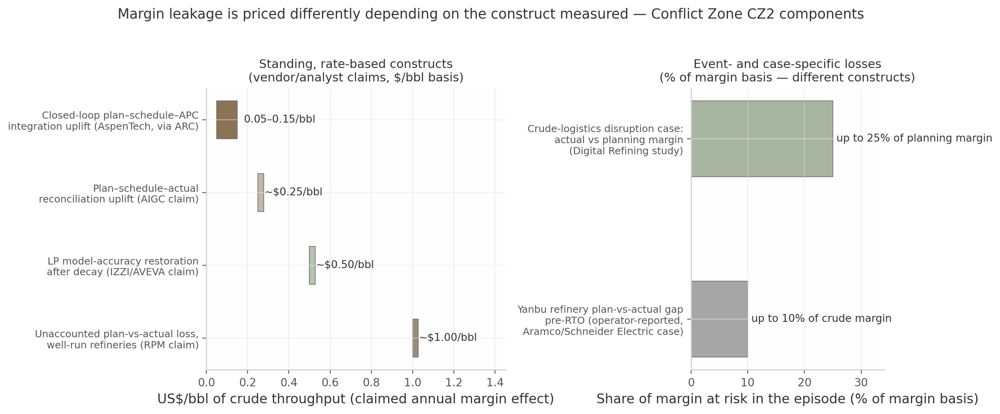

## 2. How Lookback and Backcasting Are Done Today

Downstream organizations do not lack retrospective machinery: margin is bridged monthly against benchmark cracks, reliability is benchmarked against a 40-year proprietary database, demurrage claims reconstruct port calls, and incident investigation is codified in federal regulation. Backcasting — in both senses used here, testing a completed period against the linear program (LP) that planned it and reasoning backward from a desired end state — exists as a named, staffed practice. The chapter's finding is asymmetry, not absence: the industry has industrialized the *measurement* of variance while leaving the *learning* from variance manual, person-dependent, and episodic. This chapter documents how each discipline is performed today; Chapter 3 examines why the learning intent rarely materializes.

### 2.1 Margin and performance retrospectives

Margin retrospectives run on four institutionalized mechanisms — the public margin-capture key performance indicator (KPI), the monthly controller bridge, external benchmarking, and LP plan-vs-actual backcasting — each quantifying a different slice of one question and only loosely reconciled.

#### 2.1.1 Margin capture rate as the public lookback KPI (Marathon 105% FY2025; Suncor 96% vs custom 5-2-2-1) and why practitioners demand decomposition (inventory lag 15–45 days/phantom profit, RINs, hedges, yield mix, basis)

The margin capture rate — realized gross margin divided by a company-specific benchmark index — is the industry's de-facto public lookback KPI. Marathon Petroleum reported 105% capture for full-year 2025 and 114% in the fourth quarter;[^d03-7^][^d03-8^] Suncor disclosed 96% against its custom "5-2-2-1 index," publishing the full reconciliation (US$39.50/bbl realized versus US$41.15/bbl index).[^d03-9^]

Practitioners warn the headline figure conceals what a lookback exists to reveal: capture rate "obscures the reasons for under-capture" and must be decomposed into inventory-method timing, yield mix versus benchmark, Renewable Identification Number (RIN) costs, hedge timing, and basis risk.[^d03-12^] The inventory effect alone is material — reported cost of goods reflects purchases made 15–45 days earlier, so rising crude prices manufacture "phantom profit" from old inventory; Suncor notes the lag can run "from several weeks to several months."[^d03-12^][^d03-9^] Capture above 100% is therefore ambiguous — execution excellence or index mismatch. The public KPI is a screen, not a lookback; the analytical content lives in the decomposition.

#### 2.1.2 The monthly controller bridge (crack spread → reported gross margin) and mandatory yield reconciliation; Solomon Fuels Study as dominant external retrospective (320+ refineries, ~850 staff-hours data effort, cause-level gap analysis)

The canonical internal artifact is the monthly controller bridge: a written, signed analysis, prepared "every single monthly close," reconciling benchmark crack spread to reported gross margin and quantifying each driver — inventory cost lag, RIN costs, hedge timing, yield mix, throughput variance, fixed-cost absorption.[^d03-12^] Its mandatory companion is yield reconciliation, comparing actual volumes against those implied by crude charged, budget yields, and inventory movements; variances above threshold must be investigated.[^d03-12^] The discipline is deliberately conservative — phantom profit is quantified every period and never permitted to drive capital-allocation or bonus decisions — and in tooling terms it remains a document-and-worksheet practice: Excel fed by enterprise resource planning (ERP) actuals.[^d03-12^][^d03-19^]

The dominant *external* retrospective is the Solomon Fuels Study: biennial, more than 320 refineries (~85% of global capacity), costing each participant about 850 staff-hours of data collection, and delivering a gap analysis bridging "cash margin to what is possible based on refinery configuration and location."[^d03-13^][^d03-14^][^d03-15^] Solomon states its analysis has evolved "to delve into the underlying causes of these gaps" — an explicit shift from variance reporting toward causal learning.[^d03-13^] Yet the capital-projects database run by Independent Project Analysis (IPA) shows what decades of variance reporting alone achieve: execution slip has remained "amazingly constant" since 2012 despite a decade of lessons-learned rhetoric.[^d03-24^] Measurement has been excellent and stable; learning has not followed.

#### 2.1.3 The LP plan-vs-actual gap ("margin leakage"): quantified components ($0.05–0.15/bbl closed-loop integration; ~$0.50/bbl LP decay persisting months-to-years; up to 25% of planning margin in crude-logistics case; up to 10% of crude margin at Yanbu) — presented as layered constructs per Conflict Zone CZ2

The retrospective's most consequential object is the gap between what the LP planned and what the refinery earned — the "margin leakage" between plan, schedule, and operations named in analyst coverage of AspenTech's closed-loop strategy.[^d03-4^] The gap is structural — LP models update on planning cycles while the plant runs continuously, so "by the time the next planning run catches up, the refinery has already been operating suboptimally for hours or days" — and attributing the money values follows "many approaches" with no settled standard.[^d03-1^][^d03-2^]

Public quantifications differ by an order of magnitude because they measure different constructs — the Conflict Zone CZ2 resolution treats them as layered components, not competing estimates (Table 2.1, Figure 2.1): (i) an *integration* layer — AspenTech claims $0.05–0.15/bbl from closed-loop plan–schedule–APC integration, the only independently relayed figure;[^d03-4^] (ii) a *reconciliation* layer — AIGC claims up to $0.25/bbl;[^d03-5^] (iii) a *model-decay* layer — an IZZI practitioner estimate at an AVEVA conference of ~$0.50/bbl (range $0.10–1.00 by crude-switch severity) from LP errors that "persist for months or even years";[^d03-3^][^d02-32^] and (iv) *event-driven* layers on percentage bases — actual margin fell "by up to 25%" versus plan in a Digital Refining crude-logistics case,[^d08-13^] and Saudi Aramco's Yanbu refinery reported up to 10% of crude margin before closing six percentage points via real-time optimization with 3–6-month payback (operator-reported).[^d02-27^] A vendor concept note adds >$1/bbl of unaccounted plan-vs-actual loss even at well-run refineries, while cautioning the gap is usually "an accounting measurement not an operational performance measurement."[^d02-29^]

Table 2.1 — The layered constructs of "margin leakage" (Conflict Zone CZ2 resolution)

| Layer | Construct and basis | Quantification | Source type and confidence |
|---|---|---|---|
| Integration uplift | Closed-loop plan–schedule–APC integration; $/bbl, annual | $0.05–0.15/bbl | AspenTech claim via ARC Advisory; unaudited [^d03-4^] |
| Reconciliation | Plan-vs-schedule-vs-actual closure; $/bbl, annual | up to $0.25/bbl | AIGC vendor claim; unaudited [^d03-5^] |
| LP model decay | Margin foregone from stale LP submodels; $/bbl, annual; persists months–years | ~$0.50/bbl (range $0.10–1.00) | IZZI/AVEVA practitioner estimate; mechanism corroborated, unaudited [^d03-3^][^d02-32^] |
| Event-driven: logistics | Actual vs planning margin erosion in a crude-logistics case; % of planning margin | up to 25% | Digital Refining case study; single-case construct [^d08-13^] |
| Event-driven: site program | Plan-vs-actual gap at Yanbu pre-RTO; % of crude margin; 6 pts closed | up to 10% | Operator-authored case (Aramco/Schneider Electric); medium-high confidence [^d02-27^] |
| Total unaccounted gap | Unexplained plan-vs-actual loss at well-run refineries; $/bbl, annual | >$1/bbl | Vendor concept note; upper-bound rhetoric [^d02-29^] |

The table's value lies in what it prevents: summing these figures into one "leakage total." The $/bbl numbers price standing, recoverable inefficiency against throughput; the percentages price episodic erosion against a margin that itself varies with the market, and the $/bbl layers overlap (reconciliation includes part of model decay). The credibility gradient matters: the smallest figure is the one an independent analyst relayed, the largest come from parties selling the remedy — the defensible planning range for the standing gap is $0.05–0.50/bbl, with events treated as separately investigated losses. The decisive qualifier is *persistence*: LP errors surviving "months or even years" is a knowledge failure, not an analytics failure — the variance was visible, and no one owned converting it into an updated model.[^d03-3^]

*Figure 2.1 — Components of the LP plan-vs-actual gap ("margin leakage"), separated by construct. Left: standing, rate-based constructs on a $/bbl-of-throughput basis — closed-loop integration uplift $0.05–0.15/bbl (AspenTech claim via ARC Advisory [^d03-4^]); plan–schedule–actual reconciliation up to $0.25/bbl (AIGC claim [^d03-5^]); LP model-accuracy restoration ~$0.50/bbl (IZZI/AVEVA claim [^d03-3^]); unaccounted loss at well-run refineries >$1/bbl (Refinery Profit Meter [^d02-29^]). Right: event- and case-specific losses on %-of-margin bases — up to 25% of planning margin (Digital Refining [^d08-13^]); up to 10% of crude margin pre-RTO at Aramco Yanbu (operator-reported [^d02-27^]). Figures are vendor or operator claims, not audited measurements; the two panels use different bases and are not additive; the $/bbl constructs overlap. Sources as cited; compiled 2026-07.*

Backcasting against the LP is already institutionalized at the frontier. Aramco's central LP organization performs "'back-casting' and issue[s] a monthly report on the LP gap along with required mitigations";[^d02-52^] Shell sites run Margin Variance Analysis and LP "post-mortem analysis" under a named LP-model custodian;[^d02-51^] and AVEVA's framework names "Prescriptive Performance (Plan vs. Actual)" as the after-operation layer of the Chapter 1 stack.[^d02-24^] The discipline exists as a profession, but practice is bimodal: a monthly, owned, reported routine at a minority of operators, annual-or-never model regeneration at the rest.[^d02-32^]

### 2.2 Operations and reliability lookbacks

Operations lookbacks are the most codified family — a proprietary benchmarking ledger, a regulatory investigation floor, and a mature indicator pyramid — and the one where failed learning is best documented, because the U.S. Chemical Safety Board (CSB) publishes the recurrences.

#### 2.2.1 Solomon RAM benchmarking on monetized downtime; MA ≥ OA ≥ on-stream availability stack (EDC-weighted); top-vs-bottom ≈ 7% of Plant Replacement Value; investor-grade availability KPIs (BP OA-basis vs Valero MA-basis)

The industry's downtime ledger is the Solomon Reliability & Maintenance (RAM) Study, built on *monetized* downtime: it evaluates "reliability (based on monetized downtime) and maintenance performance" against peers and sizes the best-to-worst spread at about 7% of Plant Replacement Value (PRV).[^d04-1^][^d04-2^] The database spans 1,500+ sites, 10,000 production units, and 54,000 turnarounds over 40 years; Solomon claims clients close ~10% of identified gaps with "returns exceeding 100 times the study cost" (vendor claim).[^d04-2^][^d04-3^][^d04-4^]

Every lost hour must be classified into a strict hierarchy — mechanical availability (MA) ≥ operational availability (OA) ≥ on-stream factor — before benchmarking (Table 2.2).[^d04-5^] Site roll-ups weight units by Equivalent Distillation Capacity (EDC) share, and turnaround downtime is annualized over the turnaround interval.[^d04-6^] Availability is investor-reported on different bases (Conflict Zone CZ6): BP reports the Solomon OA basis (96.1% in 2023) as "refining availability"; Valero reported 97.2% *mechanical* availability for 2021 alongside a Tier 1 process-safety-event rate of 0.05.[^d04-7^][^d04-8^][^d04-9^]

Table 2.2 — The Solomon availability stack as the operations-lookback ledger (with public reporting bases)

| Metric level | Downtime categories counted | Lookback treatment | Public reporting example |
|---|---|---|---|
| Mechanical availability (MA) | Turnarounds, breakdowns, slowdowns (<75% of nominal rate) | Maintenance-led ledger; highest of the three values | Valero: 97.2% MA (2021) [^d04-9^] |
| Operational availability (OA) | MA + technology (catalyst regeneration, decoking, operator error) + authority (regulatory inspection, testing) | Adds operations- and compliance-caused losses | BP: 96.1% OA (2023), reported as "refining availability" [^d04-7^][^d04-8^] |
| On-stream factor | OA + external causes (economic/market shutdowns, off-site incidents, domino effects) | Widest loss ledger; captures commercially driven downtime | Not typically reported externally |
| Roll-up and smoothing | Site values EDC-weighted; turnaround hours annualized over the interval | Unit-level ledger aggregated by economic weight; event timing smoothed | Solomon RAM peer comparison [^d04-5^][^d04-6^] |

Two consequences follow. First, "availability" is not one number: the same word masks three loss ledgers, so cross-company and cross-year comparisons are invalid until the basis is aligned — BP's OA and Valero's MA are both honestly reported and mutually incomparable, and utilization can exceed 100% of nameplate on yet another basis.[^d04-10^][^d04-11^] Second, the ledger's time conventions — EDC weighting and turnaround annualization — place the same physical event in different periods across the reliability, production, and financial ledgers by construction, which is why operations lookbacks so often disagree with finance on what a disruption "cost." The 7%-of-PRV prize is real, but harvesting it requires a cross-ledger reconciliation most organizations perform manually, if at all.

#### 2.2.2 Incident investigation and RCA practice: OSHA PSM compliance anchor (no RCA mandate; 48h/team/5-yr retention), EPA 2024 RMP root-cause mandate and AFPM resistance; method pluralism (5-Why → TapRooT/Apollo/ICAM) and CCPS's multiple-root-cause discipline

Incident lookbacks are anchored in compliance rather than learning. OSHA's process safety management standard requires investigating any incident that "resulted in or could reasonably have resulted in a catastrophic release" — near misses included — within 48 hours, by a team including a knowledgeable person, with a written report, a resolution system, and five-year retention.[^d04-22^] OSHA concedes in its modernization docket that the standard "does not require employers to identify the root cause of the incident," estimating that adding root-cause analysis (RCA) would raise investigation time ~50%.[^d04-23^] Regulation is splitting on this point: the Environmental Protection Agency's 2024 Risk Management Program rule mandates root-cause investigations for facilities with prior accident history, several state refinery programs already require RCA, and the American Fuel & Petrochemical Manufacturers (AFPM) objects to "mandating a specific root-cause analysis methodology… even for those incidents that pose little potential risk."[^d04-25^][^d04-26^][^d04-24^] The result is a two-class investigation system in which lookback *depth* is heterogeneous by design.

Methods compound the heterogeneity: practice spans 5-Why and fishbone at the frontline to structured methods — TapRooT, Apollo, the Incident Cause Analysis Method (ICAM), Tripod Beta.[^d04-40^][^d04-41^] The default, 5-Why, is criticized for single-cause thinking and confirmation bias;[^d04-38^][^d04-44^] the Center for Chemical Process Safety (CCPS) states the counter-discipline — a root cause is "a fundamental, underlying, system-related reason… that identifies a correctable failure(s) in management systems," and there is "typically more than one root cause for every process safety incident."[^d04-33^][^d04-35^]

The CSB record shows what shallow lookbacks cost. Texas City: eight prior blowdown-drum releases (1994–2004) "were not properly investigated, and appropriate corrective actions were not implemented."[^d04-47^] Chevron Richmond: sulfidation-susceptible pipe had been flagged by the company's own metallurgists "as far back as 2002"; CSB reframed the issue as "not corrosion, but how to make effective corporate decisions."[^d04-51^][^d04-52^] BP-Husky Toledo: a near-identical 2019 near-miss was investigated but produced no action items — "a missed opportunity" before the fatal 2022 fire.[^d04-55^] The pattern for COMPANY is unambiguous: the investigations happened; retention, indexing, and reuse of their findings did not.

#### 2.2.3 Lookback data plumbing: historian event frames, ISA-18.2 alarm KPIs (Toledo: 3,712 alarms/12h), LIMS quality records, production accounting mass balances — rarely fused, on different clocks

The raw material of operations lookbacks lives in four systems answering four questions on four clocks. Process historians provide the forensic substrate: event frames "automatically bookmark important events" against thresholds, store context, and support bulk comparison.[^d04-60^] Alarm systems carry their own retrospective discipline under the International Society of Automation's ISA-18.2 standard: below six alarms per operator-hour is acceptable; more than ten in ten minutes is a flood.[^d04-58^][^d04-59^] Toledo shows both the failure and the forensic value — operators faced 3,712 alarms in the ~12 hours before the explosion (about 309/hour, roughly 50 times the acceptable rate), and those logs became the post-incident evidence.[^d04-55^] Laboratory information management systems (LIMS) hold the quality lookback: one mid-sized refiner runs 5,500–6,500 samples and ~30,000 tests monthly, flagging excursions.[^d04-62^][^d04-63^] Production accounting closes the mass balance monthly and "detect[s] early deviations from the plan."[^d04-65^]

These systems are rarely fused: process data arrive in seconds, LIMS results per sample, computerized maintenance management system (CMMS) work orders over days, financial actuals monthly — and the benchmark ledger annualizes turnaround downtime.[^d04-6^] Coding is unstable ("EVERYONE uses the CMMS/EAM differently"; inconsistent boundary and failure-mode classification can shift measured failure rates ~40% despite ISO 14224).[^d04-16^][^d04-14^] Emerson names the commercial-seam consequence: comparing actual to expected performance and "'back-cast[ing]' the LP models… can be complex and time consuming."[^d04-66^] The cost of a six-hour trip is therefore estimated, not measured — and the estimate depends on which ledger the analyst queries.

#### 2.2.4 The operational→commercial bridge: downtime monetization anchors ($1.2–3M/day FCC turnaround overrun; KBC per-unit values; DOE shutdown ledger; PES $750M loss) — mostly manual

Monetizing downtime is the least standardized step, with anchors spanning a 100-fold range by basis (Conflict Zone CZ4). The defensible primary basis is margin on lost conversion: the U.S. Energy Information Administration documented Valero's St. Charles fluid catalytic cracking (FCC) turnaround at $1.2–3.0 million of exposure per day beyond schedule.[^d04-67^] KBC's case library prices lost FCC capacity at $13 per barrel-per-day and whole-refinery capacity at $1.34 per barrel-per-day.[^d04-65^] The Department of Energy's event ledger logged ~1,700 U.S. refinery shutdowns in 2009–2012 (46% mechanical), yet reported lost-opportunity submissions totaled just over $32 million — best read as under-reporting.[^d04-68^] At the catastrophic tail: Philadelphia Energy Solutions' ~$750 million 2019 loss ended in closure and bankruptcy, and refining accounts for more than a third of Marsh's 100 largest hydrocarbon losses (1974–2019).[^d04-53^][^d04-73^] Vendor "$500,000+ per hour" claims should be treated as upper-bound rhetoric on a revenue basis.[^d04-71^]

Even with sound unit values, the bridge is mostly manual: losses must be valued at *time-varying* margin (ledgers use static factors while refiners "economically optimize" by market window),[^d04-74^] unplanned constraints force "spot purchases or sales at distressed prices" booked in trading systems,[^d04-66^] and no published evidence shows a standard automated join across the three ledgers.[^d04-65^]

Sustainability and emissions lookbacks ride on the same plumbing and inherit its weaknesses. Energy is ~60% of European refinery cash operating costs (a widely cited Concawe figure, older but standard) and fired heaters 74–78% of refinery energy — energy-efficiency retrospectives are simultaneously margin and Scope 1 emissions retrospectives.[^d01-33^][^d01-34^] Refining emits ~1 GtCO₂e per year; decarbonization charters now require public progress reporting (zero routine flaring by 2030), and emissions are entering the planning stack itself (BP's "commercial CO2 emission modeling"; LP-software emissions monitoring).[^d06-9^][^d06-52^][^d02-21^][^d02-75^] The retrospective apparatus for emissions — flaring events, efficiency drift, target tracking — remains scattered across historian tags, energy reports, and regulatory filings, with no equivalent of the margin bridge.

### 2.3 Supply chain, logistics, and commercial lookbacks

Logistics lookbacks mirror operations lookbacks inversely: strong transaction systems, weak retrospective discipline. Events are captured where systems auto-record them (terminal automation, batch tracking) and reconstructed from documents and memory where they do not (port calls, demurrage, on-time-in-full performance).

#### 2.3.1 Inventory/working-capital reviews (days of supply, DIO/CCC; $200B trapped cash estimate); stockouts visible mainly in crises (UK 2021; OR Tambo)

The canonical inventory KPI is days of supply — stocks divided by trailing four-week average demand — tracked weekly from EIA data against five-year seasonal ranges, while public oversight lags two to three months.[^d05-869^][^d05-868^][^d05-876^] Working-capital review is institutionalized as a board discipline: EY benchmarks days inventory outstanding (DIO) and the cash conversion cycle (CCC), found downstream CCC deteriorating while other segments improved, and sized trapped cash at about US$200 billion on U.S. balance sheets (CAD$230 billion across North America).[^d05-760^][^d05-883^] The constraint is equally quantified: carrying costs run 20–30% of inventory value per year, yet cutting too far drives stockouts and expedited freight that "often exceed the savings."[^d05-885^][^d05-887^]

Stockouts themselves are measured episodically, in crises. In the 2021 UK crisis, BP ran out of main grades at nearly a third of its stations and at least half of non-motorway stations were dry; the remedy was ad hoc suspension of competition law.[^d05-511^] South Africa's OR Tambo airport lost fuel to 54 flights from a single stuck valve in December 2024 — after authorities had known of the storage inadequacies "for over a decade" — and a refinery fire weeks later cut 72% of regional supply.[^d05-790^][^d05-786^][^d05-793^] Inventory *levels* are watched weekly; inventory *failures* are learned from only when they become news.

#### 2.3.2 Demurrage and port/rail lookbacks: 72-hr SHINC laytime norms, claims from "PDFs and memory", berth/jetty root causes ($2M/yr refiner case), rail demurrage contention under PSR

Marine demurrage mechanics are standardized; the lookback discipline is not. Tanker practice allows 72 hours of laytime (Sundays and holidays included) before demurrage accrues as liquidated damages, with claims typically time-barred at 90 days.[^d05-767^][^d05-768^] Reconstruction still runs on documents and recollection: "port events are still, in most operations, captured manually and transmitted as PDFs... weeks may have passed, context is lost."[^d05-768^] Practitioners insist "the leverage is upstream"; AI-assisted claims vendors claim 10–20% cost reductions (vendor-reported).[^d05-768^][^d05-773^] Root causes, when reconstructed, are mundane and recurring: one refiner documented $2 million per year of demurrage from berth-occupancy conflicts, limited loading rates, product unavailability, and early arrivals — and jetty scheduling separately forced sub-optimal refinery operation at "large," unquantified cost.[^d05-779^] Demurrage is also asymmetric — one party's cost is another's revenue: Stolt-Nielsen booked $71.3 million of demurrage and ancillary revenue in 2022.[^d05-Stolt^]

Rail demurrage is structurally contentious: under precision scheduled railroading (PSR), carriers shortened free time and issued invoices shippers challenged as demonstrably wrong, prompting the Surface Transportation Board's Demurrage Billing Requirements rule and a shipper petition for "reciprocal demurrage" when railroads hold private cars beyond 72 hours.[^d05-772^][^d05-769^] Berth platforms now market "audit-ready," time-stamped logs of every vessel call in response.[^d05-784^] The lesson: demurrage lookbacks are a data-capture problem masquerading as a negotiation problem — whoever owns the time-stamped record owns the claim.

#### 2.3.3 OTIF and network utilization: definition fragmentation (97% internal vs 82% customer = $800k penalties); pipeline allocation/interface losses ($50k/interface; automation cuts 40–75%); terminal occupancy reporting (Vopak 84–94%)

On-time-in-full (OTIF) performance suffers definition fragmentation before performance shortfalls: there is "no all-encompassing standard definition" — on-time can mean customer-requested or supplier-promised dates, slots or windows; in-full can be measured at order, line, or case level.[^d09-16^] One documented supplier "achieved 97% OTIF by internal metrics but only 82% according to their largest customer, resulting in $800,000 in unexpected penalties."[^d09-17^] Generic practice is mature (95–98% targets, root-cause reason codes), but fuel-specific public OTIF data is scarce, so reliability surfaces mainly in crisis metrics: stations dry, flights cancelled, hours-of-service waivers issued.[^d05-839^][^d05-121^][^d05-859^]

Pipeline and terminal lookbacks are better instrumented. U.S. trunk pipelines ration rather than optimize capacity: Colonial's tariff runs monthly nominations into a "Cap Freeze," allocates by calculated cycle historical allocation with a 44-cent/bbl capacity fee, and enforces 25,000-barrel mainline batch minimums.[^d05-794^][^d05-795^] Interface (transmix) losses are quantified and material: up to $50,000 per interface and "many millions" per operator per year; a measurement vendor and Phillips 66 claim industry losses could be halved.[^d05-834^][^d05-837^][^d05-845^] Interfaces run 500–2,000 barrels per 100 miles; automation cuts interface losses 40–75% by vendor claims, yet documented "over-protecting" of batch cuts persists as the rational response to missing real-time measurement.[^d05-831^][^d05-834^] Terminals report occupancy at board level — Vopak's ranged 84–94% across 2018–2024 — though swings track market structure (contango fills tanks) as much as operations.[^d05-814^][^d05-822^][^d05-823^] Terminal automation reconciles book-versus-physical inventory and auto-generates close-out variance reports,[^d05-850^][^d05-857^] while secondary distribution remains a documented gap (~16% excess mileage in one academic routing study).[^d05-235^]

#### 2.3.4 Commercial lookbacks: pricing post-mortems tool-led (Kalibrate/PDI), channel/customer/netback profitability redesigns; campaign ROI attribution "a constant struggle"; ETRM post-trade retrospective tooling absent in public evidence

Commercial retrospectives are tool-led but shallow. Fuel-pricing platforms market retrospective analytics directly — Kalibrate invites users to "analyze past pricing decisions to understand their impact on profitability" through 50-plus reports and elasticity models — and PDI's own guidance criticizes the spreadsheet status quo.[^d03-16^][^d03-19^] Channel-, customer-, and netback-level lookbacks appear mainly as *consulting demand*, itself diagnostic: refiners hire firms to "redesign… commercial reporting to show true channel profitability, customer profitability, and regional netbacks" (CVR Energy), to run "branded wholesale channel profitability analysis" (Valero), and to deliver commercial-excellence programs plus capture-rate diagnostics (Phillips 66).[^d03-36^][^d03-37^][^d03-38^] Structured post-mortems are weakest: campaign ROI attribution is "a constant struggle," with 43% of retailers citing ROI proof as a top challenge.[^d03-39^][^d03-40^] And no public evidence of energy-trading-and-risk-management (ETRM) post-trade retrospective tooling exists in this study's research base: deal capture, risk, and profit-and-loss reporting are documented, deal-level *retrospective* attribution is not — likely proprietary.[^d02-44^][^d02-45^]

Post-audit discipline, where institutionalized, is demonstrably non-influential: post-completion audits run only ~36% of the time and "did not affect future capital budgeting decisions";[^d03-22^] turnaround teams "start from scratch" because lessons "are not systematically captured."[^d03-31^] The implication: tools generate variance artifacts in abundance; the governed conversion of artifacts into updated pricing rules, contract structures, and allocation policies is what is missing.

### 2.4 Backcasting practice

Backcasting in the strategic sense — reasoning backward from a desired future to present actions — is the sector's primary instrument for net-zero pathways, portfolio reshaping, and long-range capital logic. Its methods are mature; its *embedding* into plans and budgets is the documented weak point.

#### 2.4.1 Method origins (Robinson 1982; Holmberg; Quist–Vergragt) and the canonical weakness at the embedding/implementation step; forecasting vs backcasting complementarity

Backcasting originated as a deliberate alternative to forecasting: Robinson (1982), building on Lovins' 1977 "soft energy paths," proposed designing strategies "backwards, from the future to the present."[^d06-1^][^d06-3^] Holmberg (1998) formalized it in The Natural Step's four-step sequence, and Quist and Vergragt (2006) extended it into a five-step participatory method whose final step is *embedding and implementation*.[^d06-1^][^d06-5^]

The canonical weakness is known with unusual precision: Quist, Thissen, and Vergragt's five-to-ten-year follow-up of Dutch participatory backcasting found substantial follow-up "but that is not always the case," and mostly at niche level;[^d06-7^] Geurs and van Wee identified a generic "lack of attention for the time-paths for the events between the target years and the base."[^d06-6^] The failure sits exactly at the fifth step — transfer of the pathway into owned, sequenced, resourced action. Forecasting and backcasting remain complements — forecasting asks "where will our current path take us?", backcasting "what must we do now to reach our desired destination?" — forecasting alone leads to the "Incumbent's Trap," ungrounded backcasting to goals disconnected from today's business.[^d06-4^]

#### 2.4.2 Refinery decarbonization backcasts: technology-stack consensus (efficiency→electrification→low-carbon H₂→CCS→offsets); OGCI/Wood >65% by 2040 vs WEF/IEA CCUS-primary (+7–9% cost) — genuine field disagreement (CZ5)

Refinery decarbonization backcasts share one architecture: a 2050 net-zero (Scope 1 and 2) end state reached through a technology stack in rough marginal-cost order — energy efficiency, electrification of boilers and drives, low-carbon hydrogen (blue first, green later), carbon capture and storage (CCS) on FCC units, reformers, and fired heaters, then residual offsets.[^d06-9^][^d06-13^] On *sequencing* the field genuinely disagrees (Conflict Zone CZ5), and the disagreement is assumption-driven. The Oil and Gas Climate Initiative's Wood-led roadmap (2023) leads with electrification: over 65% of a refinery's CO₂ can be cut by 2040 *if* low-carbon power is available, with electric boilers abating under $150 per tonne against ~$500 per tonne for furnace electrification.[^d06-9^] The World Economic Forum/IEA Net-Zero Industry Tracker instead names carbon capture, utilization and storage (CCUS) "the primary decarbonization pathway for refineries" and estimates decarbonization raises refining costs by 7–9%.[^d06-12^] The two reconcile only site by site — lead technology depends on regional power prices and availability, CO₂ transport-and-storage access, and carbon price — which is why a backcast's assumptions must be recorded, not just its conclusions.[^d06-12^][^d06-13^]

Site-level practice shows what a refinery backcast looks like: a Worley two-phase study screened 42 abatement options down to 20 and — unusually — embedded re-evaluation triggers ("at appropriate times as specified in the roadmap timeline").[^d06-11^] CATF's archetypes make the closure logic explicit: underutilization is not financially feasible, so some refineries shut while survivors run full and decarbonize.[^d06-13^]

#### 2.4.3 Corporate instruments: exploratory scenarios (Shell tradition; Horizon normative) vs laddered targets, with Shell's own firewall ("not expressions of strategy"); portfolio backcasting margin/policy-led (IEA Oil 2025 closures; conversions: Rodeo, Martinez, Vertex reversal)

Majors build long-term pathways from two loosely coupled instruments. The first is exploratory scenario planning — Shell's tradition since Pierre Wack's 1971–72 scenarios, designed to produce "prepared minds" rather than predictions.[^d06-26^][^d06-27^] Normative backcasting has entered that canon: in Shell's 2025 Energy Security Scenarios, Archipelagos and Surge are exploratory while Horizon is explicitly normative, engineered to reach net-zero by 2050 — though even Horizon delivers only ~7% below-2010 CO₂ by 2030, conceding the near-term gap inside the vision itself.[^d06-28^][^d06-29^][^d06-56^] Shell maintains an explicit firewall: scenarios are "not forecasts, nor are they expressions of Shell's strategy or business plan."[^d06-57^] The second instrument is the laddered target — Shell's net-carbon-intensity steps to 100% by 2050; TotalEnergies' 15%/35%/60%+ ladder.[^d06-31^][^d06-37^]

Portfolio backcasting — which assets to close, convert, or keep — is happening at scale but is margin- and policy-led, not vision-led. IEA's *Oil 2025* projects refined-product demand peaking in 2027 at 86.3 million barrels per day, with 4.2 mb/d of new capacity against 1.6 mb/d of announced closures to 2030: "more capacity will have to shut, with high-cost plants in Europe and on the US West Coast expected to be hardest hit."[^d06-23^] Wood Mackenzie expects Europe to lose up to 5 mb/d by 2050 and half of European refineries to show negative net cash margins by the early 2030s.[^d06-25^] Conversions are the flagship execution cases — Phillips 66 Rodeo (commercial renewable-diesel operation from April 2024) and Marathon/Neste's Martinez (ramping toward 730 million gallons per year) — but they are policy-credit-dependent and reversible: Rodeo subsequently ran at reduced rates on weak margins, and Vertex Energy *reverted* its converted Mobile, Alabama unit to fossil in 2024.[^d06-42^][^d06-41^][^d06-47^][^d06-60^] Portfolio behavior matches backcast logic, but the cited drivers are margins, carbon costs, and credits — portfolio backcasting today is implicit and price-led, without published intermediate milestones.[^d06-23^][^d06-25^]

#### 2.4.4 Connection to capital planning and CI: clean-energy capex ~2.5% vs ~50% NZE benchmark; TPI 98% misalignment; milestone fragility (Shell 2035 retired; BP abandoned); episodic updates via investor votes vs DAPP signposts/triggers

The weakest link is the interface with capital planning. IEA calculates the industry invested ~$20 billion in clean energy in 2022 — 2.5% of total capex — against a net-zero-consistent benchmark of ~50% by 2030; the Transition Pathway Initiative finds 98% of oil and gas companies do not align future capex with decarbonization goals and only 2% are 1.5°C-aligned.[^d06-24^][^d06-39^]

Interim milestones prove fragile precisely when they enter the planning horizon. Shell "retired" its 45% 2035 net-carbon-intensity target in 2024 — just before it would have entered the ten-year planning window — and weakened 2030 from 20% to 15–20%; its prior legal disclaimer stated that Shell's operating plans "cannot reflect our 2050 net-zero emissions target and 2035 NCI target, as these targets are currently outside our planning period."[^d06-32^][^d06-33^] BP moved its 2030 production-cut target from 40% to 25%, then abandoned it; Carbon Tracker notes several majors hold 2050 goals with "no interim targets," and one investor analysis calculates the weakening implies decarbonizing "up to five times faster between 2030 and 2050."[^d06-34^][^d06-38^][^d06-36^] Pathway revision is episodic and investor-driven — "climate ambitions follow climate votes" — rather than continuous and evidence-driven.[^d06-33^]

A corrective template exists and is standard elsewhere: Dynamic Adaptive Policy Pathways (DAPP) equip plans with *signposts* (monitored variables testing whether the plan still meets its conditions) and *triggers* (critical values firing pre-agreed actions); DAPP is routine in climate-adaptation planning but largely absent from refinery roadmaps, the Worley and OGCI staged studies being exceptions.[^d06-48^][^d06-49^][^d06-11^][^d06-10^] The implication for COMPANY: a backcast pathway without owned milestones inside the current planning period, monitored signposts, and a scheduled re-baselining cadence is a publication, not a plan — and the record shows such publications are disposable.

Table 2.3 — Backcasting instruments: question answered, horizon/cadence, observed practice, and documented weakness

| Instrument | Question answered | Horizon/cadence | Observed practice | Documented weakness |
|---|---|---|---|---|
| Exploratory scenarios (Shell Energy Security Scenarios) | What futures could plausibly arrive, and what would prepare us for them? | Multi-decadal (to 2050 and beyond); scenario suite refreshed periodically (2025 ESS: Archipelagos, Surge) | Shell tradition since Pierre Wack's 1971–72 scenarios, built to produce "prepared minds" rather than predictions [^d06-26^][^d06-29^] | Scenario–strategy firewall: scenarios are "not forecasts, nor are they expressions of Shell's strategy or business plan" — insight is quarantined from owned plans [^d06-57^] |
| Normative backcast scenario (Horizon) | What must happen to reach a chosen end state (net-zero by 2050)? | Engineered backward from the 2050 end state | Horizon in Shell's 2025 ESS is explicitly normative — yet delivers only ~7% below-2010 CO₂ by 2030, conceding the near-term gap inside the vision itself [^d06-28^] | The vision concedes its own near-term shortfall and still sits behind the scenario–strategy firewall — a backcast nobody is obliged to execute |
| Laddered corporate targets (Shell NCI; TotalEnergies) | What interim steps ladder from today to the 2050 goal? | Stepped targets to 2050 (Shell net-carbon-intensity steps to 100%; TotalEnergies 15%/35%/60%+ ladder) | Public milestone ladders at the majors [^d06-31^][^d06-37^] | Milestone retirement at the planning-window boundary — Shell "retired" its 2035 NCI target in 2024 just before it entered the ten-year window and weakened 2030; revision is episodic and investor-vote-driven ("climate ambitions follow climate votes") [^d06-32^][^d06-33^] |
| Technology-stack roadmaps (OGCI/Wood; WEF/IEA) | Which abatement technologies, in what sequence, deliver the end state? | Technology stacks in rough marginal-cost order to 2040/2050 | Genuine, assumption-driven disagreement (CZ5): electrification-led (>65% of refinery CO₂ cut by 2040, OGCI/Wood) vs CCUS-primary at +7–9% cost (WEF/IEA) [^d06-9^][^d06-12^] | Sequencing reconciles only site by site; assumptions are rarely recorded with the conclusions; roadmaps largely lack monitored signposts |
| Portfolio conversion/closure decisions (IEA Oil 2025; Rodeo, Martinez, Vertex) | Which assets to close, convert, or keep on the pathway? | Demand peak 2027; closure need to 2030; 2050 endgame | Executing at scale but margin-, policy-, and credit-led: Rodeo commercial from April 2024, Martinez ramping, Vertex reverted its converted unit to fossil in 2024 [^d06-23^][^d06-42^][^d06-47^] | Implicit, price-led backcasting — no published intermediate milestones, and decisions reverse when credits weaken |
| Adaptive-pathway signposts/triggers (DAPP) | Is the plan still valid, and what fires the pre-agreed response? | Continuous monitoring of signposts against critical trigger values | Routine in climate-adaptation planning; refinery exceptions are the Worley and OGCI staged studies with embedded re-evaluation triggers [^d06-48^][^d06-49^][^d06-11^] | Absence of signposts — largely missing from refinery roadmaps, so pathways drift without a monitored re-baselining cadence |

Read across the rows, Table 2.3 shows a complete instrument set with an incomplete chain of custody. Each instrument answers its own question on its own cadence — multi-decadal scenarios, stepped targets to 2050, technology stacks to 2040, portfolio calls to 2030, continuous signposts — but no instrument hands its output to the next as an owned input. Scenarios are firewalled from strategy; targets are retired at exactly the moment they enter the window where capital is allocated; roadmaps record conclusions rather than assumptions; portfolio decisions execute backcast logic while citing prices, so the pathway narrative cannot claim causal force; and the one instrument that would monitor the pathway itself — DAPP's signposts and triggers — is the one the sector has not adopted. The pattern is the strategic analogue of this chapter's operational finding: variance and vision are both produced, sometimes published, but the conversion of pathway intelligence into owned milestones inside the current planning period remains episodic, reversible, and investor-driven. For COMPANY, instrument sophistication is not the constraint; the binding gap is the interface where a backcast becomes a budget.

#### 2.4.5 Two senses of "backcasting" in refining practice — a distinction the learning system must serve

The word "backcasting" carries two distinct meanings in refining, and a learning system that conflates them will misclassify its most valuable artifacts. The first is the strategic futures method of §2.4.1 — Robinson's line of reasoning backward from a desired end state — and needs no restatement here. The second is native to refinery economics and largely invisible outside it: comparing actual performance against the *best-possible* performance achievable under the same realized conditions — the prices, demand, and equipment availability that actually occurred — computed by re-running the LP model as a counterfactual optimum. McKinsey states the distinction sharply: an effective backcasting process "compares the actual performance to the best possible performance under the same conditions," whereas most lookback machinery merely "explain[s] deviations between planned and actual performance."[^n08^]

The distinction is not semantic trivia, because the two comparisons can return opposite verdicts on the same period. Margin-variance analysis — actual versus original plan — can show a favorable variance while the operation still leaked value against the achievable optimum: the plan itself was set weeks earlier, on different prices, and beating it says nothing about what the realized market would have paid for a better-run month. McKinsey reports that many organizations operate only the variance test, with regular backcasting and historic performance reviews "often missing or overlooked."[^n08^] The documented best-practice instance of the operational sense is the one already described in this chapter: Aramco's central LP organization, which performs monthly back-casting and issues a report on the LP gap with required mitigations (§2.1.3).[^d02-52^]

The consequence for knowledge management is taxonomic, and Chapter 5 develops it: the two senses generate different artifact types — pathway assumptions and milestone rationales on one side, counterfactual gap analyses carrying model-version context on the other — which a competitive-intelligence (CI) knowledge taxonomy must capture as distinct asset classes with distinct context fields and owners (§5.4).

### 2.5 Tooling and data used today — and the intended learning loop

#### 2.5.1 The full tooling map (BI dashboards, LP/APS, S&OP, historians, ERP, CMMS, TMS/TAS, demand forecasting, pricing engines) and how companies conceptually intend lookback/backcasting to improve future decisions (PDCA intent vs practice, forward reference to §3)

Every practice documented in this chapter runs on a recognizable toolchain, mapped in Table 2.4 by value-chain layer. Two properties stand out: the planning layer is an oligopoly of four linear-programming suites feeding advanced planning and scheduling (APS) tools,[^d02-1^][^d02-4^] and the frontier is moving — machine-learning demand forecasting now tests under 10% mean absolute percentage error at a 12-month horizon[^d02-43^] — yet spreadsheet bridges persist across every layer, an acknowledged maturity floor.[^d02-12^][^d03-19^]

Table 2.4 — Lookback types: cadence, artifact, tooling, and known weakness

| Value-chain layer | Tool class | Representative systems (evidence) | Primary lookback artifact | Cadence / clock | Known weakness |
|---|---|---|---|---|---|
| Strategic / portfolio | Scenario suites, capital-project databases | Shell Energy Security Scenarios [^d06-29^]; IPA benchmarks [^d03-23^] | Scenario publications; target ladders; post-completion audits | Multi-decadal horizons; pathway revision episodic and investor-vote-driven [^d06-33^] | Scenario–strategy firewall — scenarios are "not forecasts, nor are they expressions of Shell's strategy or business plan"; milestones retired at the planning-window boundary; post-audits change no decisions [^d06-57^][^d06-32^][^d03-22^] |
| Planning (monthly/weekly) | LP planning; S&OP/IBP | Aspen PIMS, Honeywell RPMS, Haverly GRTMPS, AVEVA USC [^d02-1^][^d02-4^]; aspenONE SCM [^d02-63^] | LP plan; monthly back-casting / LP-gap report (Aramco [^d02-52^]); Margin Variance Analysis (Shell [^d02-51^]) | Monthly/weekly LP cycles; monthly back-casting / LP-gap report at frontier operators [^d02-52^] | Plan-vs-actual attribution follows "many approaches" with no settled standard; published leakage values are vendor constructs, unaudited [^d03-2^][^d03-4^][^d03-5^] |
| Scheduling & blending | Refinery schedulers, blend optimizers | Aspen Petroleum Scheduler/MBO; AVEVA USC Schedule; Honeywell BLEND [^d02-7^][^d02-25^][^d02-14^] | Plan-vs-schedule-vs-actual reconciliations [^d02-25^] | Runs between the monthly LP cycle and the continuous plant — suboptimal for "hours or days" before the next planning run [^d03-1^] | Monetization bridge to margin is manual — static ledger factors vs time-varying margin; no automated join across the three ledgers [^d04-74^][^d04-65^] |
| Operations (real time) | Historians, alarm systems, LIMS, APC, CMMS | PI System event frames [^d04-60^]; ISA-18.2 alarm KPIs [^d04-58^]; LabWare-class LIMS [^d04-62^]; CMMS work-order history [^d04-16^] | Event frames; alarm-flood analyses; quality excursions; RCA reports | Process data in seconds, LIMS per sample, CMMS over days; RCA event-driven (48-hour start) [^d04-60^][^d04-22^] | Coding instability — "EVERYONE uses the CMMS/EAM differently"; boundary/failure-mode coding shifts measured failure rates ~40% despite ISO 14224 [^d04-16^][^d04-14^] |
| Production accounting (close) | Mass-balance reconciliation, yield accounting, BI dashboards | KBC Visual Mesa-class systems [^d04-65^]; ERP actuals + Excel bridges [^d03-12^] | Yield reconciliation; controller bridge [^d03-12^] | Monthly close — bridge and yield reconciliation "every single monthly close" [^d03-12^] | Capture-rate ambiguity (headline obscures phantom profit, RINs, hedges, mix, basis); Excel/document-based practice fed by ERP actuals [^d03-12^][^d03-19^] |
| Logistics (marine, pipeline, terminal, truck) | TAS/TMS, berth schedulers, batch tracking, wetstock | DTN/Varec TAS [^d05-850^][^d05-857^]; Dropboard/MISMARINE [^d05-440^][^d05-784^]; Emerson PipelineManager [^d05-108^] | Close-out variance reports; time-stamped port-call records; scheduled-vs-actual batch histories; demurrage files | Weekly EIA days-of-supply tracking; port-call and demurrage lookbacks event-driven (claims time-barred at 90 days) [^d05-869^][^d05-768^] | "PDFs and memory" — port events captured manually, context lost; OTIF definition fragmentation (97% internal vs 82% customer) [^d05-768^][^d09-16^][^d09-17^] |
| Commercial (demand, pricing, trading) | Demand forecasting, pricing engines, ETRM | ML demand models [^d02-43^]; Kalibrate [^d03-16^]; ION Endur-class ETRM [^d02-44^] | Price-decision reviews; channel/customer profitability reports; (no documented post-trade retrospective tool) | Financial actuals monthly; price and campaign reviews per event [^d04-6^] | Campaign ROI attribution "a constant struggle"; no ETRM post-trade retrospective tool in public evidence [^d03-39^][^d02-44^] |
| External benchmarks | Benchmark studies | Solomon Fuels/RAM [^d03-13^][^d04-1^]; IPA [^d03-23^] | Monetized gap-to-peer analyses | Biennial (Solomon Fuels Study); turnaround downtime annualized over the interval [^d03-13^][^d04-6^] | ~850 staff-hours of manual data collection per participant; gap-closure returns vendor-reported [^d03-14^][^d04-4^] |

The map's most important property is what it does *not* contain: no layer owns the conversion of a lookback finding into an updated model, policy, or constraint. Each tool produces its variance artifact on its own clock and keys; the joins between layers — historian to financial ledger, RCA report to LP vector, demurrage claim to chartering policy — are performed by people, in spreadsheets, episodically.[^d02-12^][^d04-66^] This is why "closed-loop" marketing coexists with manual reality (Conflict Zone CZ7): frontier sites run genuine closed-loop integration while the baseline runs on documents, and both are true of the same industry at once. The two added columns sharpen the same diagnosis from different angles. The cadence column shows every layer keeping its own time — seconds in the historian, weekly in the market, monthly at the close, biennial in the benchmark — so two lookbacks rarely describe the same period, and every cross-ledger join must reconcile clocks before it can reconcile numbers. The weakness column shows the failure modes differ in kind — KPI ambiguity, unaudited vendor constructs, unstable coding, manual monetization, document-and-memory capture, fragmented definitions, absent tooling — which is why no single system purchase closes the loop. For COMPANY, the tooling question is secondary to the knowledge question — the artifacts exist; their context and their *consequences* are what evaporate.

The intended learning loop is nonetheless explicit across the evidence — the plan–do–check–act (PDCA) cycle in industry artifacts. *Plan:* the LP and network models set the optimal course; backcasts define the destination. *Do:* schedulers, operators, and traders execute, generating events. *Check:* the controller bridge, yield reconciliation, capture decomposition, Solomon gaps, alarm and quality KPIs, demurrage files, and campaign reviews quantify what happened against intention. *Act:* findings are supposed to update LP yield vectors and constraints, safety stocks, maintenance strategies, pricing rules, contracts, and backcast milestones. Doctrine states the intent plainly: CCPS frames "Learn from Experience" as one of four accident-prevention pillars;[^d04-32^] lean practice supplies the A3 format — PDCA on one shareable page — so analysis becomes a reusable artifact;[^d04-90^] and the value-chain framework draws "Prescriptive Performance (Plan vs. Actual)" as the layer that closes the stack back into planning.[^d02-24^] Observed practice is that the loop is open at nearly every link — post-audits that change no decisions,[^d03-22^] slip "amazingly constant" for a decade,[^d03-24^] turnaround lessons "not systematically captured,"[^d03-31^] investigated near-misses producing no action items before fatal repeats,[^d04-55^] LP errors persisting "months or even years,"[^d03-3^] and milestones retired at the planning-window boundary.[^d06-32^] Chapter 3 examines the eight systemic gaps that keep the loop open.
