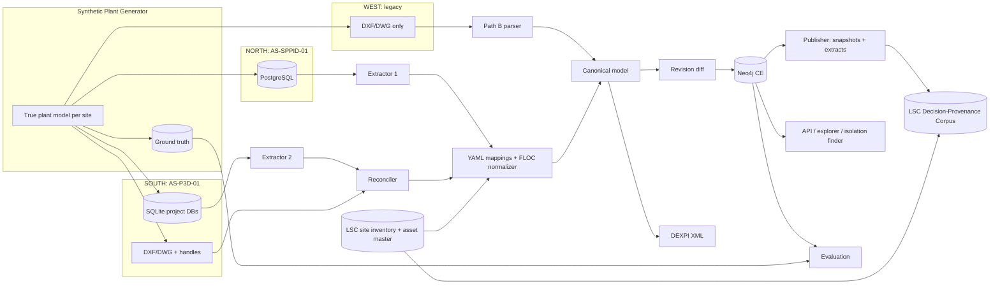

# Project Charter: Open-Source P&ID-to-Knowledge-Graph Hydration Engine (CAD-KGH)

**Version:** 3.1
**Owner:** Hamid Adesokan
**Type:** Personal learning / portfolio project
**Fictional enterprise:** Lagos Specialty Chemicals (LSC)
**Date:** September 2026
**Related project:** LSC Decision-Provenance Corpus (isolation / MOC / spec-break decisions)

> **Data policy:** All data is synthetic. LSC is a fictional enterprise. The source-system simulators are approximations built from public documentation. They are not vendor schemas.

> **In this repository:** Canonical CAD-KGH v3.1 charter. Implementation packages land in this repo (the `cad-kgh/` tree in §13 is the workstream layout, not a second product identity). Shared site codes come from the [knowledge-source inventory](../discovery/knowledge-source-inventory.md); `authoring_system_id` never equals a `site_code`.

---

## 0. Revision Notes

### v3 → v3.1

| # | Change | Reason |
|---|--------|--------|
| 1 | Removed `LSC-A` / `LSC-B` as site codes. Introduced **`authoring_system_id`** (`AS-SPPID-01`, `AS-P3D-01`), separate from **`site_code`** (`NORTH`, `SOUTH`, `WEST`) from the LSC site inventory. | Authoring systems are not sites. The inventory is the only source of site codes. |
| 2 | Pairing: North → SmartPlant-like, South → Plant-3D-like, West → legacy drawings only (Path B). | Realistic brownfield mix. Gives the drawing-only baseline a real place in the scenario. |
| 3 | Adopted a **three-identifier asset model**: functional location (FLOC), engineering tag, and equipment number. **`asset_ref` = FLOC code.** | Industry practice separates the *position* (tag / functional location) from the *physical, serialized item* installed there. |
| 4 | **Decision:** CAD-KGH is a **separate graph that feeds** the decision-provenance corpus through a versioned interface. It is neither merged into the corpus nor run in parallel with no link. | Decisions have to cite the topology as it was when they were made, without tying the two graphs' life cycles together. |
| 5 | M5 redefined as **Canonical, DEXPI, Load & Publish**. Schedule extended to 13 weeks. | Publishing to the corpus is now a milestone deliverable. |

---

## 1. Executive Summary

### 1.1 Scenario

LSC wants every P&ID captured in a knowledge graph, linked to other plant data, and kept **evergreen**. LSC does not digitize flat P&ID files, because engineering changes are made in the authoring tools and a drawing-derived graph goes stale. Instead it takes the data straight from its authoring systems, loads it into Neo4j, and exchanges it using **DEXPI**.

| Site (`site_code`) | Authoring system (`authoring_system_id`) | Graph path | Notes |
|---|---|---|---|
| `NORTH` | `AS-SPPID-01` (SmartPlant-P&ID-like, relational) | Source-first | The mature route; works well |
| `SOUTH` | `AS-P3D-01` (Plant-3D-like: DWG + project DB) | Source-first + graphics-to-data reconciliation | The harder route |
| `WEST` | None (legacy DXF/DWG only; no authoring DB) | Path B: drawing-only baseline | Brownfield site awaiting migration |

### 1.2 Objective

Rebuild LSC's source-first P&ID architecture end-to-end with **free and open-source software**, and publish versioned topology evidence to the LSC Decision-Provenance Corpus.

### 1.3 Hypotheses

| ID | Hypothesis | Measure |
|----|-----------|---------|
| H1 | Source-first extraction beats drawing-only reconstruction on topology accuracy. | Edge precision/recall: NORTH/SOUTH vs. WEST against ground truth |
| H2 | SOUTH (Plant-3D-like) is harder than NORTH, mainly because of the graphics-to-data join. | Auto-reconciliation rate; mapping-exception count |
| H3 | A single canonical model serves both sources without special-case consumers. | Identical query results regardless of source |
| H4 | Revision diffing keeps the graph current without full reloads. | Share of injected changes applied correctly; update time vs. full reload |
| H5 | Decisions in the corpus can be traced to the exact topology snapshot they relied on. | Share of corpus decisions with a resolvable snapshot and extract |
| H6 | The stack runs with no licensing cost. | License audit |

---

## 2. Scope

### 2.1 In Scope

- Synthetic plant generator (true model per site, realism injection, ground truth)
- Simulator `AS-SPPID-01` (PostgreSQL) and simulator `AS-P3D-01` (SQLite project DBs + DXF/DWG with entity handles)
- WEST legacy drawing set (DXF/DWG only)
- Extractors, graphics-to-data reconciler, YAML mapping layer with coverage reports
- DEXPI-aligned canonical model; DEXPI round trip (pyDEXPI)
- Neo4j hydration with full provenance (Apache AGE as an alternate)
- Evergreen change management (revision diff → incremental patch → `ChangeEvent`)
- **Publishing interface to the Decision-Provenance Corpus** (snapshots, evidence extracts, PROV-O links)
- Consumption demos: line trace, impact analysis, isolation-boundary finder

### 2.2 Out of Scope

- Scaling, delivery models, team enablement, cost models
- Real commercial systems or SDKs
- Write-back from the graph or the corpus to sources
- 3D, isometrics, B-Rep; OCR / raster drawings
- Building the Decision-Provenance Corpus itself (a separate project; CAD-KGH only publishes to it)

---

## 3. Identity Model

### 3.1 Three Identifiers

Industry practice separates the **functional location** (the tag, i.e., the position where a pump of a given service belongs) from the **physical asset** installed there. When a pump is swapped out, the tag stays the same and the asset or equipment number changes. ISO 15926 examples draw the same line: the tag is the intangible functional object, and serial-numbered items are the materialized objects that fill that function over time.

| Identifier | Purpose | Owner | Format | Example | Stability |
|---|---|---|---|---|---|
| **Engineering tag** (`tag_id`) | What the P&ID shows | Authoring system | Site-specific convention (ISA-5.1 style for instruments) | NORTH: `P-1101A`; SOUTH: `21-P-101-A`; instrument `FIC-1101` | Changes when an item is re-tagged |
| **Functional location** (`asset_ref`) | Canonical "position" identity shared across systems | LSC asset master / site inventory | `{SITE3}-{UNIT}-{CLASS}-{SEQ}{TRAIN}` | `NTH-110-P-101-A`, `STH-210-P-101-A`, `WST-310-V-004` | Stable; renumbering handled by aliases |
| **Equipment number** (`equipment_no`) | The physical, serialized item | CMMS / asset register | Opaque 8-digit number, never reused | `10004521` | Permanent; moves with the item |

**Rules**

1. **`asset_ref` is always the FLOC code.** P&IDs describe function, so topology attaches to FLOCs. Serialized equipment is linked to a FLOC through time-bounded installations.
2. `SITE3` codes: `NTH` = NORTH, `STH` = SOUTH, `WST` = WEST. They come from the site inventory and nowhere else.
3. Unit numbers are grouped by site to avoid collisions: NORTH 100–199, SOUTH 200–299, WEST 300–399.
4. The class code uses a controlled list: `P` pump, `V` vessel, `E` exchanger, `K` compressor, `T` tank, `XV` / `HV` / `CV` valves, ISA-5.1 letter codes for instruments.
5. The equipment class follows ISO 14224 (e.g., centrifugal pump), stored as `iso14224_class`. The hierarchy is Site → Plant/Unit → Section/System → Equipment unit.
6. Each node also has an internal surrogate key: `uid = hash(authoring_system_id, source_id)`. Human-readable codes are never used as primary keys.
7. Tag normalization is deterministic and versioned: `P-1101A` (NORTH) → `NTH-110-P-101-A`, and `21-P-101-A` (SOUTH, unit 210) → `STH-210-P-101-A`.
8. **Aliases.** When a FLOC is renumbered, the old code is kept in `floc_alias(old_code, new_code, effective_date)`. The corpus resolves old references through this table.
9. **Collision guard.** CI fails the build if any `authoring_system_id` value matches a `site_code` or `SITE3` value, or if two live FLOCs share a code.

### 3.2 System-to-Site Mapping

```text
authoring_system_site(authoring_system_id, site_code, valid_from, valid_to)
AS-SPPID-01 → NORTH  2016-01-01 → null
AS-P3D-01   → SOUTH  2018-06-01 → null
(WEST has no authoring system; Path B only)
```

### 3.3 Graph Pattern

```text
(:FunctionalLocation {asset_ref})<-[:REALIZES]-(:Equipment)          // P&ID item represents the position
(:PhysicalAsset {equipment_no})-[:INSTALLED_AT {from, to}]->(:FunctionalLocation)
(:FunctionalLocation)-[:ALIAS_OF {effective}]->(:FunctionalLocation)
```

---

## 4. Relationship to the Decision-Provenance Corpus

### 4.1 Decision

**CAD-KGH is a separate graph that feeds the corpus through a versioned interface.** It is not merged into the corpus, and it is not a parallel graph with no link.

| Option | Verdict |
|---|---|
| Parallel graph, no link | Rejected: duplicated identity; decisions can't cite topology |
| Merge into the corpus | Rejected: couples schemas, rebuilds, and life cycles; engineering detail swamps the corpus |
| **Feed via interface** | **Chosen:** one owner per graph; exact, time-correct evidence; either side can be rebuilt independently |

### 4.2 Interface

1. **Shared keys:** `site_code`, `asset_ref` (FLOC), `equipment_no` (optional), CAD-KGH `uid`.
2. **Snapshots:** each published revision per authoring system gets `snapshot_id = sha256(canonical graph serialization)`, plus `authoring_system_id`, `revision`, `valid_from`, `valid_to`. Snapshots are never changed after publishing.
3. **Evidence extracts:** small, versioned subgraphs published as JSON-LD:

| Extract | Contents | Decision type served |
|---|---|---|
| `isolation_boundary` | Equipment FLOC, isolation valves, normal positions, path hops, drains/vents | Isolation decisions |
| `spec_break` | Line, upstream/downstream piping classes, break location, rating change | Spec-break decisions |
| `change_delta` | Added / removed / modified items and connections between revisions | MOC decisions |

4. **Provenance (PROV-O):**

```text
corpus:Decision  prov:used            cadkgh:Extract/{extract_id}
cadkgh:Extract   prov:wasDerivedFrom  cadkgh:Snapshot/{snapshot_id}
cadkgh:Snapshot  prov:wasDerivedFrom  cadkgh:SourceRecord/{authoring_system_id}/{source_id}
cadkgh:Extract   prov:generatedAtTime "…"^^xsd:dateTime
```

5. **Direction:** data flows from CAD-KGH to the corpus only. The corpus never modifies CAD-KGH.
6. **Point-in-time queries:** `GET /extracts/isolation_boundary?asset_ref=NTH-110-P-101-A&as_of=2019-03-14` returns the extract from the snapshot that was valid on that date.
7. **WEST items** are published with `confidence < 1.0` and `derivation = "drawing_reconstruction"`, so decisions resting on reconstructed topology are visible.

---

## 5. Realistic Source Simulators

> Approximations for learning, based on public documentation. Not complete or exact vendor schemas.

### 5.1 `AS-SPPID-01`: SmartPlant-P&ID-like (NORTH)

- An abstract plant-item base table with a global `sp_id`, plus type-specific subtype tables
- Items stored separately from their drawn symbols (representations)
- Generic connector/relationship tables for connectivity
- Values stored as integer codes that resolve through code lists; site-extended lists (e.g., a custom "Corrosive" fluid system)
- Pipeline → pipe runs (1:N)

```text
t_plantitem(sp_id PK, item_type_id, item_tag, sp_plantgroup_id, is_deleted, created_on, modified_on)
t_equipment, t_vessel, t_nozzle, t_piperun, t_pipeline, t_inlinecomp, t_instrument, t_instrloop
t_connector(sp_id, sp_connectitem1_id, sp_connectitem2_id, connector_type_id)
t_relationship(sp_id, sp_item1_id, sp_item2_id, relationship_type_id)
t_representation(sp_id, sp_model_item_id, sp_drawing_id, representation_type_id, x, y, rotation)
t_drawing, t_drawingversion, codelists, t_itemnote
```

Tag convention: `P-1101A` (unit 110 is embedded in the number).

### 5.2 `AS-P3D-01`: Plant-3D-like (SOUTH)

- SQLite project DBs styled on `.dcf` files
- Single-`PnPID` inheritance chain (base → engineering items → equipment → class table)
- Class and property metadata tables; pick lists
- Relationship tables; a `PnPDataLinks` table joining DWG handles to `PnPID`
- Graphics and data can drift out of sync

```text
PnPBase, EngineeringItems, Equipment, CentrifugalPump, Nozzle, PipeLineGroup, Pipes,
HandValves, GeneralInstrumentSymbols, PnPRelationships, PnPDataLinks,
PnPTables, PnPProperties, PnPPickLists, PnPDrawings
```

Tag convention: `21-P-101-A` (area prefix `21` = unit 210).

### 5.3 WEST Legacy Drawings

- DXF/DWG only. A mix of named blocks and exploded symbols; inconsistent layers
- Tag convention: free text, e.g., `V4` or `VESSEL 4`, normalized to `WST-310-V-004`

### 5.4 Realism Injection

| Category | Examples |
|---|---|
| Site configuration | Different tag formats per site; custom code lists; renamed classes |
| Legacy | Deprecated codes; items with no graphics; a FLOC renumbering event (for testing aliases) |
| Data quality | Duplicate tags, missing specs, orphan connectors, soft-deleted items still referenced |
| Graphics/data drift (SOUTH) | Unlinked DWG entities, data rows with no graphics, stale handles |
| Topology | Off-page connectors, branches, bypasses, recycle loops, spec breaks, reducers |
| Asset lifecycle | Pump change-outs (same FLOC, new `equipment_no`) |
| Revisions | 3–5 revisions per sheet: adds, removes, re-tags, re-routes, spec changes |

---

## 6. Architecture



---

## 7. Canonical Graph Model

### 7.1 Common Properties

`uid`, `site_code`, `authoring_system_id` (null for WEST), `asset_ref`, `tag_id`, `source_id`, `source_class`, `dexpi_class`, `iso14224_class`, `revision`, `snapshot_id`, `valid_from`, `valid_to`, `confidence`, `derivation` (`source_extract` / `drawing_reconstruction`), `cad_handle`

### 7.2 Nodes

`:Site`, `:Unit`, `:System`, `:FunctionalLocation`, `:PhysicalAsset`, `:DrawingSheet`, `:Equipment` (+ subtypes), `:Nozzle`, `:PipingNetworkSystem`, `:PipingNetworkSegment`, `:Valve`, `:PipingComponent`, `:SpecBreak`, `:Instrument`, `:Loop`, `:OffPageConnector`, `:SourceRecord`, `:MappingException`, `:ChangeEvent`, `:Snapshot`, `:Extract`

### 7.3 Relationships

```text
(:Site)-[:HAS_UNIT]->(:Unit)-[:HAS_SYSTEM]->(:System)-[:CONTAINS]->(:FunctionalLocation)
(:Equipment|:Valve|:Instrument)-[:REALIZES]->(:FunctionalLocation)
(:PhysicalAsset)-[:INSTALLED_AT {from,to}]->(:FunctionalLocation)
(:Equipment)-[:HAS_NOZZLE]->(:Nozzle)
(:PipingNetworkSystem)-[:HAS_SEGMENT]->(:PipingNetworkSegment)
(:PipingNetworkSegment)-[:CONNECTS_TO {end}]->(:Nozzle|:PipingComponent|:Valve|:OffPageConnector|:SpecBreak)
(:PipingNetworkSegment)-[:FLOWS_TO]->(:PipingNetworkSegment)
(:SpecBreak)-[:BETWEEN {side}]->(:PipingNetworkSegment)
(:Instrument)-[:MEASURES]->(...), (:Instrument)-[:CONTROLS]->(:Valve), (:Instrument)-[:PART_OF]->(:Loop)
(:OffPageConnector)-[:CONTINUES_AS]->(:OffPageConnector)
(:*)-[:DEPICTED_ON]->(:DrawingSheet)
(:*)-[:DERIVED_FROM]->(:SourceRecord)
(:ChangeEvent)-[:AFFECTED]->(:*)
(:Snapshot)-[:INCLUDES]->(:*), (:Extract)-[:FROM_SNAPSHOT]->(:Snapshot)
```

### 7.4 Isolation Boundary Query

```cypher
MATCH (f:FunctionalLocation {asset_ref: "NTH-110-P-101-A"})<-[:REALIZES]-(e:Equipment)
MATCH (e)-[:HAS_NOZZLE]->(:Nozzle)<-[:CONNECTS_TO]-(s:PipingNetworkSegment)
MATCH path = (s)-[:CONNECTS_TO|LOCATED_ON|CONTINUES_AS*1..15]-(v:Valve {is_isolation: true})
WHERE none(n IN nodes(path)[1..-1] WHERE n:Valve AND n.is_isolation)
RETURN DISTINCT v.asset_ref, v.tag_id, v.normal_position, length(path) AS hops
ORDER BY hops;
```

---

## 8. Mapping Layer (excerpt)

```yaml
source: AS-SPPID-01
site_code: NORTH
floc_normalizer:
  pattern: '^(?P<cls>[A-Z]{1,3})-(?P<unit>\d{3})(?P<seq>\d)(?P<train>[A-Z]?)$'
  template: 'NTH-{unit}-{cls}-{seq:03d}{-train}'
  version: 1
classes:
  - {source: t_piperun, target: PipingNetworkSegment, key: sp_id}
connectivity: {table: t_connector, from: sp_connectitem1_id, to: sp_connectitem2_id, edge: CONNECTS_TO}
unmapped_policy: report
---
source: AS-P3D-01
site_code: SOUTH
floc_normalizer:
  pattern: '^(?P<area>\d{2})-(?P<cls>[A-Z]{1,3})-(?P<seq>\d{3})(-(?P<train>[A-Z]))?$'
  template: 'STH-{area}0-{cls}-{seq}{-train}'
  version: 1
graphics_link: {table: PnPDataLinks, handle: DwgHandle, id: PnPID}
unmapped_policy: report
```

---

## 9. Technology Stack (100% Free & Open Source)

| Stage | Technology | License |
|---|---|---|
| NORTH simulator | PostgreSQL | PostgreSQL License |
| SOUTH simulator | SQLite | Public domain |
| Graphics | ezdxf; LibreCAD / QCAD CE | MIT; GPL-2.0 / GPL-3.0 |
| DWG ↔ DXF | GNU LibreDWG | GPL-3.0 |
| Extraction / mapping | SQLAlchemy, PyYAML, Pydantic | MIT |
| Spatial (Path B) | Shapely, Rtree, scikit-learn | BSD-3 / MIT / BSD-3 |
| Validation | NetworkX, pandera | BSD-3 / MIT |
| DEXPI | pyDEXPI | AGPL-3.0 |
| Graph DB | Neo4j CE (alt: Apache AGE, ArcadeDB) | GPL-3.0 / Apache-2.0 |
| Provenance / publishing | rdflib (JSON-LD, PROV-O), pySHACL | BSD-3 / Apache-2.0 |
| Orchestration | Prefect or Dagster | Apache-2.0 |
| API / UI | FastAPI, Streamlit, Cytoscape.js | MIT / Apache-2.0 / MIT |
| Graph-RAG (optional) | Ollama, LlamaIndex / LangChain | MIT |

**Excluded:** ODA File Converter (proprietary freeware), Memgraph CE (BSL 1.1), vendor SDKs.

---

## 10. Milestones (13 weeks)

| Milestone | Deliverable | Target |
|---|---|---|
| M0: Environment | Compose stack, repo, license CI | Week 1 |
| M1: Research & Design | Simulator schemas, identity model, canonical model, interface spec v0, ADRs | Week 2 |
| M2: Generator + NORTH | True model, `AS-SPPID-01` populated, ground truth, site inventory/asset master seed | Week 4 |
| M3: SOUTH + WEST | `AS-P3D-01` DBs + DXF with handles; WEST legacy drawings; drift injection | Week 5 |
| M4: Extraction & Mapping | Extractors, reconciler, YAML mappings, FLOC normalizers, coverage report | Week 7 |
| **M5: Canonical, DEXPI, Load & Publish** | See 10.1 | **Week 9** |
| M6: WEST Baseline | Path B parser and snapping engine; confidence scoring | Week 10 |
| M7: Evergreen | Revision diff, incremental patch, new snapshots and `change_delta` extracts | Week 11 |
| M8: Consumption | API (including `as_of`), explorer, isolation finder | Week 12 |
| M9: Evaluation | Scorecards by site/path; end-to-end corpus trace tests; findings | Week 13 |

### 10.1 M5 Deliverables & Exit Criteria

**Deliverables**

- Unified canonical model; DEXPI round trip
- Neo4j load with `site_code`, `authoring_system_id`, `asset_ref`, `uid` on every node
- `authoring_system_site` mapping table and the CI collision guard
- `floc_alias` table and alias resolution
- Snapshot publisher (content hash, bitemporal validity)
- Evidence extracts v1: `isolation_boundary`, `spec_break`, `change_delta` (JSON-LD + SHACL shapes)
- Contract test fixtures: one isolation, one MOC, and one spec-break decision in the corpus, each traced back to a CAD-KGH snapshot and source record

**Exit criteria**

- 100% of corpus `asset_ref` values resolve (directly or via alias), or are logged as `:MappingException`
- 0 collisions between `authoring_system_id` and site codes
- All extracts pass SHACL validation
- Re-publishing an unchanged revision produces the same `snapshot_id`

---

## 11. Risks

| Risk | Sev. | Likelihood | Mitigation |
|---|---|---|---|
| Simulators drift from real tool behavior | High | Medium | Public-source ADRs; label everything as an approximation |
| SOUTH graphics/data reconciliation gaps | High | High | Match by handle, then tag, then position; route the rest to `:MappingException` |
| FLOC normalization errors | High | Medium | Versioned regex normalizers; golden test set per site; alias table |
| Identity collisions (sites vs. systems) | Medium | Low | Separate fields; CI guard |
| Corpus/CAD-KGH schema drift | Medium | Medium | Versioned extract schemas; SHACL; contract tests in CI for both repos |
| Decisions citing low-confidence WEST topology | Medium | Medium | `confidence` and `derivation` exposed on every extract |
| DEXPI mapping gaps | Medium | Medium | Documented extensions |
| Copyleft obligations if published | Low | Low | Isolate GPL/AGPL components |

---

## 12. Success Metrics

| Metric | NORTH | SOUTH | WEST (Path B) |
|---|---|---|---|
| Entity accuracy | ≥ 99.5% | ≥ 98% | ≥ 95% |
| Connectivity precision / recall | ≥ 99% / ≥ 99% | ≥ 98% / ≥ 97% | ≥ 95% / ≥ 90% |
| FLOC normalization accuracy | ≥ 99.9% | ≥ 99.5% | ≥ 97% |
| Graphics-to-data auto-reconciliation | n/a | ≥ 97% | n/a |
| Corpus `asset_ref` resolution | 100% resolved or flagged | Same | Same |
| Snapshot determinism | 100% | 100% | 100% |
| Change propagation | 100% of injected deltas | 100% | Reported |
| Open-source adherence | No proprietary runtimes | Same | Same |

*These targets are proposed for this project, not industry benchmarks.*

---

## 13. Repository Layout

```text
cad-kgh/
├── docs/ (charter, ADRs, identity-model.md, corpus-interface-spec.md)
├── generator/
├── sim_as_sppid_01/      # NORTH
├── sim_as_p3d_01/        # SOUTH
├── legacy_west/          # WEST drawings
├── extractors/  mappings/  identity/ (floc normalizers, aliases, collision guard)
├── canonical/  dexpi/  path_b_drawing/  change_mgmt/
├── loaders/  publisher/ (snapshots, extracts, prov, shacl)
├── api/  ui/  flows/  eval/  tests/contract/
```
