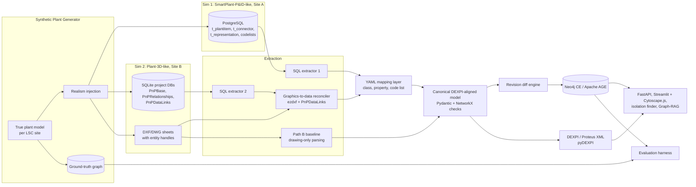

# Project Charter: Open-Source P&ID-to-Knowledge-Graph Hydration Engine (CAD-KGH)

**Version:** 3.0
**Owner:** Hamid Adesokan
**Type:** Personal learning / portfolio project
**Fictional scenario client:** Lagos Specialty Chemicals (LSC)
**Date:** September 2026
**Status:** Imported into this repository (canonical copy)

> **In this repository:** CAD-KGH is the engineering-source workstream under Enterprise Context Engineering. It hydrates simulated P&ID authoring systems into a DEXPI-aligned graph that later decision artifacts can cite. `LSC-A` / `LSC-B` are **authoring-system sites**, not the North / South / West commercial regions in the [knowledge-source inventory](../discovery/knowledge-source-inventory.md). The `cad-kgh/` tree in §11 is the target implementation layout for this workstream, not a separate product repository.

> **Data policy:** All data is synthetic. "Lagos Specialty Chemicals (LSC)" is a fictional operator used to frame the scenario. The source-system simulators are *approximations* built from public documentation and community references. They are **not** copies of any vendor's proprietary schema, and they use no client, employer, or partner data.

---

## 0. Revision Notes

### v2 → v3

| # | Change | Reason |
|---|--------|--------|
| 1 | Framed the scenario around the fictional client **Lagos Specialty Chemicals (LSC)**. | Keeps the project neutral and anonymized. |
| 2 | Replaced the single "clean" authoring database with **two realistic, different source simulators**: a **SmartPlant-P&ID-like** relational store and a **Plant-3D-like** project database (SQLite `.dcf` style) plus linked DWG/DXF graphics. | Real source schemas are complex, abstract, and different from each other. The mapping problem is the real work. |
| 3 | Added a **source-to-canonical mapping layer** (declarative YAML mappings) that merges both sources into one DEXPI-aligned canonical model. | This is what integrating two different authoring systems actually looks like. |
| 4 | Added the **CAD-handle ↔ database-row join** for the Plant-3D-like source. | In Plant-3D-style tools, graphics live in DWG and engineering data lives in the project DB, linked by IDs. Reconciling the two is a known hard step. |
| 5 | Added **realism injection**: site-specific configuration, legacy tags, schema extensions, pick-list drift, orphaned records, multi-sheet continuity, and revision history. | Synthetic data that is too clean produces results that won't hold up on real data. |
| 6 | Kept drawing-only parsing (Path B) as a **baseline**. | So source-first vs. flat-file can be measured side by side. |
| 7 | Scaling and delivery-model content is **not included**, as requested. | Scope decision. |

---

## 1. Executive Summary

### 1.1 Scenario: Lagos Specialty Chemicals (LSC)

LSC is a fictional specialty-chemicals operator. It wants a digital twin in which every Piping & Instrumentation Diagram (P&ID) is captured in a knowledge graph, linked to other plant data, and kept **evergreen**.

LSC deliberately avoids the common approach of digitizing flat P&ID files (PDF, scans, static CAD exports) and pulling entities and relationships out of them. Engineering changes are made in the authoring tools, not in the flat files, so a graph built from drawings drifts out of date.

LSC instead goes **straight to the two authoring systems** its sites use:

- **Site A:** a SmartPlant-P&ID-style system backed by a relational database
- **Site B:** an AutoCAD-Plant-3D-P&ID-style system (DWG drawings plus a project database)

LSC takes the data those systems used to draw the P&IDs, loads it into Neo4j, and exchanges it with consuming applications using **DEXPI**. The Site A route works well. The Site B route is harder because graphics and data live in separate stores and have to be reconciled.

### 1.2 Project Objective

Rebuild LSC's architecture end-to-end with **free and open-source software only**, using realistic simulations of both authoring systems, so the source-first approach can be built, tested, and measured.

### 1.3 Hypotheses

| ID | Hypothesis | Measure |
|----|-----------|---------|
| H1 | Source-first extraction gives a more accurate topology than drawing-only reconstruction. | Precision/recall of connectivity edges against ground truth |
| H2 | The Plant-3D-like source is harder to integrate than the SmartPlant-like source, mainly because of the graphics-to-data join. | Share of items reconciled automatically; number of mapping exceptions |
| H3 | A shared canonical model lets both sources feed one graph and one DEXPI output without special-case consumers. | Same query results regardless of which source an item came from |
| H4 | Revision-based change detection keeps the graph current without full reloads. | Share of injected changes applied correctly; update time vs. full reload |
| H5 | The whole stack runs with no licensing cost. | License audit |

---

## 2. Scope

### 2.1 In Scope

| Area | Deliverable |
|------|-------------|
| **Synthetic plant generator** | A single "true" plant model per LSC site. From it, the generator writes both source-system simulations, the DXF/DWG graphics, and a **ground-truth graph** used for scoring |
| **Source Simulator 1: SmartPlant-P&ID-like** | Relational schema (PostgreSQL) with an abstract plant-item base table, typed subtype tables, a separate graphical-representation table, generic relationship and connector tables, enumerated code lists, and drawing/revision tables |
| **Source Simulator 2: Plant-3D-like** | Project database files in SQLite (styled on `.dcf`) with a base-object table keyed by a single ID, class-inheritance tables, class/property metadata tables, relationship tables, pick lists, and a **data-link table** that ties DWG entity handles to database rows. Graphics are written as DXF (optionally converted to DWG). |
| **Extractors** | SQL extractors for each simulator, plus the graphics-to-data reconciler for Simulator 2 |
| **Mapping layer** | Declarative YAML mappings (source class/property → canonical class/property; code list → canonical enumeration) with a mapping-coverage report |
| **Canonical model** | Pydantic models aligned with DEXPI class names; NetworkX-based validation |
| **DEXPI exchange** | Canonical → DEXPI/Proteus XML via pyDEXPI; round-trip tests |
| **Baseline (Path B)** | Drawing-only extraction from DXF (ezdxf + Shapely/Rtree snapping) with **no** database access |
| **Graph hydration** | Idempotent Neo4j loader (Apache AGE as an alternate) with source provenance on every node and edge |
| **Evergreen change management** | Revision snapshots per source → diff → incremental graph patch → `ChangeEvent` lineage |
| **Consumption demos** | Line tracing, impact analysis, and an isolation-boundary finder; FastAPI + Streamlit/Cytoscape.js explorer; optional local Graph-RAG |
| **Evaluation harness** | Automated scoring by source and by path, against ground truth |

### 2.2 Out of Scope

- Scaling, delivery models, team enablement, and cost models
- Integration with real commercial systems or their SDKs/APIs
- Writing changes back from the graph to the sources
- 3D models, isometrics, and B-Rep geometry
- OCR / computer vision on raster drawings (possible later phase)

---

## 3. Realistic Source Simulators

> These are *approximations for learning*. Table and column names are drawn from public documentation and community references about how these tool families store data. They are generalized and are not complete or exact vendor schemas.

### 3.1 Simulator 1: SmartPlant-P&ID-like (LSC Site A)

**Traits to reproduce**

- **Abstract base table.** Every engineering object gets a row in a common plant-item table with a global ID (`SP_ID`-style) and an item type. Type-specific details sit in subtype tables (equipment, vessel, pipe run, instrument, nozzle, inline component). Public references show a single pipe-run class being published as separate *connector* and *process-point* concepts to an integration schema, and retrieved items landing in a `T_PlantItem`-style table keyed by `SP_ID`.
- **Model vs. representation.** Engineering items are separate from their graphical symbols. One item can appear as several representations across drawings.
- **Generic connectivity.** Connections are stored as connector/relationship rows (item 1, item 2, relationship type), not as geometry.
- **Code lists.** Fluid codes, piping classes, and similar values are stored as integer codes that resolve through enumerated-list tables. Sites extend these lists (public Smart P&ID help shows, for example, a custom "Corrosive" fluid system being added).
- **Pipeline vs. pipe run.** A pipeline can contain many pipe runs. A pipe run belongs to at most one pipeline.

**Simulated tables (PostgreSQL)**

```text
t_plantitem(sp_id PK, item_type_id FK, item_tag, sp_plantgroup_id, is_deleted, created_on, modified_on)
t_equipment(sp_id PK/FK, equipment_subclass_id, design_pressure, design_temp, ...)
t_vessel(sp_id PK/FK, ...)
t_nozzle(sp_id PK/FK, sp_equipment_id, nominal_diameter_id, ...)
t_piperun(sp_id PK/FK, sp_pipeline_id, piping_class_id, nominal_diameter_id, fluid_code_id, insulation_type_id, flow_direction_id)
t_pipeline(sp_id PK/FK, line_number_label)
t_inlinecomp(sp_id PK/FK, sp_piperun_id, component_subclass_id, op_fail_action_id, ...)
t_instrument(sp_id PK/FK, measured_variable_code, instrument_type_modifier, loop_sp_id, ...)
t_instrloop(sp_id PK/FK, loop_function_id)
t_connector(sp_id PK, sp_connectitem1_id, sp_connectitem2_id, connector_type_id)
t_relationship(sp_id PK, sp_item1_id, sp_item2_id, relationship_type_id)
t_representation(sp_id PK, sp_model_item_id, sp_drawing_id, representation_type_id, x, y, rotation)
t_drawing(sp_id PK, drawing_number, title, sp_plantgroup_id)
t_drawingversion(sp_id PK, sp_drawing_id, revision, status, issued_on)
codelists(list_id, list_name, value_id, short_value, long_value, dependent_value_id)
t_itemnote(sp_id, sp_item_id, note_text)
```

### 3.2 Simulator 2: Plant-3D-like (LSC Site B)

**Traits to reproduce**

- **Project database files.** Data is split across several SQLite database files (P&ID/process data, piping, and so on), styled on the `.dcf` files a Plant 3D project uses (for example `ProcessPower.dcf` and `Piping.dcf`).
- **Single-ID inheritance chain.** One object's data is spread across several linked tables joined by a single `PnPID`. Public references describe equipment stored across a base table, an engineering-items table, an equipment table, and a class-specific table, all joined by `PnPID`.
- **Metadata tables.** Classes and properties are defined in metadata tables (`PnPTables`, `PnPProperties`-style). Convenience views (`_PNP`-style) flatten the inheritance chain.
- **Relationship tables.** Separate tables hold relationships (for example line-to-endpoint and asset ownership).
- **Graphics apart from data.** Symbols and lines are DWG entities. A data-link table maps DWG entity handles to `PnPID` rows. Graphics and data **can drift out of sync**.
- **Pick lists.** Enumerated values are stored in pick-list tables and extended per project.

**Simulated tables (SQLite, e.g. `processpower.sqlite`)**

```text
PnPBase(PnPID PK, PnPClassName, PnPGuid, PnPTimestamp, PnPStatus)
EngineeringItems(PnPID PK/FK, Tag, Description, Spec, Size, Manufacturer)
Equipment(PnPID PK/FK, EquipmentType, DesignPressure, DesignTemperature)
CentrifugalPump(PnPID PK/FK, FlowRate, Head, ...)          -- class-specific leaf table
Nozzle(PnPID PK/FK, NozzleId, OwnerPnPID, Size)
PipeLineGroup(PnPID PK/FK, LineNumber, Service, Spec)
Pipes(PnPID PK/FK, LineGroupPnPID, FlowDirection)
HandValves(PnPID PK/FK, ValveType, NormalPosition, IsolationDuty)
GeneralInstrumentSymbols(PnPID PK/FK, Area, Type, Loop, ...)
PnPRelationships(RelID PK, RelType, SourcePnPID, TargetPnPID)  -- line-endpoint, ownership, loop membership
PnPDataLinks(DwgName, DwgHandle, PnPID, LinkType)             -- graphics ↔ data join
PnPTables(TableName, ParentTable, DisplayName)                -- class metadata
PnPProperties(TableName, PropertyName, DataType, PickListName)
PnPPickLists(PickListName, Value, DisplayValue)
PnPDrawings(PnPID PK, DwgName, Title, Revision)
```

Graphics: DXF/DWG sheets whose block inserts and line entities carry handles that match `PnPDataLinks.DwgHandle`.

### 3.3 Realism Injection (both simulators, configurable rates)

| Category | Examples |
|---|---|
| **Site configuration** | Different tag formats per site (`P-101A` vs. `11-P-101-A`); custom code lists and properties (e.g., a "Corrosive" fluid system); renamed classes |
| **Legacy data** | Old tag conventions, deprecated code values, items with no drawing representation |
| **Data-quality faults** | Duplicate tags, missing sizes/specs, orphan connectors, soft-deleted items that are still referenced |
| **Graphics/data drift (Sim 2)** | DWG entities with no data link, data rows with no graphics, stale links after a copy/paste |
| **Topology complexity** | Off-page connectors across multiple sheets, branches, bypasses, recycle loops, spec breaks, reducers |
| **Instrumentation** | Loops that span sheets, shared transmitters, control valves with fail-action attributes |
| **Revision history** | 3–5 revisions per sheet with adds, removes, re-tags, re-routes, and spec changes |

---

## 4. Target Architecture



---

## 5. Mapping Layer

Mappings are declarative, version-controlled YAML files, one per source. They are checked for coverage (every source class and property mapped, or explicitly ignored).

```yaml
# mappings/sim1_smartplant_like.yaml
source: sim1_smartplant_like
classes:
  - source: t_piperun
    target: PipingNetworkSegment
    key: sp_id
    properties:
      nominal_diameter_id: {target: nominal_size, codelist: NominalDiameter}
      fluid_code_id:       {target: fluid_code,   codelist: FluidCode}
      piping_class_id:     {target: spec,         codelist: PipingMaterialsClass}
  - source: t_inlinecomp
    where: "component_subclass_id IN (SELECT value_id FROM codelists WHERE list_name='ValveType')"
    target: Valve
connectivity:
  table: t_connector
  from: sp_connectitem1_id
  to: sp_connectitem2_id
  edge: CONNECTS_TO
codelists:
  FluidCode:
    KA: AMMONIA_ANHYDROUS
    KW: AMMONIA_AQUEOUS
unmapped_policy: report
```

```yaml
# mappings/sim2_plant3d_like.yaml
source: sim2_plant3d_like
classes:
  - source: CentrifugalPump
    join_chain: [PnPBase, EngineeringItems, Equipment, CentrifugalPump]
    key: PnPID
    target: CentrifugalPump
  - source: HandValves
    join_chain: [PnPBase, EngineeringItems, HandValves]
    target: Valve
    properties:
      IsolationDuty: {target: is_isolation, type: bool}
connectivity:
  table: PnPRelationships
  where: "RelType = 'LineEndpoint'"
  from: SourcePnPID
  to: TargetPnPID
  edge: CONNECTS_TO
graphics_link:
  table: PnPDataLinks
  handle: DwgHandle
  id: PnPID
unmapped_policy: report
```

---

## 6. Canonical Graph Model (DEXPI-aligned)

### 6.1 Common Properties

`uid` (canonical, stable across sources), `tag_id`, `site` (`LSC-A` / `LSC-B`), `source_system`, `source_id` (`sp_id` or `PnPID`), `source_class`, `dexpi_class`, `revision`, `valid_from`, `valid_to`, `confidence`, `drawing_ref`, `cad_handle` (Sim 2 / Path B)

### 6.2 Nodes

| Label | Description |
|---|---|
| `:Plant`, `:Area`, `:Unit` | LSC site hierarchy |
| `:DrawingSheet` | P&ID sheet with revision |
| `:Equipment` (+ subtype labels such as `:CentrifugalPump`, `:Vessel`) | Process equipment |
| `:Nozzle` | Connection point on equipment |
| `:PipingNetworkSystem` | Pipeline / line group |
| `:PipingNetworkSegment` | Pipe run |
| `:Valve`, `:PipingComponent` | Inline items |
| `:Instrument`, `:Loop` | Instrumentation and control loops |
| `:OffPageConnector` | Link between sheets |
| `:SourceRecord` | Raw source row reference (for lineage) |
| `:MappingException` | Items that couldn't be mapped or reconciled |
| `:ChangeEvent` | A revision delta |

### 6.3 Relationships

```text
(:Plant)-[:HAS_AREA]->(:Area)-[:HAS_UNIT]->(:Unit)-[:CONTAINS]->(:Equipment)
(:Equipment)-[:HAS_NOZZLE]->(:Nozzle)
(:PipingNetworkSystem)-[:HAS_SEGMENT]->(:PipingNetworkSegment)
(:PipingNetworkSegment)-[:CONNECTS_TO {end}]->(:Nozzle|:PipingComponent|:Valve|:OffPageConnector)
(:PipingNetworkSegment)-[:FLOWS_TO]->(:PipingNetworkSegment)
(:Valve)-[:LOCATED_ON]->(:PipingNetworkSegment)
(:Instrument)-[:MEASURES]->(:PipingNetworkSegment|:Equipment)
(:Instrument)-[:CONTROLS]->(:Valve)
(:Instrument)-[:PART_OF]->(:Loop)
(:OffPageConnector)-[:CONTINUES_AS]->(:OffPageConnector)
(:*)-[:DEPICTED_ON]->(:DrawingSheet)
(:*)-[:DERIVED_FROM]->(:SourceRecord)
(:ChangeEvent)-[:AFFECTED]->(:*)
```

### 6.4 Example: Isolation Boundary

```cypher
MATCH (e:Equipment {tag_id: "P-101A", site: "LSC-A"})-[:HAS_NOZZLE]->(:Nozzle)<-[:CONNECTS_TO]-(s:PipingNetworkSegment)
MATCH path = (s)-[:CONNECTS_TO|LOCATED_ON|CONTINUES_AS*1..15]-(v:Valve {is_isolation: true})
WHERE none(n IN nodes(path)[1..-1] WHERE n:Valve AND n.is_isolation)
RETURN DISTINCT v.tag_id, v.source_system, length(path) AS hops
ORDER BY hops;
```

---

## 7. Technology Stack (100% Free & Open Source)

| Stage | Technology | License |
|---|---|---|
| Sim 1 database | PostgreSQL | PostgreSQL License |
| Sim 2 project DBs | SQLite | Public domain |
| Graphics generation / editing | ezdxf; LibreCAD / QCAD CE | MIT; GPL-2.0 / GPL-3.0 |
| DWG ↔ DXF | GNU LibreDWG (`dwg2dxf`, `dxf2dwg`) | GPL-3.0 |
| Synthetic data | Python, Faker | PSF / MIT |
| Extraction / mapping | SQLAlchemy, PyYAML, Pydantic | MIT |
| Spatial (Path B, reconciliation checks) | Shapely, Rtree, scikit-learn | BSD-3 / MIT / BSD-3 |
| Validation | NetworkX, pandera | BSD-3 / MIT |
| DEXPI | pyDEXPI | AGPL-3.0 |
| Graph DB | Neo4j Community Edition (alt: Apache AGE, ArcadeDB) | GPL-3.0 / Apache-2.0 |
| Orchestration | Prefect or Dagster | Apache-2.0 |
| API / UI | FastAPI, Streamlit, Cytoscape.js, Gephi | MIT / Apache-2.0 / MIT / CDDL-GPL |
| Graph-RAG (optional) | Ollama + open-weight model; LlamaIndex/LangChain | MIT / Apache-2.0 / MIT (check each model's license) |
| Containers | Docker Engine / Podman | Apache-2.0 |

**Excluded:** ODA File Converter (freeware, not open source), Memgraph CE (BSL 1.1), and all vendor SDKs.

---

## 8. Milestones

| Milestone | Deliverable | Target |
|---|---|---|
| M0: Environment | Compose stack, repo, license CI | Week 1 |
| M1: Research & Design | Public-source research notes on both tool families; simulator schemas; canonical model; ADRs | Week 2 |
| M2: Generator + Sim 1 | True-model generator, Sim 1 populated, ground truth | Week 4 |
| M3: Sim 2 + Graphics | SQLite project DBs, DXF sheets with handles, data-link table, drift injection | Week 5 |
| M4: Extraction & Mapping | Both extractors, YAML mappings, coverage report, graphics-to-data reconciler | Week 7 |
| M5: Canonical, DEXPI & Load | Unified canonical model, DEXPI round trip, Neo4j hydration with lineage | Week 8 |
| M6: Path B Baseline | Drawing-only parser and snapping engine | Week 9 |
| M7: Evergreen | Revision diff and incremental patching for both sources | Week 10 |
| M8: Consumption | API, explorer, isolation finder, optional Graph-RAG | Week 11 |
| M9: Evaluation | Scorecards by source and path; findings write-up | Week 12 |

---

## 9. Risks

| Risk | Sev. | Likelihood | Mitigation |
|---|---|---|---|
| Simulators drift from real tool behavior | High | Medium | Base design on public docs; record assumptions in ADRs; label everything as an approximation |
| Graphics/data reconciliation gaps (Sim 2) | High | High | Match by handle first, then by tag, then by position; send unresolved items to `:MappingException` |
| Code-list and site-configuration differences | Medium | High | Per-site code-list mappings; unmapped values fail loudly in the coverage report |
| Cross-source identity conflicts (same tag at both sites) | Medium | Medium | Canonical `uid` = hash(site, source_system, source_id); tag used as a secondary match only |
| DEXPI mapping gaps | Medium | Medium | Mapping table with documented extensions |
| Path B snapping errors | High | High | Configurable tolerance; log every snap with its distance |
| Copyleft obligations if published | Low | Low | Isolate GPL/AGPL components; keep `THIRD_PARTY_LICENSES.md` |

---

## 10. Success Metrics

| Metric | Sim 1 (source-first) | Sim 2 (source-first) | Path B (drawing-only) |
|---|---|---|---|
| Entity accuracy (class + key attributes) | ≥ 99.5% | ≥ 98% | ≥ 95% |
| Connectivity precision / recall | ≥ 99% / ≥ 99% | ≥ 98% / ≥ 97% | ≥ 95% / ≥ 90% |
| Graphics-to-data auto-reconciliation | n/a | ≥ 97% (rest flagged) | n/a |
| Mapping coverage (classes / properties) | 100% mapped or explicitly ignored | Same | n/a |
| Cross-sheet trace accuracy | ≥ 99% | ≥ 97% | ≥ 85% |
| Revision change propagation | 100% of injected deltas | 100% | Reported |
| DEXPI round-trip loss | 0 losses on mapped properties | Same | n/a |
| Idempotent reload | No changes to the graph | Same | Same |
| Open-source adherence | No proprietary runtimes or paid APIs | Same | Same |

*These targets are proposed for this project, not industry benchmarks.*

---

## 11. Repository Layout

```text
cad-kgh/
├── docker-compose.yml
├── THIRD_PARTY_LICENSES.md
├── docs/ (charter, ADRs, research notes, ontology)
├── generator/            # true plant model, realism injection, ground truth
├── sim1_smartplant_like/ # Postgres DDL, seed, code lists
├── sim2_plant3d_like/    # SQLite DDL, pick lists, DXF writer, data links
├── extractors/           # sim1.py, sim2.py, reconciler.py
├── mappings/             # YAML per source + coverage checker
├── canonical/            # Pydantic models, validators
├── dexpi/                # pyDEXPI adapters, round-trip tests
├── path_b_drawing/       # drawing-only baseline
├── change_mgmt/          # diff + patch
├── loaders/              # neo4j/, age/
├── api/  ui/  flows/  eval/  tests/
```
